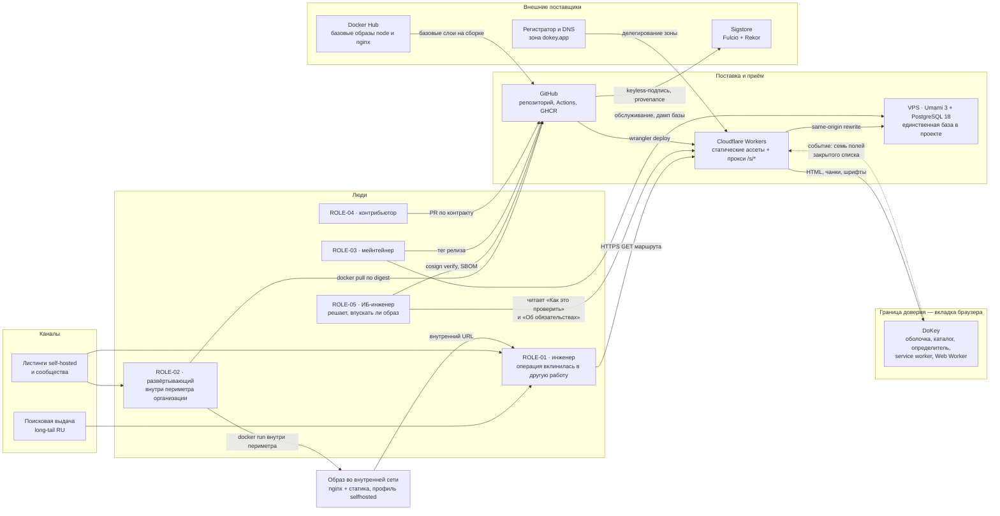
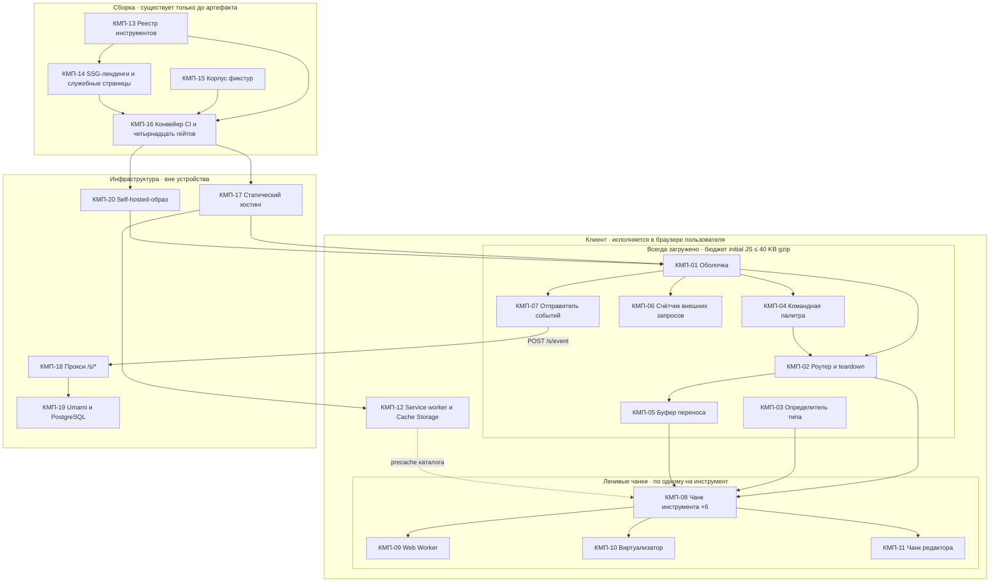
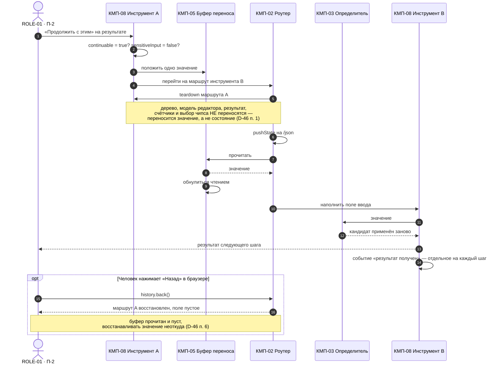
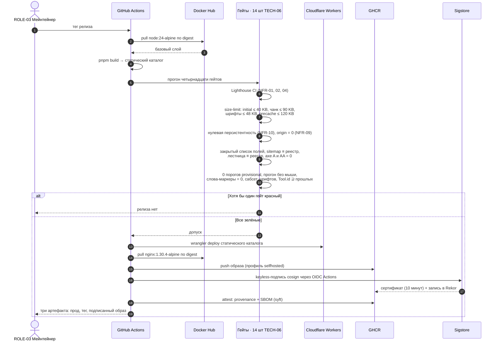
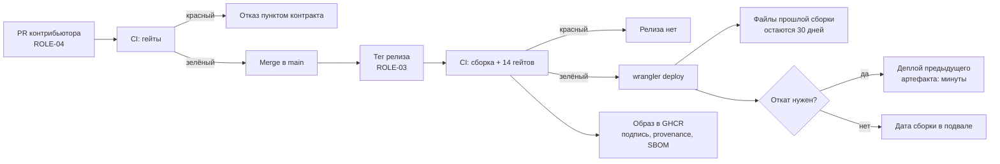

# DoKey — Архитектура

**Дата:** 2026-09-07 · **Статус:** черновик к согласованию
**Опирается на:** [data-model.md](data-model.md) (контуры К-1…К-4, ENT-01…ENT-30, §7 миграции),
[tech-stack.md](tech-stack.md) (ADR-01…ADR-18, ограничения О-01…О-16, риски ST-01…ST-11),
[user-flows.md](user-flows.md) (FL-01…FL-20, §4 «где отваливаются»),
[prd.md](prd.md) (REQ-*, NFR-*, §6 «Интеграции и данные»),
[decisions.md](decisions.md) (D-02, D-05, D-07, D-09, D-13, D-22, D-23, D-28, D-44, D-46…D-49,
D-52, D-55, D-59, D-62…D-64, D-67, D-71, D-74, D-78…D-83),
[backlog.md](backlog.md) (TECH-01…TECH-15), [roadmap.md](roadmap.md) (волны В-0…В-11),
[brd.md](brd.md) (§8 экономика).
**Не содержит:** выбора версий и обоснований выбора технологий ([tech-stack.md](tech-stack.md) —
здесь стек уже выбран и только расставлен), состава полей сущностей ([data-model.md](data-model.md)
§2), продуктовых требований (PRD), обоснований уровня «почему вообще так» (decisions.md), вёрстки
и языка интерфейса (Design System).
**Новые вопросы:** Q-151…Q-158 в [open-questions.md](open-questions.md).
**Лимиты §4 проверены веб-поиском 2026-09-07** — документация Cloudflare, GitHub, Docker, Sigstore
и MDN; ссылки стоят в самих строках. Знание из памяти источником лимита в этом документе не является.

---

## 0. Соглашения

**КМП-NN** — компонент: единица со своей зоной ответственности и своей границей отказа.
**ИНТ-NN** — интеграция: точка, где что-то пересекает границу процесса или машины.
**ИНВ-NN** — архитектурный инвариант: правило, нарушение которого делает продукт другим продуктом,
а не худшей версией этого.

Три правила, по которым написан документ:

1. **Масштаб не проектируется.** BRD ориентирует на 1 000–5 000 визитов в месяц (D-07), доход $0,
   бюджет $87 в год (О-03), команду из одного человека (О-01). Всё, что выглядит как подготовка к
   другому порядку величин, здесь отсутствует. Точки роста не строятся, а **фиксируются**: §9
   называет для каждой признак срабатывания и первое действие, и это весь заложенный механизм.
2. **Компонент существует, только если его требует поток FL-NN.** В §2 у каждого КМП-NN стоит
   колонка «Питает»; компонент без потока в ней — дефект этого документа, а не задел. Исключение
   ровно одно, и оно названо вслух в §2.1.
3. **Слова «сервис», «очередь», «база» употребляются только там, где предмет есть.** У DoKey это
   один прокси в двадцать строк, ноль очередей и одна база — чужая, под Umami. Это тот же
   предохранитель, что в data-model §0: не стилистика, а защита от дрейфа к серверу, отменённому
   D-05.

### 0.1 Три факта, из которых следует всё остальное

1. **Серверного рантайма продукта не существует** (ADR-12, ADR-13). Единственный код, исполняемый
   не на устройстве пользователя, — прокси `/s/*`: переписать путь и отдать запрос на VPS. Он не
   видит ввода, не имеет состояния, и его отказ не влияет ни на один пользовательский поток.
2. **Граница доверия совпадает с границей вкладки.** Не с границей сети и не с границей аккаунта —
   их нет. Поэтому «безопасность» здесь означает ровно одно: что физически может покинуть вкладку
   и чем это проверяет машина (ИНВ-01…ИНВ-04).
3. **Единственная настоящая миграция — клиент на устройстве** (data-model §7.0). Откат прода — это
   предыдущий артефакт; отката установленного PWA не существует. Поэтому §5 и §7 написаны вокруг
   кеша и обновления, а не вокруг схемы и даунтайма.

---

## 1. Контекст

Система и её внешний мир. Главное на этой диаграмме — линия, которой **нет**: из области «Граница
доверия» наружу не идёт ни одной стрелки, несущей ввод.



**Что пересекает границу вкладки — исчерпывающе.**

| Направление | Что | Когда | Чего в этом нет |
|---|---|---|---|
| Внутрь | HTML маршрута, чанки, шрифты, спрайт, манифест PWA, OpenSearch-описание | Первый визит и смена сборки | Ничего от чужих origin: `script-src` и `connect-src` — `'self'` без исключений (О-07) |
| Наружу | `AnalyticsEvent`: семь полей ENT-29 — `name`, `url`, `referrer`, `browser`, `ttr`, `toolId`, `failureReason` | Онлайн, при отсутствии DNT и GPC | Содержимого ввода, результата, ключа, токена, их фрагментов и длин, по которым содержимое восстановимо (REQ-TRUST-06) |
| Наружу | Ничего | Офлайн | События не копятся: ни очереди, ни счётчиков (REQ-METR-07, D-44) |
| Наружу | Ничего | Профиль `selfhosted` | Аналитика физически отсутствует в артефакте и не включается конфигурацией (ENT-26) |

**Почему событие идёт через хостинг, а не напрямую в VPS.** Прямое обращение потребовало бы
исключения в `connect-src` и сделало бы счётчик внешних запросов на первом экране ненулевым — то
есть страница опровергала бы собственное обещание собственной вёрсткой (D-22). Прокси на своём
origin здесь не оптимизация, а условие одновременного выполнения REQ-TRUST-04 и NFR-09.

**Чего в контексте нет и не появится:** платёжного провайдера, провайдера идентификации, почтового
шлюза, внешнего LLM, CDN для ассетов, SaaS-мониторинга. Все шесть отсутствуют по решению (D-05,
О-07, ADR-12), а не по очерёдности работ.

---

## 2. Компоненты



### 2.1 Зона ответственности — по одной строке

| ID | Компонент | Зона ответственности | Питает |
|---|---|---|---|
| **КМП-01** | Оболочка (ENT-04) | Держит шапку, статус сети, статусные регионы `role="status"` и `role="alert"` и «недавние» (≤ 5); переживает переход между маршрутами | FL-01, FL-08, FL-09, FL-16 |
| **КМП-02** | Роутер и teardown (ENT-23) | Клиентская навигация через History API без перезагрузки и обнуление полей оставленного маршрута по перечню контракта инструмента | FL-09, FL-05 шаг 6, FL-02 A2 |
| **КМП-03** | Определитель типа (ENT-17, ENT-19) | Ранжирует кандидатов по лестнице специфичности и применяет самого специфичного с осмысленным результатом — немедленно и без подтверждения | FL-02, FL-03, FL-07 |
| **КМП-04** | Командная палитра (ENT-09) | Даёт вход в любой инструмент не более чем за два нажатия; ищет по трём источникам имени и по недавним | FL-08, FL-09 |
| **КМП-05** | Буфер переноса (ENT-30) | Однократная ячейка в памяти роутера: переносит **одно значение** через границу маршрута и обнуляется чтением | FL-07, FL-02 A2 |
| **КМП-06** | Счётчик внешних запросов (ENT-24) | Считает кросс-origin записи `performance.getEntriesByType('resource')` и показывает число в шапке на всех маршрутах | FL-13, FL-01 шаг 2 |
| **КМП-07** | Отправитель событий | Отправляет семь разрешённых полей (D-92, D-124) с таймаутом ≤ 1 с и нулём повторов; молчит офлайн, при DNT и при GPC | FL-02 шаг 2, FL-11 A2 |
| **КМП-08** | Чанк инструмента (×6) | Одна объявленная операция над вводом и её результат в единой форме REQ-TOOL-07; собственных layout-решений не имеет | FL-05, FL-06, FL-10, FL-12 |
| **КМП-09** | Web Worker | Уносит разбор, форматирование, кодирование и хэширование с главного потока; несёт отмену и прогресс на видимой границе `postMessage` | FL-11, FL-06, FL-10 |
| **КМП-10** | Виртуализатор | Держит в DOM только видимые узлы дерева и вывода | FL-06, FL-11 шаг 3 |
| **КМП-11** | Чанк редактора | Подменяет SSG-textarea редактором после первой отрисовки, не двигая каретку; только в JSON Workbench | FL-06 A3 |
| **КМП-12** | Service worker и Cache Storage (К-3) | Precache оболочки, ядра и **всех** чанков каталога фоном после первой отрисовки; версионирование кеша и правило обновления D-67 | FL-16, FL-01, FL-09 |
| **КМП-13** | Реестр (ENT-03) | Единственный источник маршрутов, sitemap, `hreflang`, палитры, активных ступеней лестницы и чисел порогов | FL-08, FL-19, FL-20 |
| **КМП-14** | SSG-лендинги и служебные страницы (ENT-06, ENT-07) | Отдают читаемый HTML и поле ввода до выполнения JS; несут FAQ, «Как это проверить», «Держать под рукой», бенчмарк, развёртывание | FL-01, FL-13, FL-14, FL-17, FL-18 |
| **КМП-15** | Корпус фикстур (ENT-21) | Ловит регрессию определителя: падение одного образца останавливает сборку | FL-19, FL-20 |
| **КМП-16** | Конвейер CI (TECH-05, TECH-06) | Собирает, прогоняет четырнадцать гейтов, деплоит, публикует образ с подписью, provenance и SBOM, пересобирает раз в месяц | FL-19, FL-20 |
| **КМП-17** | Статический хостинг | Отдаёт артефакт и ставит заголовки ответа: CSP, HSTS, правила кеша | FL-01, FL-16 |
| **КМП-18** | Прокси `/s/event` | Переписывает **один** путь на VPS, чтобы страница не обращалась к чужому origin. `/s/script.js` упразднён D-93: клиент приёмника не отдаётся, событие шлёт КМП-07 | инструментовка всех FL, предъявление FL-13 |
| **КМП-19** | Umami 3 и PostgreSQL 18 | Принимает и агрегирует события; отвечает на десять прокси-метрик PM-01…PM-10 | ни один FL-NN пользователя — см. ниже |
| **КМП-20** | Self-hosted-образ (ENT-27) | Даёт организации тот же артефакт без единого сетевого обращения в рантайме и без аналитики физически | FL-17, FL-18 |

**Единственное исключение из правила «компонент нужен потоку».** КМП-19 не участвует ни в одном
шаге ROLE-01, и его отказ пользователь не видит по построению (NFR-11). Он оставлен, потому что
питает решения ROLE-03 — десять метрик PM-01…PM-10, на которых стоят вехи M-08, M-09 и M-15, — и
потому что ST-04 уже назвал условие, при котором он демонтируется целиком. Это компонент с
назначенной датой проверки на нужность, а не задел.

### 2.2 Чего в схеме нет — и почему это решение, а не пробел

| Отсутствует | Где обычно стоит | Почему нет у нас |
|---|---|---|
| **Сервер приложения** | Между клиентом и базой | Обработка ввода на сервере — красная линия D-05; PRD прямо говорит, что модуля нет (ADR-13) |
| **База данных продукта** | Под сервером приложения | Персистентность равна нулю (NFR-10). Единственная база — PostgreSQL под Umami, и в ней нет ни одного поля продукта сверх семи ENT-29 |
| **Очередь сообщений** | Между приёмом и обработкой | Обрабатывать нечего: каждая операция синхронна внутри вкладки. Очередь офлайн-событий отвергнута явным решением (D-44) |
| **Кеш-слой (Redis и подобные)** | Перед базой | Кешировать нечего: артефакт статичен, состояние вкладки живёт в модульных переменных |
| **Слой аутентификации** | Перед всем | Аккаунтов нет ни в каком виде (ADR-12); ROLE-01 — единственная роль внутри работающего приложения |
| **Шлюз API** | Перед сервисами | Сервис один, и он в двадцать строк |
| **Сбор ошибок (Sentry и аналоги)** | Рядом с клиентом | Сторонний origin (О-07) плюс риск, что фрагмент ввода уедет в стек-трейс (REQ-TRUST-06). Последствие честно названо в §8: часть отказов мы не увидим никогда |

---

## 3. Ключевые потоки

Пять сценариев: три пользовательских (центр продукта, самая дорогая точка доверия, петля), один
инфраструктурный (офлайн и обновление) и один поставки. Вместе они задействуют все двадцать
компонентов §2.1 — это и есть проверка правила 2 из §0.

### 3.1 FL-02 · Преобразование вставкой — от Ctrl+V до данных

Центральный поток продукта: всё остальное — либо вход в него, либо возврат к нему. Обратить
внимание стоит на две вещи: маршрут меняется **после** применения кандидата, а не до, и событие
уходит уже после того, как результат показан.

```mermaid
sequenceDiagram
    autonumber
    actor U as ROLE-01
    participant SH as КМП-01 Оболочка
    participant DT as КМП-03 Определитель
    participant RT as КМП-02 Роутер
    participant HB as КМП-05 Буфер переноса
    participant TL as КМП-08 Чанк инструмента
    participant WK as КМП-09 Web Worker
    participant EV as КМП-07 Отправитель
    participant PX as КМП-18 Прокси /s/*
    participant UM as КМП-19 Umami

    U->>SH: Ctrl+V в поле ввода
    SH->>DT: значение (в памяти вкладки)
    DT->>DT: ранжирование по лестнице<br/>JWT → JSON → UUID → URL → …
    DT-->>SH: победитель + альтернативы чипсами

    alt Инструмент победителя ≠ открытый маршрут
        DT->>HB: положить значение (однократно)
        DT->>RT: сменить инструмент
        RT->>RT: teardown оставленного маршрута
        RT->>RT: replaceState на маршрут победителя
        RT->>HB: прочитать и обнулить
        HB-->>TL: значение
    else Инструмент тот же
        SH-->>TL: значение
    end

    TL->>TL: чанк уже в кеше — precache каталога
    alt Ввод за мягким порогом или объёмный
        TL->>WK: postMessage: op, id, payload
        WK-->>TL: progress
        Note over TL,WK: доступна отмена;<br/>главный поток не блокируется > 50 мс
        WK-->>TL: result
    else Обычный размер
        TL->>TL: считает на главном потоке
    end

    TL-->>U: результат в отдельной области,<br/>ввод не тронут
    TL->>EV: «результат получен» + ttr + toolId
    EV->>EV: онлайн? DNT и GPC отсутствуют?
    EV-)PX: POST /s/event, таймаут ≤ 1 с, 0 повторов
    PX->>UM: same-origin rewrite на VPS
    Note over EV,UM: отказ на любом шаге —<br/>0 видимых ошибок, 0 мс к TTR
```

**Где этот поток отваливается** (user-flows §4, точки 1 и 2): человек не заметил чипсы и ушёл. В
метриках это выглядит как **снижение** доли ручных переключений, то есть регрессия читается как
улучшение. Архитектура этого не лечит и не может: событие ухода отправить некому.

### 3.2 FL-05 · JWT и подпись — поток, ради которого написан teardown

Самая дорогая точка доверия во всём продукте — шаг, на котором человек решает, вставлять ли боевой
секрет. Архитектурно интересны три момента: ключ не покидает КМП-08, `crypto.subtle` проверяется
**до** показа действия, и уход с маршрута обнуляет носители по перечню контракта.

```mermaid
sequenceDiagram
    autonumber
    actor U as ROLE-01 · П-1
    participant SH as КМП-01 Оболочка
    participant DT as КМП-03 Определитель
    participant JW as КМП-08 JWT Inspector
    participant WC as Web Crypto · браузер
    participant RT as КМП-02 Роутер и teardown
    participant EV as КМП-07 Отправитель

    U->>SH: вставляет токен из лога
    SH->>DT: значение
    DT-->>JW: JWT — верх лестницы, применён немедленно
    JW-->>U: header, payload, exp / iat / nbf, срок действия
    JW->>EV: «результат получен»
    Note over U,JW: подавляющее большинство останавливается здесь —<br/>это полноценное завершение (D-25 п. 1)

    opt Человек разворачивает поле ключа
        JW->>WC: доступен ли crypto.subtle?
        alt Защищённый контекст
            WC-->>JW: да
            JW-->>U: поле ключа, маскировано, без type=password
            U->>JW: вводит ключ
            JW->>WC: HMAC-SHA256 над header.payload
            WC-->>JW: сравнение подписей
            JW-->>U: «Подпись верна» / «Подпись не совпала»
        else Незащищённый контекст (http в интранете)
            WC-->>JW: crypto.subtle отсутствует
            JW-->>U: «Этот инструмент работает только по HTTPS<br/>или на localhost» + ссылка на развёртывание
            Note over JW,U: разбор header и payload продолжает работать;<br/>подделка криптографии запрещена навсегда (D-64)
        end
    end

    U->>RT: уходит с маршрута
    RT->>JW: teardown по перечню контракта ENT-25
    JW-->>RT: ключ, токен и производные обнулены
    Note over RT: гейт проверяет инвариант:<br/>подстрока токена-фикстуры не встречается<br/>ни на одной достижимой поверхности (D-48)
```

**Ключ в буфер переноса не попадает никогда.** Из инструмента с `sensitiveInput = true` не
переносится ничего — ни токен, ни ключ, ни производные (D-46 п. 4). Человек, уходящий с JWT
Inspector, приходит в следующий инструмент с пустым полем: это контракт, а не сбой.

### 3.3 FL-07 · Петля «продолжить с этим» через границу маршрута

Единственный разрешённый способ пройти многошаговую задачу. Архитектурно это один механизм на все
четыре способа перехода (палитра, чипс, подмена определителем, петля) — и однократная ячейка,
обнуляемая чтением.



**Гейт NFR-10 проверяет после каждой навигации A → B три вещи:** поля ввода A пусты, буфер переноса
пуст, носители первой части NFR-10 чисты. Это единственное место, где отсутствие персистентности
проверяется машиной, а не читается в тексте.

### 3.4 FL-16 · Офлайн и обновление — единственный механизм без дешёвого отката

Два разных сюжета в одной диаграмме, потому что они делят одно состояние: версию кеша. Правило
D-67 (`skipWaiting` только по действию человека, файлы прошлых сборок живут 30 дней) существует
ровно для того, чтобы работающая вкладка не осталась без своих чанков.

```mermaid
sequenceDiagram
    autonumber
    actor U as ROLE-01
    participant SH as КМП-01 Оболочка
    participant SW as КМП-12 Service worker
    participant CS as Cache Storage
    participant HO as КМП-17 Хостинг

    rect rgb(240, 245, 255)
    Note over U,HO: Первый визит — онлайн
    U->>HO: GET /json
    HO-->>U: HTML лендинга, читаемый без JS
    SH->>SW: register
    SW->>HO: precache оболочки и ядра
    SW->>CS: положить под именем кеша с id сборки
    Note over SW,HO: после первой отрисовки, вне критического пути:<br/>докачка чанков ВСЕХ инструментов каталога;<br/>чанк редактора — только runtime-кеш (D-63)
    end

    rect rgb(245, 250, 240)
    Note over U,CS: Повторный визит — сети нет
    U->>SH: открывает PWA или вкладку
    SH->>SW: запрос оболочки
    SW->>CS: отдать из precache
    CS-->>U: оболочка, статус «Офлайн» в шапке
    U->>SH: открывает любой инструмент каталога
    SW->>CS: чанк уже здесь
    CS-->>U: инструмент работает
    U->>SH: выполняет преобразование
    SH-->>U: результат
    Note over SH: событие НЕ отправляется и НЕ копится —<br/>слепое пятно названо, а не закрыто (D-44)
    end

    rect rgb(255, 248, 240)
    Note over U,HO: Вышла новая сборка
    SH->>SW: проверка при каждом запуске и раз в 6 часов
    SW->>HO: новый манифест
    SW->>CS: новый кеш РЯДОМ со старым
    SW-->>U: тихая строка «Вышла новая версия» + «Обновить»
    Note over SW,U: при непустом поле рядом стоит<br/>«введённое не сохранится»; модального нет
    U->>SW: нажимает «Обновить»
    SW->>SW: skipWaiting — только теперь
    SW->>CS: на activate удалить кеши прошлых сборок
    end

    rect rgb(255, 245, 245)
    Note over U,HO: Старая вкладка запрашивает исчезнувший чанк
    U->>HO: GET chunk-<старый хеш>.js
    HO-->>U: файл на месте — прошлые сборки живут 30 дней
    Note over HO: это основной механизм, а не skipWaiting:<br/>он задаётся правилом деплоя, а не кодом
    end
```

### 3.5 FL-20 · Релиз — от тега до трёх артефактов

Владельцем факта «релиз состоялся» является конвейер, а не человек: гейт не пройден — релиза нет.



---

## 4. Интеграции

Точек соприкосновения девять. Ни одна не видит ввода — это определение продукта, а не его
характеристика (PRD §6). Для каждой названы протокол, проверенный лимит и **режим отказа**: что
происходит с системой и что видит человек.

### 4.1 Сводка

| ID | Интеграция | Протокол | Проверенный лимит (2026-09-07) | Режим отказа | Что видит пользователь |
|---|---|---|---|---|---|
| **ИНТ-01** | Статический хостинг, отдача ассетов | HTTPS/2, GET | Запросы к статическим ассетам **бесплатны и неограниченны**; ≤ 20 000 файлов на версию Worker, ≤ 25 MiB на файл ([Cloudflare](https://developers.cloudflare.com/workers/platform/limits/)) | Недоступность edge | Повторный визит: оболочка и весь каталог из precache — как офлайн (FL-16). Первый визит: браузерная страница ошибки, кеша нет по определению |
| **ИНТ-02** | Прокси `/s/*` → Umami | HTTPS POST, same-origin rewrite | Worker бесплатного плана: **100 000 запросов в сутки**, 10 мс CPU на запрос, ≤ 50 подзапросов, 128 MB, старт ≤ 1 с; лимит сбрасывается в 00:00 UTC ([Cloudflare](https://developers.cloudflare.com/workers/platform/limits/)). При исчерпании суточного лимита наш код не исполняется и отвечает платформа — отказом или обходом Worker'а, в зависимости от режима и схемы маршрута; поведение в схеме «свой домен плюс статика» записывается фактом на T-027 (D-167) | Таймаут ≤ 1 с, 0 повторов, деградация молча. При исчерпании лимита — ответ платформы без конверта api-spec §3.2 и без `Retry-After` (D-167) | **Ничего.** 0 видимых ошибок и 0 мс прироста TTR (NFR-11). Продукт работает полностью; теряются метрики, а не функции |
| **ИНТ-03** | Umami 3 + PostgreSQL 18 на VPS | **HTTPS** — плечо идёт через публичный интернет и несёт IP и тело события (D-94); сертификат Let's Encrypt на поддомене, HTTP не отвечает вовсе | Своя машина, $5–6 в месяц; лимитов провайдера нет, есть лимит диска и памяти | Падение VPS, миграция Umami, исчерпание диска. **Гибель VPS уносит историю аналитики:** зашифрованный дамп лежит на том же VPS, копии вне него нет — принято D-169, это метрики, а не функции продукта | **Ничего** (тот же NFR-11). Мейнтейнер узнаёт из §8, а не от пользователя |
| **ИНТ-04** | GitHub Actions | HTTPS, OIDC | Для публичных репозиториев на стандартных раннерах — **бесплатно и без лимита минут**; 6 ч на job, 35 дней на workflow run, 1 000 запросов API в час на репозиторий по `GITHUB_TOKEN`, 20 параллельных jobs на Free ([GitHub](https://docs.github.com/en/actions/reference/limits), [billing](https://docs.github.com/en/billing/concepts/product-billing/github-actions)) | Красный гейт, отсутствие раннеров, **автоотключение расписания** | Ничего: отказ до релиза. Пользователь видит последствие только как отсутствие новой версии |
| **ИНТ-05** | GHCR — публикация и раздача образа | OCI over HTTPS | Хранение и трафик Container registry **бесплатны**; ≤ 10 GB на слой; публичные пакеты тянутся анонимно ([GitHub](https://docs.github.com/en/billing/concepts/product-billing/github-packages)) | Недоступность реестра, закрытый политикой доступ у ROLE-02 | ROLE-02 не может забрать образ. Путь: перенос через разрешённый шлюз, `docker save` / `load` — описан на странице развёртывания (FL-17) |
| **ИНТ-06** | Sigstore: Fulcio и Rekor | HTTPS, OIDC из Actions | Сертификат Fulcio действует **10 минут**; public good instance — целевой SLO **99,5 %**, управляется OpenSSF, публичных лимитов запросов не объявлено ([docs.sigstore.dev](https://docs.sigstore.dev/certificate_authority/overview/), [OpenSSF](https://openssf.org/blog/2023/10/03/running-sigstore-as-a-managed-service-a-tour-of-sigstores-public-good-instance/)) | Недоступность Fulcio или Rekor на шаге подписи | Релиза нет: REQ-DIST-02 требует подписи на каждой сборке. ROLE-05 в FL-18 не получает предмет проверки — и правильно отказывает |
| **ИНТ-07** | Docker Hub — базовые образы `node:24-alpine`, `nginx:1.30.4-alpine` | OCI over HTTPS | Анонимно — **100 pull за 6 часов** на адрес IPv4 или подсеть IPv6 /64; аутентифицированный Personal — 200 за 6 часов; платные — без лимита ([Docker](https://docs.docker.com/docker-hub/usage/pulls/)) | — | **Снят D-112:** базовые образы зеркалятся в GHCR по digest и тянутся оттуда. Docker Hub перестаёт быть зависимостью конвейера; интеграция остаётся только как источник зеркала при обновлении версии |
| **ИНТ-08** | Браузерные контракты без сети: манифест PWA, OpenSearch-описание | Файлы артефакта | Лимитов нет; установка PWA и регистрация service worker требуют **защищённого контекста** ([MDN](https://developer.mozilla.org/en-US/docs/Web/API/Service_Worker_API)) | Политика организации запрещает установку; `http` в интранете | Отказ среды, не приложения: «Держать под рукой» объясняет оба механизма (FL-14, FL-15) |
| **ИНТ-09** | Регистратор домена и DNS зоны `dokey.app` | DNS | Зона `.app` целиком в HSTS-preload — HTTP невозможен по построению | Потеря доступа к аккаунту, истечение регистрации | Продукт недоступен целиком, включая сохранённые ярлыки и `start_url` установленного PWA. Регистратор — не Cloudflare, домен оплачен на несколько лет вперёд; при потере Cloudflare меняются NS у регистратора и включается ST-03. Второй носитель — отложенный аварийный доступ доверенного лица к набору восстановления (D-162) |

### 4.2 Что из этого действительно может сломаться

**Три отказа, у которых пользователь ничего не заметит,** и это спроектировано: ИНТ-02, ИНТ-03 и
любой отказ инструментовки целиком. NFR-11 требует молчаливой деградации, а офлайн-события не
копятся (D-44). Цена ровно одна и названа в §8: **об отказе аналитики мы узнаём не от продукта.**

**Два отказа, которые останавливают релиз, но не прод:** ИНТ-06 (Sigstore) и ИНТ-07 (Docker Hub).
Оба лечатся повтором и оба неотличимы от дефекта в коде на первый взгляд.

**Один отказ, у которого нет обходного пути внутри архитектуры:** ИНТ-09. Домен — единственная
точка, у которой нет ни отката, ни кеша: сохранённый ярлык, `start_url` установленного PWA и вся
выдача D-07 привязаны к имени, а не к содержимому. Поэтому доступ к нему защищён вне архитектуры
(D-162): регистратор — не Cloudflare, домен оплачен на несколько лет вперёд, при потере Cloudflare
меняются NS у регистратора и включается ST-03. Второго владельца с постоянными правами нет:
второй человек, способный отгрузить код всем пользователям, ломал бы модель угроз
([security-and-access.md](security-and-access.md) THR-02, THR-03). Второй носитель —
**отложенный** аварийный доступ доверенного лица к набору восстановления.

**Отдельный класс — браузерные API, а не сеть.** `crypto.subtle` отсутствует в незащищённом
контексте ([MDN](https://developer.mozilla.org/en-US/docs/Web/API/Crypto/subtle)), и это не
гипотетический случай: self-hosted-образ в интранете обычно стоит на голом `http`. Правило одно на
весь каталог (D-64): возможность проверяется **до** показа действия, при отказе называется причина
и остающийся путь, подделка возможности запрещена навсегда. Тем же свойством обладает **service
worker**: он регистрируется только по HTTPS или на `localhost`
([MDN](https://developer.mozilla.org/en-US/docs/Web/API/Service_Worker_API)). Последствие разобрано
**D-89**: на голом `http` отваливаются precache (REQ-CORE-04), офлайн (NFR-12), установка PWA и
состояние `Вышла новая версия` (D-63) — четыре вещи сразу, и все четыре объявляются, а не молчат.

---

## 5. Хранение и кэширование

Продукт хранит четыре разные вещи в четырёх разных местах с четырьмя разными сроками. Ни одно из
них не является базой данных, и три из четырёх не переживают закрытие вкладки.

| Что | Где | Контур | TTL | Инвалидация |
|---|---|---|---|---|
| Реестр, тексты, фикстуры, числа порогов | Файлы репозитория → артефакт сборки | К-1 | От релиза до релиза; после сборки неизменны | Новая сборка целиком; отката к «части старой» не существует |
| Ввод, результат, токен, ключ, дерево, счётчики, выбор чипса | Модульные переменные вкладки | К-2 | От ввода до ухода с маршрута или закрытия вкладки | `RouteTeardown` по перечню контракта ENT-25; «Очистить» как явное действие |
| Буфер переноса (ENT-30) | Память роутера | К-2 | От перехода до **первого чтения** | Обнуляется чтением; непрочитанный — teardown-ом следующего перехода |
| «Недавние» (≤ 5 инструментов) | Память оболочки | К-2 | Жизнь оболочки | Вытеснение по давности открытия; перезагрузку не переживают |
| Оболочка, ядро, **все** чанки каталога | Cache Storage, precache | К-3 | До смены версии кеша | Имя кеша несёт идентификатор сборки; прошлые кеши удаляются на `activate`, а не под работающей вкладкой |
| Чанк редактора | Cache Storage, runtime-кеш | К-3 | До вытеснения браузером | Не входит в precache: 90 KB не оплачиваются теми, кто не открывает JSON Workbench |
| ~~Признак «подсказка о ярлыке показана»~~ | — | — | — | **Снято D-124:** флаг переехал в память оболочки, на устройстве не остаётся ничего, кроме precache |
| Файлы прошлых сборок | Хостинг | — | **30 дней** (D-67 п. 1) | Правило деплоя, не код: старая вкладка догружает свои чанки независимо от активного SW |
| Событие аналитики | PostgreSQL под Umami | К-4 | **12 месяцев** (D-113) | Удаление записей старше 12 месяцев — первый шаг ежемесячного задания на VPS, до снятия дампа (D-169) |
| Дамп базы приёмника | VPS, зашифрован `age` до записи на носитель; копии вне VPS нет | К-4 | До следующего ежемесячного прогона — в копии запись живёт не дольше, чем в базе (D-169) | Одно ежемесячное задание: удалить записи старше 12 месяцев → снять дамп → `pg_restore --list` → удалить предыдущий. На VPS не больше одного регулярного дампа и одного дампа перед миграцией; второй удаляется ближайшим прогоном |
| Ответы хостинга | Edge-кеш и кеш браузера | — | Хешированные ассеты — длинный TTL и `immutable`; HTML маршрутов — короткий, с ревалидацией | Смена хеша в имени файла; заголовки живут в репозитории, а не в панели провайдера (ST-03) |

**Чего в хранилищах нет — и это проверяется машиной, а не обещается текстом.** 0 байт
пользовательского ввода в `localStorage`, `sessionStorage`, URL, query, фрагменте и истории
(NFR-10). Гейт проверяет три условия после каждой навигации: поля оставленного маршрута пусты,
буфер переноса пуст, носители чисты.

**Единственный настоящий риск кеширования — не промах, а залипание.** Хеши чанков меняются на
каждой сборке; вкладка со старой оболочкой запрашивает файл, которого могло бы не быть. Механизм
защиты трёхслойный и описан в data-model §7.2: версионированное имя кеша, `skipWaiting` только по
действию человека, тридцатидневная жизнь файлов прошлых сборок. Работает именно третий слой —
первые два делают его безопасным, а не наоборот.

**Ввод при обновлении не переносится и не восстанавливается.** Восстановление требует
персистентности, запрещённой NFR-10. Поэтому обновление, стирающее работу, обязано не происходить
в момент работы — отсюда правило «только по действию человека», а не забота об элегантности.

---

## 6. Фоновая обработка

**Очередей нет, брокера нет, воркеров на сервере нет.** Фоновым в DoKey называются четыре вещи, и
все четыре либо живут внутри вкладки, либо принадлежат конвейеру.

| Что | Где исполняется | Триггер | Ретраи | Идемпотентность |
|---|---|---|---|---|
| Разбор, форматирование, кодирование, хэширование | Web Worker внутри вкладки (КМП-09) | Ввод за порогом или объёмный ввод | **Нет.** Есть отмена: после «Отменить» область возвращается к состоянию до запуска (D-71) | Полная: чистая функция от значения; повтор даёт тот же результат |
| Докачка чанков всего каталога | Service worker (КМП-12) | После первой отрисовки, вне критического пути | Штатные повторы браузера; своих нет | Полная: положить в кеш то, что уже там, — no-op |
| Проверка новой версии | Service worker | При каждом запуске оболочки и раз в 6 часов у долгоживущей вкладки | Нет | Полная: сравнение манифестов |
| Ежемесячная пересборка образа | GitHub Actions, `schedule` | Календарь | Нет автоматических; провал заводит issue | **Частичная и это важно:** байтовая воспроизводимость отвергнута (D-28), поэтому пересборка даёт новый digest даже без изменений. Запиннутый digest у ROLE-02 при этом не двигается — обновление всегда явное |

**Отправка события — не фоновая задача, а выстрел без гарантии.** Таймаут ≤ 1 с, 0 повторов, при
недоступности приёмника — тишина (NFR-11). Офлайн событие не отправляется и **не копится**: ни
очереди, ни счётчиков на устройстве (REQ-METR-07, D-44). Часть данных теряется, и это принято
решением, а не упущено.

**Единственный дубликат, который система создаёт сама, — по построению.** Каждый шаг петли
«продолжить с этим» даёт отдельное событие «результат получен», поэтому три шага петли выглядят в
PM-01 как три успеха. Это не дефект идемпотентности, а свойство единицы счёта, и его нужно помнить
при чтении метрики (FL-07).

**Три предохранителя расписания пересборки** (D-59): провал заводит issue, а не письмо; три провала
подряд отключают расписание; дата последней успешной сборки публикуется на странице образа и в
README. Наружу обещается **дата, а не периодичность** (CB-08). У этого механизма обнаружился второй,
чужой выключатель — 60 дней без активности репозитория; **снят D-112:** пересборка записывает исход
коммитом, то есть сама и обновляет активность, и публикует дату.

---

## 7. Окружения и деплой

### 7.1 Что есть на самом деле

Окружений три, и «staging» среди них нет — это факт, а не умолчание, и он имеет цену (§7.3).

| Окружение | Где | Что в нём проверяется | Кто трогает |
|---|---|---|---|
| **dev** | Машина мейнтейнера, `pnpm dev` | Вёрстка, поведение, острова; service worker — по отдельному флагу, `http://localhost` считается защищённым контекстом | ROLE-03 |
| **CI** | Эфемерный раннер GitHub Actions | Четырнадцать гейтов TECH-06, браузерные сценарии Playwright, четыре состояния D-63, сценарии обновления SW | Конвейер; у мейнтейнера нет прав обойти гейты, и это сознательно (ROLE-06) |
| **prod** | `dokey.app` на Cloudflare Workers + статические ассеты | Всё остальное | Только конвейер: деплой из Actions через wrangler |
| *(отдельно)* | Внутренний контур организации | Образ из GHCR, профиль `selfhosted` | ROLE-02, вне нашего контроля и вне нашей ответственности (REQ-CONTENT-05) |

### 7.2 Как катим



**Деплой прода — один шаг Actions.** Артефакт — статический каталог; заголовки (`CSP`, `HSTS`,
правила кеша) лежат файлом в репозитории, а не в панели провайдера — это условие плана реакции
ST-03: переезд хостинга должен стоить часы, а не дни.

**Откат прода стоит минуты и не имеет состояния** — это предыдущий артефакт. **Отката установленного
PWA не существует:** новая версия доезжает только по действию человека, а старая живёт на устройстве
столько, сколько человек её не обновляет. Это и есть механизм без дешёвого отката, названный в
tech-stack §5, и он же причина, по которой сценарии обновления закрываются e2e-тестами в В-6, а не
проверкой глазами.

**Деплой Umami — отдельная и ручная операция.** Docker Compose на VPS, оба образа по digest,
обновление по своей воле и **с дампом базы перед миграцией**. Прод продукта от этого не зависит ни
в одну сторону: аналитика деградирует молча. **Дамп шифруется до записи на носитель** (D-169):
`pg_dump` идёт в `age -r` с открытым ключом из репозитория, закрытый ключ лежит офлайн у ROLE-03,
нового секрета на VPS нет. Дамп перед миграцией удаляется ближайшим ежемесячным прогоном, копии
вне VPS нет.

**Self-hosted у развёртывающего** обновляется новым digest под новым тегом и `docker compose up -d`;
откат — предыдущий digest. Единственное обязательство с нашей стороны — **не удалять опубликованные
теги**: запиннутый тег, исчезнувший из GHCR, ломает изолированный контур, где скачать повторно
нечего.

### 7.3 Чего в схеме не хватает, и это стоит произнести

Окружений стало четыре: **staging заведён D-111** на `stage.dokey.app` — тот же артефакт, профиль
без аналитики, `noindex` и `Disallow: /`. Его предмет — три пункта RUN-17, которые не прогнать ни
на dev, ни в CI: скринридер, установка PWA и ярлыка, предложение менеджера паролей.

**Миграцию service worker staging не проверяет, и это записано прямо:** другой origin получает
свой scope и свои кеши, то есть проверяет механизм, но не переход. Переход проверяется иначе —
**прогоном на одном origin в CI** (D-111 п. 2): один адрес отдаёт сначала предыдущий релизный
артефакт, SW регистрируется, затем подмена на новый. Scope и кеши те же, что у пользователя, и
проверка идёт **до** деплоя, а не после. Тридцатидневная жизнь файлов прошлых сборок и окно
версии в подвале остаются страховкой, а не единственной проверкой.

---

## 8. Наблюдаемость

Раздел написан честно: **у DoKey нет способа узнать о большинстве проблем раньше пользователя.**
Это следствие принятых решений, а не пробел, — и ровно поэтому центр тяжести наблюдаемости
перенесён из рантайма в конвейер.

### 8.1 Три эшелона

| Эшелон | Что видит | Когда | Ограничение |
|---|---|---|---|
| **Гейты CI** — основной | Нарушение любого из NFR, допускающих релиз, — состав перечислен только в NFR-17 (D-173); регрессию определителя на корпусе фикстур; расхождение sitemap и реестра; исчезнувший `Tool.id` | До релиза | **Предотвращают, а не обнаруживают.** Ничего не говорят о том, что происходит после выпуска |
| **Umami, PM-01…PM-10** | Долю визитов с результатом, категории отказа, долю ручных переключений, полевой TTR, источники входа | Помесячно и пореализно; первое число — 2027-01-20 | Агрегаты по доставленным событиям. Офлайновой части визита в данных не существует |
| **Панель хостинга** | Запросы, ошибки и CPU **прокси** `/s/*` | В реальном времени, у поставщика | Видит только Worker: раздача статики через него не идёт, значит трафик продукта в ней не отражён |

### 8.2 Логи

Их четыре вида, и три из них не наши.

- **Логов приложения нет и быть не может:** приложение исполняется на чужом устройстве, а отправка
  чего-либо сверх семи полей ENT-29 — гейт CI (REQ-METR-04). Это прямая цена решения: стек-трейс
  падения у пользователя мы не увидим никогда.
- **Логи хостинга** — у поставщика; **логи edge не включаются и не хранятся** (D-126): Workers Logs
  выключены, выгрузка логов зоны не заводится.
- **Логи VPS** — TLS-фронт, Umami и PostgreSQL, доступны мейнтейнеру, не мониторятся. **Формат
  журнала фронта задан явно и не пишет ни `$remote_addr`, ни User-Agent** (D-126): хранилище ПДн
  остаётся ровно одно — события в PostgreSQL, где IP нет по D-96. Диагностический журнал с адресом
  включается вручную на время разбора, гасится после, и каждое включение — строка в
  `infra/vps/maintenance.md` (D-115).
- **Журналы CI** — единственный полный и наш; хранятся у GitHub, доступ по тегу сборки.

### 8.3 Алерты — что вообще может разбудить мейнтейнера

| Событие | Механизм | Есть сегодня? |
|---|---|---|
| Гейт красный на PR или теге | Статус проверки в GitHub | **Да** |
| Провал ежемесячной пересборки | Issue в репозитории (D-59) | **Да** |
| Три провала пересборки подряд | Автоотключение расписания | **Да** |
| Расписание отключено GitHub за 60 дней без активности репозитория | Пересборка коммитит исход — активность обновляется ею же (D-112); плюс сверка `state` расписаний на релизе | **Да** с T-178. Раньше — **нет:** молча, и внешне неотличимо от предыдущей строки — Q-152 |
| `dokey.app` недоступен | Синтетическая проверка каждые 6 часов, issue после двух неуспехов подряд (D-108) | **Да** с T-031 |
| Worker не исполняется: исчерпан суточный лимит или снят маршрут | Та же проверка классифицирует ответ: прод отвечает, а `/s/event` — без конверта api-spec §3.2; issue «Worker не исполняется: суточный лимит (сброс в 00:00 UTC) или снят маршрут». `Retry-After` не ставится: при исчерпании лимита отвечает платформа, ставить его некому (D-167) | **Да** с T-031 |
| Приёмник аналитики недоступен | Пункт 5 синтетической проверки (D-108) | **Не в продукте и не может быть:** NFR-11 требует тишины. Обнаруживается снаружи, в расписании |
| VPS исчерпал диск | — | **Нет.** Ретенция назначена 12 месяцев (D-113), поэтому рост ограничен, но свободное место всё равно никем не наблюдается |
| Новая сборка «залипла» у пользователей | — | **Нет.** Косвенно: окно версии `builtAt` в подвале даёт способ отличить пересборку от новой версии при разборе жалобы (ST-07) |

**Минимум, укладывающийся в О-01, О-03 и О-07** (принят **D-108**: каждые 6 часов, issue после двух неуспехов подряд): синтетическая
проверка в том же расписании Actions — `curl` на `dokey.app` и на путь прокси, при неуспехе
заводится issue. Ноль новых поставщиков, ноль денег, ноль сторонних origin в сборке: О-07
ограничивает релизный артефакт, а не инструментарий эксплуатации. Это единственный способ узнать об
отказе раньше пользователя, доступный без второй обслуживаемой системы.

### 8.4 Пять слепых пятен, о которых мы не узнаем никогда

Взяты из user-flows §4 и здесь только называются как архитектурное свойство, а не как задача:
чипсы типа не замечены (видно с **обратным** знаком: регрессия читается как улучшение);
исчезновение исходного ввода в петле; уход по нетерпению до события об отказе; ранее не открытый
инструмент офлайн; проверка ИБ в FL-18. Единственный доступный канал по всем пяти — реакция на
релиз в сообществах, то есть тот же канал, который D-31 уже назначил инструментом исследования.

---

## 9. Масштабирование

**Порядок величин, под который спроектировано:** 1 000–5 000 визитов в месяц (D-07), шесть позиций
каталога, один человек 3–4 дня в неделю, $87 в год. Ниже — что упрётся первым **при этих числах**,
а не при воображаемых.

### 9.1 Первым упрётся не трафик

| Что упрётся | Признак срабатывания | Запас сегодня | Что тогда делаем |
|---|---|---|---|
| **Время мейнтейнера** (О-01) | Два календарных месяца подряд, в каждом из которых есть запись в `infra/vps/maintenance.md` (триггер ST-04, D-115) | Часами не измеряется сознательно (D-43 п. 3); признак читается из журнала, а не оценивается | Лестница ST-04: перенести Umami на бесплатный serverless → Plausible Cloud → **выключить аналитику вовсе** и жить на лабораторных числах. Продукт не ломается: NFR-11 уже требует молчаливой деградации |
| **Бюджет precache 120 KB gzip** на сумму чанков каталога (NFR-18) | Гейт size-limit краснеет при добавлении позиции | Шесть позиций; число — оценка до первой закрытой позиции (D-78) | **Ось роста здесь каталог, а не трафик.** Порядок: пункт контракта `chunk-budget` отказывает новой позиции → пересмотр состава precache → в пределе отказ от безусловного обещания офлайна (D-63), то есть возврат исключения, которое им же и убрано |
| **Прокси `/s/*`: 100 000 запросов в сутки** | Счётчик Worker в панели | Двухпорядковый: 5 000 визитов в месяц дают ≈ 670 событий и ≈ 170 загрузок `script.js` в сутки — вместе меньше 1 % лимита. Через Worker идёт **только** `/s/*`: раздача статики его не трогает | Ничего не делаем до 30 % лимита. Дальше — сэмплирование событий на клиенте, а не платный план: доход $0 по решению |
| **Диск VPS** под событиями | Свободное место на $5-машине | Не измерен; ретенция — 12 месяцев (D-113) | Удалять старше срока ежемесячным заданием. Метрики PM-01…PM-10 сравниваются с **предыдущим релизом**, длинного ряда им не нужно |
| ~~**Docker Hub: 100 pull за 6 ч на IP**~~ (ИНТ-07) | — | ~~Раннеры GitHub делят адреса — запас не наш и не измерим~~ | **Снято D-112:** базовые образы зеркалены в GHCR по digest; лимит перестал быть чужим, потому что поставщика в конвейере больше нет |
| **Расписание Actions** | Дата последней сборки перестала обновляться | Коммит исхода пересборки; сверка `state` на релизе (D-112) | Выключателя два, и оба закрыты: наш — три провала подряд (D-59), чужой — 60 дней неактивности |

### 9.2 Что мы сознательно **не** делаем

- **Не заводим второй регион, реплику, автоскейлинг и балансировщик.** Раздача статики
  масштабируется поставщиком и в бюджете продукта не находится вовсе.
- **Не заводим ClickHouse под аналитику.** 2–4 GB памяти ради пяти тысяч визитов (D-23).
- **Не заводим оркестрацию.** Один VPS и один статический хостинг: Terraform, Ansible и Kubernetes
  дороже объекта управления (О-01).
- **Не готовим шардирование, партиционирование и архивирование** того, чего нет: у продукта нет
  базы, а чужая база под Umami наших запросов не оптимизирует.

**Единственная ось, по которой продукт действительно растёт, — ширина каталога.** И она упирается
не в мощность, а в байты: NFR-18 и NFR-03. Добавление инструмента обязано оставаться дешёвой
операцией — один модуль плюс запись в реестре, — иначе ширина каталога станет узким местом
соло-разработки раньше, чем узким местом станет что-либо ещё (D-02).

---

## 10. Архитектурные ограничения

Двенадцать правил. Каждое сформулировано так, чтобы его нарушение было **видно**, а не обсуждаемо:
у одиннадцати из двенадцати есть машина, которая ловит нарушение.

| ID | Правило | Источник | Чем ловится | Как выглядит нарушение |
|---|---|---|---|---|
| **ИНВ-01** | Содержимое ввода и результата не покидает вкладку ни при каких условиях. `script-src` и `connect-src` — `'self'` без исключений | REQ-TRUST-01, D-05 | Гейт G-04 в двух условиях (D-95): «сторонних origin = 0» **и** положительная проверка — подстрока фикстуры не встречается ни в одном URL, заголовке и теле запроса, **независимо от origin**; счётчик на первом экране | Любая «тяжёлая конвертация на сервере», любой SDK, любой CDN |
| **ИНВ-02** | 0 байт пользовательского ввода в `localStorage`, `sessionStorage`, URL, query, фрагменте и истории. **Служебных ключей ноль** (D-124): на устройстве — только precache оболочки и чанков | NFR-10, D-124 | Автотест нулевой персистентности на каждой сборке | «Сохраним черновик», «восстановим после обновления», ссылка с данными |
| **ИНВ-03** | Перенос через границу маршрута — **одно значение** через однократный буфер в памяти вкладки, обнуляемый чтением. Состояние не переносится | D-46 | Гейт трёх условий после каждой навигации A → B | `sessionStorage`, фрагмент URL, «а давайте сохраним дерево» |
| **ИНВ-04** | Из инструмента с `sensitiveInput = true` не переносится ничего | D-46 п. 4, D-25 | Инвариант teardown: подстрока токена-фикстуры не встречается на достижимых поверхностях (D-48) | Удобный перенос токена в следующий инструмент |
| **ИНВ-05** | Наружу уходят только семь полей закрытого списка. Расширение списка идёт **публикация → список → код**, а не наоборот | REQ-METR-04, D-44, data-model §7.3 | Гейт закрытого списка полей | Новое поле «ради понимания слепого пятна» — прямо запрещённая мотивация |
| **ИНВ-06** | Реестр — единственный источник маршрутов, sitemap, палитры и активных ступеней лестницы | REQ-CORE-01, D-49 | Гейт G-07 с учётом профиля (D-163): в `public` — «sitemap ≡ реестр», в `selfhosted` — «sitemap отсутствует»; G-08 «лестница ≡ реестр» | Маршрут, заведённый файлом; ступень инструмента, которого нет в сборке |
| **ИНВ-07** | `Tool.id` не меняется после релиза **никогда**; маршрут выведенной позиции остаётся пожизненно | D-82 | Гейт: множество `Tool.id` релиза — надмножество предыдущего | Переименование ради красоты: ломает ряд PM-01…PM-03 и сохранённые ярлыки |
| **ИНВ-08** | Лендинг и поле ввода читаемы **до** выполнения JS; молчаливого отказа не существует — четыре состояния с разными текстами | REQ-CORE-02, REQ-LIMIT-04, D-63 | Playwright: четыре состояния; axe до и после JS | Клиентский рендеринг лендинга; пустой экран при неприехавшем чанке |
| **ИНВ-09** | Ни одна операция не блокирует главный поток дольше 50 мс при любом размере ввода | NFR-07, REQ-LIMIT-01 | Lighthouse CI, INP p75 | Синхронный разбор «потому что обычно маленький» |
| **ИНВ-10** | `skipWaiting` — только по действию человека; кеш версионируется; файлы прошлых сборок живут 30 дней | D-67 | e2e-сценарии обновления (В-6) | Мгновенное обновление под работающей вкладкой — стирает введённое |
| **ИНВ-11** | Профиль `selfhosted` не содержит аналитики физически; образ не обращается в сеть в рантайме | REQ-DIST-03, NFR-16, ENT-27 | Гейт сборки образа | «Выключить аналитику в настройках» — операции, которой не существует |
| **ИНВ-12** | Возможность браузерного API проверяется **до** показа действия; подделка возможности запрещена навсегда | D-64 | Ручной обзор и сценарии; **единственное правило без полного машинного гейта** | `Math.random` вместо `getRandomValues`, «Скопировано» без копирования, своя криптография ради работы на `http` |

**Три из двенадцати нарушаются легче остальных, и всегда из лучших побуждений:** ИНВ-02 («сохраним
на секунду»), ИНВ-05 («одно поле, чтобы понять причину») и ИНВ-12 («иначе на http не работает»).
Именно поэтому у первых двух есть гейт, а у третьего — открытый вопрос о том, чем его закрыть.

**Правило, стоящее над всеми двенадцатью.** Технология, у которой нет способа машинно проверить
соблюдение ограничения, в проект не входит (О-13): гейт приходит вместе с инструментом, иначе
выбор не проверяется, а декларируется.

---

## 11. Новые вопросы

Восемь вопросов, поднятых расстановкой компонентов и проверкой лимитов. Ни один не додуман внутри
документа: там, где ответа нет, стоит ссылка сюда. Полные формулировки — в
[open-questions.md](open-questions.md).

| ID | Коротко | Источник | Приоритет |
|---|---|---|---|
| ~~Q-151~~ | Service worker требует защищённого контекста; образ в интранете обычно стоит на `http` — NFR-12 в целевой конфигурации FL-17 недостижим | §4.2, NFR-12 × NFR-16 × D-64 | **P1** · **закрыт D-89 2026-09-08** |
| ~~Q-152~~ | У расписания пересборки два выключателя: наш (три провала) и чужой (GitHub гасит `schedule` в публичном репозитории после 60 дней без активности) | §6, §8.3, D-59 × docs.github.com | P2 · **закрыт D-112 2026-09-09** |
| ~~Q-153~~ | Срок хранения событий в PostgreSQL под Umami не назначен ничем | §5, data-model §0 К-4 × ADR-11 | P2 · **закрыт D-113 2026-09-09** |
| ~~Q-154~~ | Окружения staging нет; обновление SW с прошлой прод-сборки проверяется только на проде | §7.3, ST-07 × D-67 | P2 · **закрыт D-111 2026-09-09** |
| ~~Q-155~~ | CI тянет базовые образы с Docker Hub анонимно с общих адресов раннеров; 429 неотличим от сломанной сборки | §4.1 ИНТ-07, ADR-04 × ADR-14 | P2 · **закрыт D-112 2026-09-09** |
| ~~Q-156~~ | Прод не наблюдается ничем: отказ хостинга и отказ приёмника обнаруживаются пользователем или случайно | §8.3, NFR-11 × О-07 | P2 · **закрыт D-108 2026-09-09** |
| ~~Q-157~~ | Поведение прокси при исчерпании суточного лимита Worker (*fail open* или *fail closed*) не выбрано; это настройка провайдера с последствием для NFR-11 | §4.1 ИНТ-02, ADR-10 × NFR-11 | P3 · **закрыт D-113 2026-09-09** |
| ~~Q-158~~ | Заголовки ответа существуют в двух копиях — `_headers` хостинга и конфигурация nginx в образе; равенство не проверяется ничем | §7, TECH-02 × TECH-09 × ST-03 | P2 · **закрыт D-107 2026-09-09** |

**Что общего у восьми.** Шесть из восьми (Q-151…Q-156) — про то, **как мы узнаём**, а не про то,
как мы работаем: у продукта без сервера почти вся эксплуатация состоит из наблюдения за чужими
механизмами. Два (Q-157, Q-158) — про единственный источник истины там, где конфигурация
раздвоилась. Ни один не блокирует В-0: три нужны до В-6, три до В-9, два до релиза.

---

## 12. Покрытие: где какой поток живёт

Проверка правила 2 из §0 — обратным ходом, от потоков к компонентам.

| Поток | Компоненты |
|---|---|
| FL-01 первый пустой запуск | КМП-14, КМП-17, КМП-01, КМП-03, КМП-06, КМП-12 |
| FL-02 преобразование вставкой | КМП-01, КМП-03, КМП-02, КМП-05, КМП-08, КМП-09, КМП-07, КМП-18, КМП-19 |
| FL-03 переключить тип | КМП-03, КМП-08, КМП-07 |
| FL-04 счётчик и чипсы кодирования | КМП-03, КМП-08 |
| FL-05 JWT и подпись | КМП-08, КМП-02, КМП-13 (`sensitiveInput`) |
| FL-06 JSON Workbench | КМП-08, КМП-09, КМП-10, КМП-11 |
| FL-07 петля | КМП-05, КМП-02, КМП-03, КМП-08 |
| FL-08 палитра | КМП-04, КМП-13, КМП-02 |
| FL-09 переход и возврат | КМП-02, КМП-05, КМП-01, КМП-12 |
| FL-10 Base64 файла | КМП-08, КМП-09 |
| FL-11 пороги | КМП-13, КМП-09, КМП-10, КМП-07 |
| FL-12 UUID и ULID | КМП-08 |
| FL-13 проверить обещание | КМП-06, КМП-14, КМП-18 |
| FL-14 установить PWA | КМП-12, КМП-14 |
| FL-15 активировать ярлык | КМП-14, КМП-12 (единственный служебный ключ) |
| FL-16 работать офлайн | КМП-12, КМП-01, КМП-08 |
| FL-17 развернуть образ | КМП-20, КМП-16, КМП-14 |
| FL-18 впустить в периметр | КМП-16, КМП-20, КМП-14 |
| FL-19 предложить инструмент | КМП-13, КМП-15, КМП-16 |
| FL-20 выпустить релиз | КМП-16, КМП-15, КМП-17, КМП-20 |

Все двадцать компонентов встречаются минимум в одном потоке; КМП-19 — только в §2.1 с
оговоркой, названной там же.
