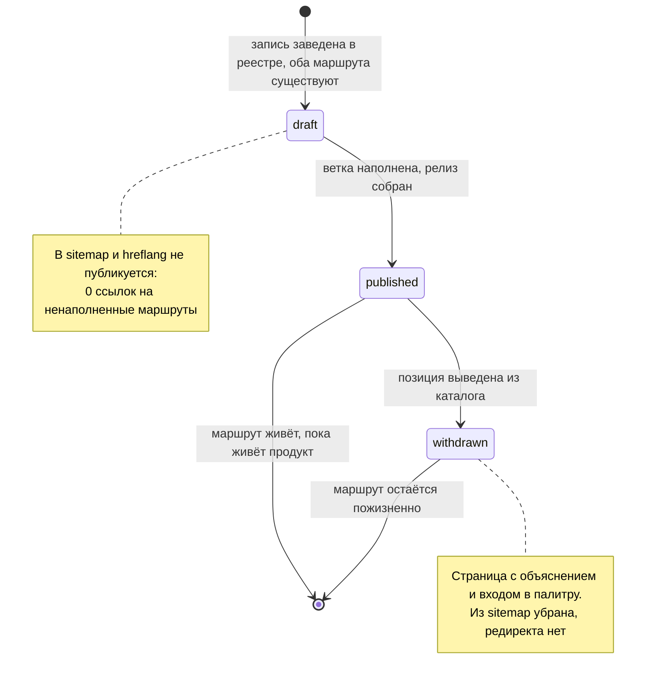
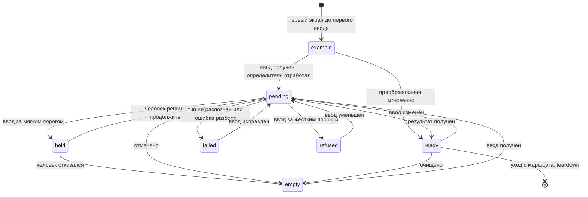
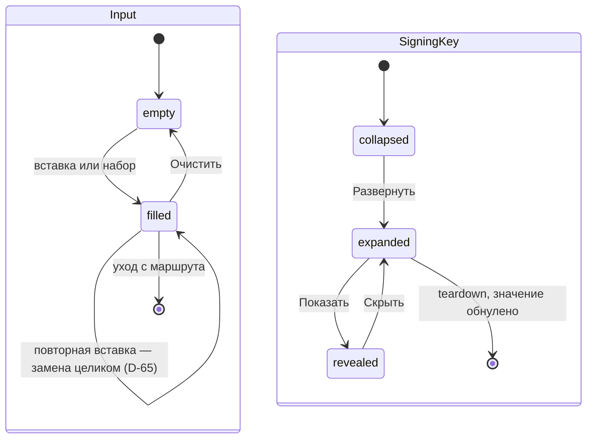
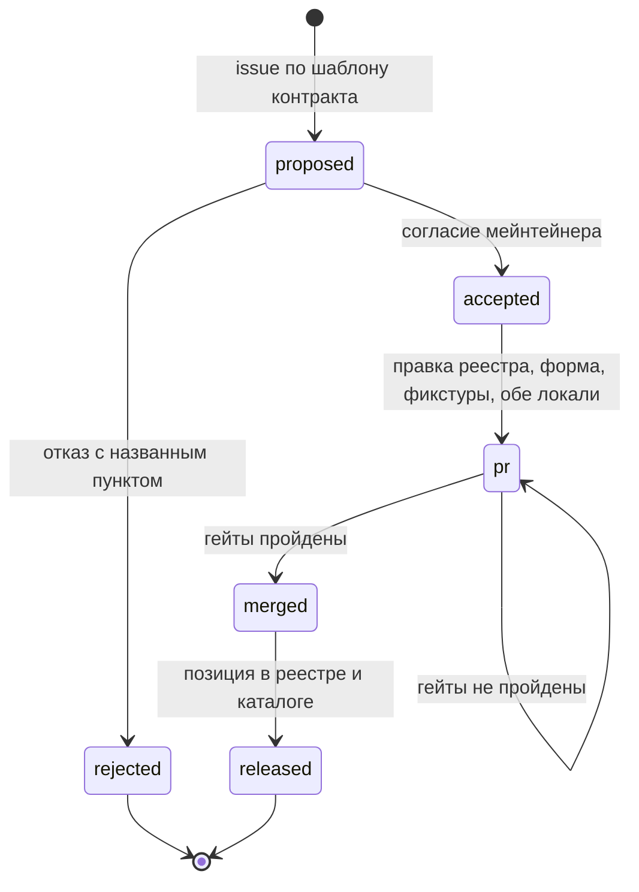
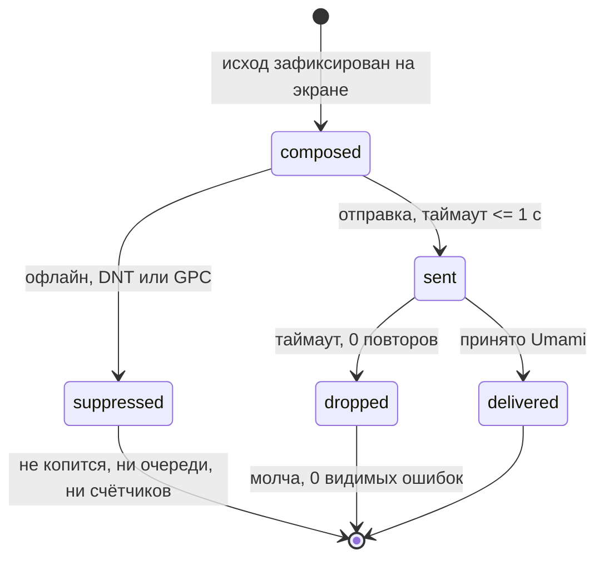

# DoKey — Модель данных

**Дата:** 2026-09-07 · **Статус:** черновик к согласованию
**Опирается на:** [glossary.md](glossary.md) (ENT-01…ENT-30 включая ENT-21a, ROLE-01…ROLE-06, §3 глаголы),
[prd.md](prd.md) (REQ-*, NFR-*, §6 «Интеграции и данные»), [user-stories.md](user-stories.md)
(US-002, US-006, US-013, US-038), [user-flows.md](user-flows.md) (FL-07, FL-19),
[decisions.md](decisions.md) (D-04, D-05, D-13, D-14, D-16, D-21, D-25, D-30, D-38, D-41, D-44,
D-46, D-49, D-51, D-56, D-63, D-67, D-71, D-73, D-81, D-82, D-83)
**Не содержит:** имён событий аналитики (их форму фиксирует analytics-spec, корень — глоссарий §3),
выбора формата и сериализации файлов реестра (решение реализации), схемы Umami (чужой продукт —
§2.4), архитектурных обоснований (decisions.md).
**Новые вопросы:** Q-138…Q-142 в [open-questions.md](open-questions.md).
**Ревизия 2026-09-07:** девять вопросов первой редакции (Q-129…Q-137) закрыты решениями D-81, D-82 и
D-83; их ответы внесены в текст, и ни одной ссылки на открытый вопрос в документе не осталось.

## 0. Соглашения

**Базы данных у продукта нет и не будет.** Персистентность равна нулю (REQ-TRUST-02, NFR-10),
имени таблицы у сущности не существует по построению (глоссарий §0). Поэтому модель данных здесь —
не схема БД, а описание **четырёх контуров**, в которых данные живут разное время и по разным
правилам. Слова «таблица», «строка» и «первичный ключ» в тексте не употребляются: замена их на
«запись», «поле» и «ключ» — не стилистика, а предохранитель против дрейфа к серверу, отменённому
D-05.

| Контур | Где живёт | Время жизни | Кто владеет | ENT-NN |
|---|---|---|---|---|
| **К-1 · Сборка** | Репозиторий → артефакт релиза; данные компилируются в статику и после сборки неизменны | От релиза до релиза | ROLE-03, гейты ROLE-06 | ENT-01…ENT-03, ENT-05…ENT-07, ENT-10, ENT-11, ENT-19, ENT-21, ENT-21a, ENT-22, ENT-25…ENT-27 |
| **К-2 · Память вкладки** | Состояние оболочки и буфер переноса ENT-30; никуда не отправляется, teardown маршрута обнуляет (ENT-23) | От ввода до ухода с маршрута или закрытия вкладки | ROLE-01 — фактически, а не по выданному праву | ENT-04, ENT-08, ENT-09, ENT-12…ENT-18, ENT-20, ENT-23, ENT-24, ENT-30 |
| **К-3 · Кеш устройства** | Cache Storage service worker: precache оболочки и ядра, runtime-кеш остального (REQ-CORE-04) | До смены версии кеша | Браузер | Собственного ENT-NN не имеет: хранит артефакт К-1, а не данные пользователя |
| **К-4 · Аналитика** | Umami на своём VPS за прокси на своём origin `dokey.app/s/event` | Пока живёт VPS | ROLE-03 | ENT-28, ENT-29 |

**Правило состава полей.** Поле существует, только если его требует REQ-NN, NFR-NN или прямое
следствие ENT-NN; у каждого поля в §2 назван источник. Поля «на вырост» перечислены явно в §2.7
как **анти-поля** — не потому, что забыты, а чтобы их появление читалось как дефект, а не как
улучшение схемы. Поле, которое требованию нужно, но у которого не определён владелец, помечено **⚠**
и вынесено в открытый вопрос — такое одно (`Tool.example`, Q-137).

**Правило имён.** Имена сущностей — кодовые имена глоссария §1, единственное число, без изменений.
Имена полей — английские, в том же стиле. Там, где глоссарий имени не закрепил (манифест
PWA), это сказано вслух, а не додумано молча; единичная фикстура имя получила — ENT-21a `Fixture` (D-83).

**Что здесь считается ключом.** Ключей три вида, и ни один не суррогатный: `id` записи реестра
(публичен, уходит в аналитику, неизменен после релиза навсегда — D-82 п. 2), `path` маршрута
(публичен, на нём стоит канал D-07, пожизненный — D-82 п. 3) и `id` пункта контракта (публичен, им формулируется отказ, D-21).
Автоинкрементов и «технических идентификаторов» в модели нет: генератор UUID — позиция каталога,
а не источник ключей продукта.

---

## 1. ER-диаграмма

Покрывает все ENT-01…ENT-30, включая ENT-21a. Границы контуров показаны комментариями. Сущности без
атрибутов — механизмы (ENT-17, ENT-19, ENT-23, ENT-30) и производные множества (ENT-02, ENT-08) — на
диаграмме есть, потому что несут связи; почему у них нет полей, разобрано в §2.6.

```mermaid
erDiagram
    %% ===== К-1 · Сборка: реестр, маршруты, контент =====
    ToolRegistry  ||--|{ Tool           : "содержит запись"
    ToolRegistry  ||--|{ Locale         : "ветвит по"
    Catalog       ||--|{ Tool           : "состоит из"
    Tool          ||--|{ Route          : "занимает по одному на локаль"
    Tool          ||--|| ToolLanding    : "предъявляет"
    Tool          ||--|{ SizeThreshold  : "объявляет"
    Tool          ||--o{ Fixture        : "ожидается кандидатом в"
    Locale        ||--o{ Route          : "определяет ветку"
    Route         ||--o| ToolLanding    : "несёт"
    Route         ||--o| StaticPage     : "несёт"
    ToolLanding   ||--|{ FaqItem        : "включает 3..5"
    FixtureCorpus ||--|{ Fixture        : "состоит из"

    %% ===== К-1 · Контракт, профиль, поставка =====
    ToolContract   ||--|{ ContractClause : "состоит из пунктов"
    ContractClause }o--o| Tool           : "проверяется при приёме"
    ContractClause }o--o| FixtureCorpus  : "требует пополнения"
    ContractClause }o--o| ToolRegistry   : "требует записи в"
    BuildProfile   ||--o{ ContainerImage : "определяет состав"
    BuildProfile   ||--|| ToolRegistry   : "собирается из"

    %% ===== К-1/К-2 · Механизмы входа =====
    EntryPoint     ||--o| CommandPalette : "реализуется как"
    EntryPoint     ||--o| SearchShortcut : "реализуется как"
    EntryPoint     ||--|| Route          : "ведёт на"
    CommandPalette }o--|{ Tool           : "ищет по каталогу и недавним"
    SearchShortcut ||--|| Route          : "открывает с фокусом в поле"

    %% ===== К-2 · Память вкладки =====
    AppShell          ||--|| Route             : "держит текущий"
    AppShell          ||--o{ Tool              : "помнит недавние"
    AppShell          ||--o| Input             : "держит"
    AppShell          ||--|| EgressCounter     : "показывает"
    AppShell          ||--|| CommandPalette    : "содержит"
    Input             ||--|| InputStats        : "даёт после первого ввода"
    Input             ||--o{ TypeCandidate     : "ранжируется в"
    Input             ||--o| Token             : "разбирается как"
    Input             ||--o| Result            : "преобразуется в"
    Result            ||--o| Input             : "возвращается петлёй продолжить с этим"
    TypeDetector      ||--|{ TypeCandidate     : "производит"
    TypeDetector      }o--|| SpecificityLadder : "ранжирует по"
    SpecificityLadder ||--|{ TypeCandidate     : "задаёт ступень"
    TypeCandidate     }o--|| Tool              : "называет инструмент"
    TypeCandidate     ||--o| Chip              : "показывается чипсом типа"
    Chip              }o--o| Result            : "меняет применённое преобразование"
    Token             ||--o| SigningKey        : "проверяется ключом HS256"
    SizeThreshold     }o--o| Input             : "проверяет размер"
    RouteTeardown     }o--|| Route             : "срабатывает при уходе с"
    RouteTeardown     ||--o{ Token             : "обнуляет"
    RouteTeardown     ||--o{ SigningKey        : "обнуляет"
    RouteTeardown     ||--o{ Result            : "обнуляет производные"
    AppShell          ||--o| HandoffBuffer     : "держит однократный буфер"
    Result            ||--o| HandoffBuffer     : "кладёт значение петлёй"
    HandoffBuffer     ||--o| Input             : "наполняет поле при переходе"
    RouteTeardown     ||--o{ HandoffBuffer     : "обнуляет непрочитанный"

    %% ===== К-4 · Аналитика =====
    AnalyticsEvent }o--|| FieldAllowlist : "ограничен закрытым списком"
    AnalyticsEvent }o--o| Tool           : "называет идентификатором"
    AnalyticsEvent }o--o| Route          : "несёт url и реферер"
    AnalyticsEvent }o--o| Result         : "фиксирует исход и категорию отказа"
    EgressCounter  }o--o{ AnalyticsEvent : "не учитывает — свой origin"
```

**Чего на диаграмме нет и не будет:** ни одной связи, ведущей от ENT-12…ENT-16 наружу вкладки.
Единственные рёбра, пересекающие границу браузера, входят в `AnalyticsEvent`, и все они упираются
в `FieldAllowlist` (§2.4). Это не свойство рисунка, а проверяемое утверждение: гейт CI REQ-METR-04
падает на любом новом ребре.

---

## 2. Сущности

### 2.1 Контур К-1 · Сборка

#### ToolRegistry (ENT-03) — реестр инструментов

Единственный источник **всех** маршрутов сборки, sitemap, `hreflang`, записи в палитре и лендинга
(REQ-CORE-01). Не запись, а коллекция: собственных полей два, остальное — инварианты.

**Типов записи два — инструмент и служебная страница** (D-82 п. 1). Служебная страница перестала быть
отдельной сущностью и стала вторым типом записи того же реестра: её маршруты попадают в sitemap и
`hreflang` по общим правилам, добавление страницы не правит оболочку, а в P0b EN-ветка заводится ей
так же, как инструменту, — маршрутом в статусе `draft`.

| Поле | Тип | Обяз. | Ограничения и источник |
|---|---|---|---|
| `entry` | `(Tool \| StaticPage)[]` | да | 1..N; в P0a — шесть инструментов (REQ-TOOL-01…06) и четыре служебные страницы (D-82 п. 1). Добавление записи любого типа не правит оболочку и роутер: diff PR не содержит их файлов (US-002 крит. 1) |
| `locale` | `Locale[]` | да | Ровно 2 — `ru` и `en`; EN заложена в P0a и наполняется в P0b (REQ-CORE-06) |

**Инварианты.** Множество маршрутов, развёрнутых из реестра, совпадает с sitemap — 0 расхождений,
гейт CI (US-002 крит. 2). Добавление записи не увеличивает initial JS (NFR-03). Запрос маршрута,
которого в реестре нет, даёт сообщение `Такого инструмента нет.` и действие «Открыть палитру» (US-002 крит. 4, D-63).

**Связи.** `ToolRegistry (1) — (1..N) Tool`; `ToolRegistry (1) — (2) Locale`.

**Доступ.** Реестр читается на сборке целиком и один раз; в рантайм попадает его производная —
карта `path → Tool` (§2.5). Индекса по самому реестру не существует: шесть записей.

#### Tool (ENT-01) — инструмент

| Поле | Тип | Обяз. | Ограничения и источник |
|---|---|---|---|
| `id` | `string` (slug) | да | Ключ записи, ASCII kebab-case, уникален и **совпадает с сегментом RU-маршрута**. Неизменен после релиза навсегда: уходит в аналитику (ENT-29), и переименование рвёт сравнение релизов в PM-01…PM-03. Гейт: множество `id` сборки — надмножество предыдущей (D-82 п. 2) |
| `name` | `string` | да | **Продуктовое имя** из глоссария §4 («JSON Workbench», «JWT Inspector», …), уникально в каталоге — гейт CI. Живёт в палитре, хлебных крошках и справке; поисковое имя — отдельное поле `ToolLanding.h1` (D-56) |
| `synonyms` | `string[]` | нет | Русские и обиходные написания («джсон», «форматтер», «база 64»). Палитра ищет по трём источникам — продуктовое имя, поисковое имя, синонимы — и нормализует русскую раскладку `жсон` → `json` (D-82 п. 4) |
| `chunk` | module ref | да | Ленивый чанк логики (REQ-CORE-05). В initial JS ≤ 40 KB gzip не входит (NFR-03) |
| `usesEditor` | `boolean` | да | `true` ровно у JSON Workbench (REQ-TOOL-08). При `false` чанк редактора не запрашивается — прямое условие NFR-06 |
| `sensitiveInput` | `boolean` | да | `true` → маршрут обязан выполнять teardown ENT-23 (D-25 п. 3). В P0a `true` у JWT Inspector. Поле подтверждено D-82 п. 1: teardown принадлежит маршруту, состав обнуляемого — инструменту, и без признака маршрут не знает, что охраняет |
| `threshold` | `SizeThreshold[]` | да | Таблица: по записи на каждую пару «класс платформы × ось» (D-73 п. 1). Оси P0a — `inputSize`, `jsonDepth` (JSON), `batchSize` (генератор); в P0b добавляется `hashInput`. До замера на В-2 числа предварительные, помечены `provisional` (D-51) |
| `detectorStep` | `{ step, recognizer, meaningfulWhen }` | нет | Ступень REQ-INPUT-01, которую обслуживает инструмент; `step` уникальна в пределах сборки. Ступень принадлежит записи реестра, а не константе определителя: при неполном каталоге (жёсткий минимум M-02) отсутствующая ступень не активна, не выигрывает ранжирование и не показывается чипсом — D-49 п. 3. **`meaningfulWhen` — предикат осмысленности, объявленный рядом с распознавателем** (D-73 п. 3): именно он даёт `TypeCandidate.meaningful`, и без него REQ-INPUT-01 не имеет признака победы. Базовая редакция девяти предикатов — таблица D-73 п. 3. Гейт CI: ни одна ступень не ссылается на инструмент вне реестра сборки |
| `route` | `Route[]` | да | По одному маршруту на локаль; EN-маршрут может быть в статусе `draft` (US-006 крит. 1) |
| `landing` | `ToolLanding` | да | 1:1 с наполненным маршрутом (REQ-CORE-02, REQ-CONTENT-03) |
| `example` | `string` | нет | Разобранный пример первого экрана до первого ввода (REQ-CONTENT-02): синтетический (REQ-TRUST-06), отрендерен на сборке — виден без JS. Поле принадлежит записи реестра (D-82 п. 5); пусто только у генератора, где роль примера играет сгенерированное значение (D-81) |

**Связи.** `Tool (1) — (1..N) Route` (N = число наполненных локалей); `(1) — (1) ToolLanding`;
`(1) — (1..N) SizeThreshold`; `(1) — (0..N) Fixture` через ожидаемого кандидата;
`(0..N) — (1) Catalog`.

**Индексы.** Один: `id → Tool`, плоская карта в памяти оболочки. Поиск в палитре по `name` при шести
записях выполняется линейным проходом — префиксный индекс здесь дороже задачи и в бюджет NFR-03 не
берётся. Порог, за которым это перестанет быть верным, — десятки позиций, то есть за пределами P1.

#### Route (ENT-05) — маршрут

| Поле | Тип | Обяз. | Ограничения и источник |
|---|---|---|---|
| `path` | `string` (URL path) | да | Статический URL, отрендерен в HTML на сборке (REQ-CORE-02); уникален в пределах локали; для инструмента совпадает с `Tool.id`. **Неизменен и пожизненен:** маршрут выведенной позиции остаётся и отдаёт объяснение с входом в палитру, из sitemap запись убирается, редиректа нет (D-82 п. 3) |
| `locale` | `enum {ru, en}` | да | REQ-CORE-06 |
| `owner` | `Tool \| StaticPage` | да | Ровно один владелец. **Служебные страницы — второй тип записи того же реестра** (D-82 п. 1): их маршруты, sitemap и `hreflang` работают по общим правилам, добавление страницы не правит оболочку |
| `contentStatus` | `enum {draft, published, withdrawn}` | да | `draft` — маршрут заведён, ветка не наполнена: в sitemap и `hreflang` не публикуется, 0 ссылок на ненаполненные маршруты (US-006 крит. 2). `withdrawn` — позиция выведена из каталога: маршрут остаётся, отдаёт объяснение, из sitemap убран (D-82 п. 3). Жизненный цикл — §3.1 |

**Производные, которые не хранятся:** `canonical`, набор `hreflang`, вхождение в sitemap,
необходимость teardown (`= owner.sensitiveInput`). Все вычисляются из реестра на сборке — иначе у
них появляется второй источник истины, запрещённый REQ-CORE-01.

**Связи.** `Route (1) — (0..1) ToolLanding`; `(1) — (0..1) StaticPage`; `Locale (1) — (0..N) Route`;
`Route (1) — (0..1) RouteTeardown`.

**Индексы.** `path → Route` — единственный горячий индекс продукта: по нему работает клиентский
роутер в бюджете «переход ≤ 300 мс» (NFR-05), он же отвечает на «маршрута нет» (US-002 крит. 4).
Строится на сборке, в рантайме — плоская карта.

#### ToolLanding (ENT-06) и FaqItem

| Поле | Тип | Обяз. | Ограничения и источник |
|---|---|---|---|
| `route` | `Route` | да | 1:1; в P0a — RU-ветка |
| `title` | `string` | да | Уникален по всей сборке — гейт CI (REQ-CONTENT-03, backlog TECH-06) |
| `description` | `string` | да | Уникален по всей сборке — тот же гейт |
| `h1` | `string` | да | **Поисковое имя** — формулировка основного запроса кластера (D-56, D-07); присутствует без выполнения JS (REQ-CORE-02). Непустое — гейт CI |
| `intro` | `string` | да | Короткий вводный абзац. Длинного SEO-текста нет (D-17) |
| `faq` | `FaqItem[]` | да | 3 ≤ N ≤ 5 (REQ-CONTENT-03) |

`FaqItem`: `question` (`string`, да), `answer` (`string`, да), `order` (`integer`, да — порядок
устойчив между сборками, иначе diff лендинга шумит на каждом релизе).

**Связи.** `ToolLanding (1) — (3..5) FaqItem`; `(1) — (1) Route`.
**Индексы.** Нет: лендинг собирается один раз и отдаётся статикой.

#### StaticPage (ENT-07) — служебная страница

| Поле | Тип | Обяз. | Ограничения и источник |
|---|---|---|---|
**Второй тип записи реестра, а не отдельная сущность** (D-82 п. 1): маршрут берётся оттуда же, откуда
маршрут инструмента, и по тем же правилам попадает в sitemap и `hreflang`.

| Поле | Тип | Обяз. | Ограничения и источник |
|---|---|---|---|
| `id` | `string` (slug) | да | **Страниц четыре и один раздел** (D-82 п. 1): «Как это проверить», «Держать под рукой», бенчмарк TTR, «Развёртывание в своей сети»; «Об обязательствах» остаётся разделом внутри развёртывания (REQ-CONTENT-05), а не пятой страницей |
| `route` | `Route[]` | да | По одному маршруту на локаль — общее правило реестра (D-82 п. 1) |
| `title` | `string` | да | Уникален по всей сборке; тот же гейт CI, что у лендингов |
| `h1` | `string` | да | Состав записи по D-82 п. 1. Присутствует без выполнения JS (REQ-CORE-02) |
| `contentStatus` | `enum {draft, published, withdrawn}` | да | Общий с маршрутом цикл §3.1: EN-ветка страницы заводится `draft` так же, как у инструмента |
| `description` | `string` | ⚠ | Гейт уникальности `title`/`description` сформулирован для лендингов (REQ-CONTENT-03); распространяется ли он на служебные страницы, состав записи D-82 п. 1 не говорит — **Q-141** |

**Связи.** `StaticPage (1) — (1..N) Route` — по локалям, когда появится EN.
**Индексы.** Нет: обслуживается общим `path → Route`.

#### Locale (ENT-11) — локаль

| Поле | Тип | Обяз. | Ограничения и источник |
|---|---|---|---|
| `code` | `enum {ru, en}` | да | Языковая ветка маршрутов (REQ-CORE-06). Не часовой пояс и не формат чисел: поведение Unix Timestamp Converter от локали не зависит |
| `isDefault` | `boolean` | да | Ровно одна локаль по умолчанию (`ru` в P0a). Нужна для `hreflang x-default`, который реестр обязан сгенерировать (REQ-CORE-01) |

#### SizeThreshold (ENT-22) — порог

| Поле | Тип | Обяз. | Ограничения и источник |
|---|---|---|---|
| `tool` | `Tool` | да | Часть ключа |
| `platformClass` | `enum {desktop, mobileSafari}` | да | Часть ключа: на мобильном Safari пороги ниже, при этом 0 сценариев падает без сообщения (NFR-14) |
| `axis` | `enum {inputSize, jsonDepth, batchSize, hashInput}` | да | Часть ключа (D-73 п. 1): размер ввода — у всех инструментов, глубина вложенности — у JSON Workbench, размер пакета — у генератора, порог хэширования — с P0b. Публикуются все оси инструмента, а не только размер |
| `soft` | `integer` (байты) | да | Мягкий порог: предупреждение с возможностью продолжить (REQ-LIMIT-03). Выводится замером: наибольший размер, на котором опорная конфигурация укладывается в p50 ≤ 1,5 с (NFR-01, D-51 п. 1) |
| `hard` | `integer` (байты) | да | Жёсткий порог: отказ с объяснением через позиционирование, а не как ошибка. Выводится замером: половина наименьшего размера, на котором операция не завершается за 10 с или вкладка падает по памяти, округлённая вниз (D-51 п. 1). Инвариант `hard > soft` |
| `provisional` | `boolean` | да | `true` — число предварительное, замера ещё не было. Разработка идёт, **релиз не выпускается**: гейт CI не пропускает сборку, в реестре которой есть хоть один `provisional` (D-51 п. 5) |
| `source` | `enum {measured, inherited}` | да | `measured` — получено процедурой D-51; `inherited` — единый порог оболочки на размер поля ввода у инструментов, где предел недостижим на разумных вводах (URL, Timestamp, UUID; D-51 п. 7). Пустой записи не бывает ни у одного инструмента |

**Инвариант публикации.** Оба числа стоят в документации инструмента **до** релиза (REQ-LIMIT-03),
и в тексте они подставляются из реестра, а не пишутся строкой (D-51 п. 8 последствий). Порог,
известный только коду, требованию не удовлетворяет.
**Связи.** `Tool (1) — (1..N) SizeThreshold`; `SizeThreshold (0..N) — (0..1) Input` при проверке.
**Индексы.** `(tool, platformClass, axis) → SizeThreshold` — карта на сборке, одно обращение на ввод.
Ключ именно тройной: ось добавлена D-73 п. 1, и пара «инструмент × класс» адресует уже не одну запись.

#### FixtureCorpus (ENT-21) и Fixture

Единичный образец закреплён в глоссарии как **ENT-21a `Fixture`** (D-83): коллекция —
`FixtureCorpus`, запись — `Fixture`.

| Поле | Тип | Обяз. | Ограничения и источник |
|---|---|---|---|
| `id` | `string` (slug) | да | Уникален в корпусе; называется в отчёте упавшего теста |
| `sample` | `string` | да | **Только синтетическое значение:** 0 боевых токенов и ключей (REQ-TRUST-06, US-013 крит. 3) |
| `expectedStep` | `enum` ступени лестницы | да | Ожидаемая ступень ENT-19 (D-83 п. 1) |
| `expectedChips` | `enum[]` ступеней | да | **Ожидаемый состав и порядок чипсов** (D-73 п. 3, D-66). У неоднозначного образца размечается именно порядок, а не единственный ответ: иначе фикстура проверяет вкус разметчика, а не механизм |
| `ambiguous` | `boolean` | да | Заведомо неоднозначные образцы присутствуют явной группой (US-013 крит. 1, D-83 п. 1) |

Ожидаемый инструмент отдельным полем **не хранится**: `Tool.detectorStep.step` уникальна в пределах
сборки, поэтому инструмент выводится из `expectedStep` однозначно. Кандидат ENT-18 (тип плюс
инструмент) собирается при прогоне, а не лежит в корпусе — правило состава полей §0.

**Инварианты.** Корпус прогоняется целиком; падение хотя бы одной фикстуры останавливает сборку
(US-013 крит. 2). PR, вводящий новый тип данных без фикстур, отклоняется по пункту контракта
(US-013 крит. 4, REQ-DIST-04).
**Связи.** `FixtureCorpus (1) — (1..N) Fixture`; `Fixture (0..N) — (1) Tool`.
**Индексы.** `expectedStep → Fixture[]` — не для скорости, а для отчёта: при правке лестницы нужно
видеть, какая ступень просела. Сам прогон линейный.

#### ToolContract (ENT-25) и ContractClause

| Поле | Тип | Обяз. | Ограничения и источник |
|---|---|---|---|
| `id` | `string` (slug) | да | **Публичен и стабилен:** отказ всегда называет пункт, а не вкус (D-21, REQ-DIST-04); смена id обесценивает уже отправленные отказы |
| `text` | `string` | да | Формулировка пункта; шаблон issue повторяет её и работает как самофильтр (FL-19 шаг 2) |
| `order` | `integer` | да | Порядок предъявления в репозитории |

Состав P0a — десять пунктов: `computable-in-browser`, `text-or-small-file`, `seconds-not-minutes`,
`audience-a01` (четыре критерия D-04), `single-form` (REQ-TOOL-07), `chunk-budget` (NFR-06),
`fixtures` (REQ-INPUT-06), `locale-structure` (наполненный текст текущей локали плюс заведённый маршрут второй в статусе `draft` — D-72 п. 4),
`registry-entry` (REQ-CORE-01), `no-maintenance-promise` (D-37).

**Связи.** `ToolContract (1) — (10) ContractClause`; `ContractClause (0..N) — (0..1) Tool` в момент
приёма позиции.

#### BuildProfile (ENT-26) — профиль сборки

| Поле | Тип | Обяз. | Ограничения и источник |
|---|---|---|---|
| `name` | `enum {public, selfhosted}` | да | Выбирается **на сборке**: «выключить аналитику в настройках» — операция, которой не существует (ENT-26) |
| `analytics` | `boolean` | да | `false` при `selfhosted`: аналитика физически отсутствует в артефакте, а не отключена конфигурацией (REQ-DIST-03) |

**Инвариант обоих профилей:** сторонних origin ровно 0 (NFR-09).
**Связи.** `BuildProfile (1) — (0..N) ContainerImage`; `(1) — (1) ToolRegistry`.

#### ContainerImage (ENT-27) — образ

| Поле | Тип | Обяз. | Ограничения и источник |
|---|---|---|---|
| `tag` | `string` | да | Пиннится ROLE-02; пиннинг объясняется на странице развёртывания (REQ-CONTENT-04) |
| `digest` | `sha256` | да | Предмет сверки целостности; сверка воспроизводима (NFR-16) |
| `buildProfile` | `enum` | да | Всегда `selfhosted` (REQ-DIST-03) |
| `signature` | Sigstore keyless | да | На каждой сборке (REQ-DIST-02) |
| `provenance` | attestation | да | На каждой сборке |
| `sbom` | документ | да | На каждой сборке; читается ROLE-05 |
| `builtAt` | ISO 8601 | да | **Единственная временна́я отметка во всей модели.** Показывается в подвале приложения (D-67 п. 6) — так ROLE-02 отличает пересборку от новой версии при запиннутом теге, не делая ни одного сетевого запроса; публикуется и как дата последней успешной пересборки на странице образа (REQ-DIST-05, D-59) |

**Инвариант рантайма:** 0 сетевых обращений (NFR-16). Образ ничего не хранит: контейнер отдаёт
статику и состояния между запусками не имеет — поэтому у поставки нет миграции данных (§7.6).

### 2.2 Контур К-2 · Память вкладки

Всё здесь живёт только в памяти вкладки, никуда не отправляется и уничтожается teardown-ом
маршрута. Ни у одной сущности контура нет `id`, `createdAt` и ссылки на предыдущее значение:
идентификатор нужен хранению, отметка времени — истории, ссылка на предыдущее — журналу. Ни того,
ни другого, ни третьего не существует (D-13 п. 4, NFR-10).

#### AppShell (ENT-04) — оболочка

| Поле | Тип | Обяз. | Ограничения и источник |
|---|---|---|---|
| `currentRoute` | `Route` | да | Переход — клиентская навигация через History API без перезагрузки (REQ-CORE-03) |
| `input` | `Input` | нет | Переносится при переходе между инструментами **значением, а не состоянием** (D-46 п. 1): дерево, модель редактора, результат, счётчики и выбор чипса оставленного инструмента не сохраняются ничем. Носитель переноса — `HandoffBuffer` (ENT-30), однократная ячейка в памяти роутера, обнуляемая чтением; ни поле A, ни поле B перехода не переживают — переживает значение, и только в памяти вкладки (D-46 п. 2, п. 5) |
| `recentTool` | `Tool[]` | нет | «Недавние» — только об инструментах и только в пределах жизни оболочки (глоссарий §4, §6). **До пяти записей; вытеснение по давности открытия, повторное открытие поднимает позицию наверх** (D-83 п. 2). Перезагрузку не переживают и места в закрытом списке служебных ключей D-71 не получают: это удобство внутри сессии, а не механизм входа — для входа есть три пути D-62 |
| `egressCounter` | `EgressCounter` | да | REQ-TRUST-04 |
| `theme` | `enum {system}` в P0a | нет | Оболочка следует системной настройке средствами CSS; значений `light`/`dark` как **выбора человека** в P0a не существует, хранить нечего (D-58). Ручной переключатель и место хранения — P0b |
| `online` | `boolean` | производное | Статус «Офлайн» в шапке; формулируется как обещание, а не как поломка (глоссарий §4) |

**Связи.** `AppShell (1) — (1) Route`; `(1) — (0..N) Tool` (недавние); `(1) — (0..1) Input`;
`(1) — (1) CommandPalette`; `(1) — (1) EgressCounter`.

#### CommandPalette (ENT-09) — командная палитра

| Поле | Тип | Обяз. | Ограничения и источник |
|---|---|---|---|
| `query` | `string` | нет | Поиск по каталогу и недавним (REQ-ENTRY-01). Всегда загружена, ленивым чанком не является (ENT-09) |
| `candidate` | `Tool[]` | производное | **Ищет то, что можно открыть, — шесть инструментов с маршрутами** (D-81 п. 4): палитра и определитель входят в восемь позиций M-02, но записей в палитре не имеют, потому что «открыть определитель» бессмысленно; служебные страницы в палитру в P0a не попадают. Поиск идёт **по трём источникам** — продуктовое имя, поисковое имя лендинга (D-56) и `Tool.synonyms`, — плюс нормализация русской раскладки `жсон` → `json` (D-82 п. 4). Плюс список недавних |

**Инвариант.** Любой инструмент достижим не более чем за два нажатия (REQ-ENTRY-01, NFR-05).
Мобильный путь к палитре — постоянная кнопка в шапке (D-62).

#### Input (ENT-12) — ввод

| Поле | Тип | Обяз. | Ограничения и источник |
|---|---|---|---|
| `value` | `string` | нет | Пусто до первого ввода. 0 байт в `localStorage`, `sessionStorage`, URL, query, фрагменте и истории браузера (NFR-10). Никогда не заменяется результатом (REQ-INPUT-03) |
| `kind` | `enum {text, file}` | да | Файл — Base64, в P0b хэш (REQ-TOOL-03) |
| `file` | `File` handle | нет | Обязателен при `kind = file`. Читается частями через `File` API, целиком в память не поднимается (REQ-LIMIT-05) |

**Связи.** `Input (1) — (1) InputStats`; `(1) — (0..N) TypeCandidate`; `(1) — (0..1) Token`;
`(1) — (0..1) Result`; `Result (0..1) — (1) Input` через петлю «продолжить с этим».
**Индексы.** Нет и быть не может: ввод — одно значение, а не выборка. Единственная структура над
данными пользователя — плоский массив узлов дерева с индексом по видимому диапазону, и он
принадлежит результату (§2.5).
Повторная вставка заменяет содержимое целиком через буфер отмены поля; правка сохраняет ручной выбор чипса, вставка и «Очистить» его сбрасывают (D-65).

#### InputStats (ENT-16) — счётчик ввода

| Поле | Тип | Обяз. | Ограничения и источник |
|---|---|---|---|
| `charCount` | `integer` | производное | REQ-INPUT-04 |
| `byteCount` | `integer` | производное | Байты **UTF-8**; единица записи в русском интерфейсе — `Б` (D-80) |
| `lineCount` | `integer` | производное | REQ-INPUT-04 |
| `wordCount` | `integer` | производное | REQ-INPUT-04 |

Метаданные ввода, а не преобразование: показываются всегда после первого ввода и распознавания не
требуют (D-16 п. 1). **Позицией каталога в P0a счётчик не является** (D-57): позиция — это то, у
чего есть собственный маршрут и лендинг; отдельной позицией он заводится в P0b. Событием METR-01
его появление не является: результатом считается операция над вводом человека либо
копирование показанного значения (D-52).

#### Result (ENT-13) — результат

| Поле | Тип | Обяз. | Ограничения и источник |
|---|---|---|---|
| `value` | `string` | нет | Пусто в состояниях `example`, `empty`, `held`, `failed`, `refused`. Появляется в отдельной области; ввод в неё не переезжает (REQ-INPUT-03) |
| `status` | `enum {example, empty, held, pending, ready, failed, refused}` | да | Жизненный цикл — §3.2 |
| `producedBy` | `Tool` | да | Инструмент победившего кандидата |
| `action` | `enum` глаголов | да | Корень из глоссария §3: `decode`, `encode`, `format`, `minify`, `validate`, `verify`, `convert`, `parse`, `generate`. Тот же корень стоит в подписи кнопки и в имени события |
| `failureReason` | `enum {type_not_detected, threshold_exceeded, parse_error}` | нет | Обязателен при `status ∈ {failed, refused}`. Ровно три категории REQ-METR-02; значение уходит наружу и потому входит в закрытый список ENT-29 |
| `errorPosition` | `integer` | нет | Позиция ошибки разбора; показывается за ≤ 300 мс и ввод не очищает (NFR-15) |
| `continuable` | `boolean` | производное | Источником петли является только результат: значение ENT-15 не передаётся ни при каких условиях (REQ-INPUT-05, D-26 п. 4). Шаг обратим на один назад через буфер возврата (D-69). На пустом результате `false` — действия на экране нет; поданное петлёй значение проходит пороги как обычная вставка, за жёстким порогом во ввод не подаётся (D-71) |

**Связи.** `Input (1) — (0..1) Result`; `Result (0..1) — (1) Input` (петля);
`Result (0..N) — (0..1) Chip`; teardown обнуляет производные значения.

#### Token (ENT-14) — токен

| Поле | Тип | Обяз. | Ограничения и источник |
|---|---|---|---|
| `raw` | `string` | да | JWT во вводе JWT Inspector. Предъявительский документ: секретен наравне с ключом, правила D-25 распространяются на оба поля |
| `header`, `payload`, `signature` | `string` | производные | Сегменты (REQ-TOOL-02); названия без перевода (глоссарий §4) |
| `alg` | `string` | производное | Из header. Определяет алгоритм проверки и **не подменяется никогда**: вне HS256 проверка не выполняется, `alg: none` даёт предупреждающий вердикт (D-68) |
| `exp`, `iat`, `nbf` | `integer` (unix) | нет | Claims; отсутствие любого — норма |
| `expired` | `boolean` | производное | `exp` в прошлом → «Истёк» (не «просрочен» и не «невалиден») |
| `signatureVerdict` | `enum {valid, mismatch, notChecked}` | производное | «Подпись верна / Подпись не совпала». Вердикт о подписи, а не о токене: «токен валиден» запрещено (глоссарий §4) |

**Инвариант.** `raw` и все производные обнуляются teardown-ом маршрута (ENT-23) и не попадают ни в
события, ни в тексты ошибок, ни в корпус фикстур (REQ-TRUST-06).

#### SigningKey (ENT-15) — ключ подписи

| Поле | Тип | Обяз. | Ограничения и источник |
|---|---|---|---|
| `value` | `string` | нет | Секрет HS256. **Не** `type="password"` внутри формы — иначе менеджер паролей предложит сохранить чужой секрет для нашего домена (D-25 п. 4); `autocomplete="off"`, `spellcheck="false"` (REQ-TRUST-05) |
| `collapsed` | `boolean` | да | Поле свёрнуто по умолчанию: `true` при входе на маршрут (REQ-TOOL-02) |
| `revealed` | `boolean` | да | Маскирование снимается действием `reveal`; по умолчанию `false` (REQ-TRUST-05) |

**Инвариант — единственный в модели без исключений:** значение не передаётся в петлю никогда, не
попадает в аналитику, тексты ошибок и фикстуры никогда, обнуляется teardown-ом маршрута всегда.
Три «никогда» и есть содержание ENT-15 как сущности.

#### TypeCandidate (ENT-18) — кандидат

| Поле | Тип | Обяз. | Ограничения и источник |
|---|---|---|---|
| `type` | `enum` ступени лестницы | да | Одна из девяти ступеней ENT-19; кандидат существует только при наличии инструмента с такой `Tool.detectorStep` в сборке (D-49 п. 3) |
| `tool` | `Tool` | да | Кандидат — тип данных **плюс** инструмент, который его обработает |
| `rank` | `integer` | производное | Позиция ступени в лестнице; побеждает самый специфичный кандидат с осмысленным результатом (REQ-INPUT-01) |
| `meaningful` | `boolean` | производное | Даёт ли кандидат осмысленный результат — второе условие победы |

**Анти-поле, названное решением:** `confidence`. Уверенность числом не показывается, единственного
правильного ответа определитель не выдаёт, ground truth для него не существует (D-14 п. 5). Поле,
которое нечем заполнить, отсутствует по существу, а не по экономии.

#### Chip (ENT-20) — чипс

| Поле | Тип | Обяз. | Ограничения и источник |
|---|---|---|---|
| `kind` | `enum {type, encode}` | да | `TypeChip` — альтернативный кандидат; `EncodeChip` — обратное направление (REQ-INPUT-02, REQ-INPUT-04) |
| `label` | `string` | да | Подпись из content-guide |
| `candidate` | `TypeCandidate` | нет | Обязателен при `kind = type` |
| `encoding` | `enum {base64, url}` | нет | Обязателен при `kind = encode`; чипс «хэшировать» включается в P0b |
| `selected` | `boolean` | да | Ручное переключение — прямой вход в PM-03 |

**Инвариант.** Чипс кодирования не срабатывает сам никогда: ни одно кодирование не применяется
автоматически (D-16 п. 3, REQ-INPUT-04). Сколько чипсов показывать, в каком порядке и что при
промахе ручного выбора — ручной выбор побеждает всегда (D-66); стоят рядом с полем ввода и видны, пока ввод непуст (D-80).

#### EgressCounter (ENT-24) — счётчик внешних запросов

| Поле | Тип | Обяз. | Ограничения и источник |
|---|---|---|---|
| `crossOriginCount` | `integer` | производное | Число записей `performance.getEntriesByType('resource')` с чужим origin (REQ-TRUST-04). В релизной сборке — 0 (NFR-09) |

Не хранится и не отправляется: это измерение, выполненное самой страницей, а не бейдж. Аналитика
через свой origin в число не входит честно (D-22 п. 2) — потому счётчик и считает не все запросы, а
кросс-origin. **Счётчик один, стоит в шапке и виден на всех маршрутах** (D-81 п. 2): двух чисел на
экране не бывает — при разной методике они разойдутся, и механизм предъявления станет поводом не
верить продукту. Строка доказательства первого экрана число не дублирует, а объясняет — что считается
и куда идёт аналитика («через свой origin, содержимое ввода не отправляется», D-80), со ссылкой на
«Как это проверить».

### 2.3 Контур К-3 · Кеш устройства

Собственных сущностей не имеет: service worker хранит **артефакт сборки** — оболочку и ядро в
precache, остальное в runtime-кеше (REQ-CORE-04). Данных пользователя там нет, и это проверяется
автотестом нулевой персистентности на каждой сборке (NFR-10).

Единственное, что продукт был бы вынужден положить в устройство сверх артефакта, — признак
«повторный визит» для одноразовой подсказки REQ-ENTRY-05. NFR-10 запрещает пользовательский ввод в
хранилищах и про служебные флаги молчит: без явного разрешения требование нереализуемо, а с
разрешением нужна оговорка на странице «Как это проверить», где сказано, чего в хранилищах нет —
D-71: заводится закрытый список служебных ключей, в P0a в нём ровно один — показана ли подсказка об активации ярлыка.

Версионирование кеша и судьба чанков предыдущей сборки — §7.2. Это единственное место во всём
продукте, где слово «миграция» означает работу, а не переименование.

### 2.4 Контур К-4 · Аналитика

#### AnalyticsEvent (ENT-28) — событие

Схему хранения задаёт Umami, а не мы. Поэтому моделируется **не таблица, а исходящая запись** — то,
что покидает браузер, и ровно это подлежит нашему контролю.

| Поле | Тип | Обяз. | Ограничения и источник |
|---|---|---|---|
| `name` | `string` | да | Форму задаёт analytics-spec, корень глагола — глоссарий §3. В P0a три события: результат получен (REQ-METR-01), результат не получен (REQ-METR-02), ручное переключение чипса типа (REQ-METR-03) |
| `url` | `string` | да | Несёт статический маркер запуска, когда визит пришёл из установленного PWA или ярлыка (D-41 п. 3). Маркер — константа, не производная от ввода |
| `referrer` | `string` | нет | Пустой реферер — признак прямого визита (PM-05) |
| `screenResolution` | `string` | да | Закрытый список ENT-29 |
| `browser` | `string` | да | Закрытый список ENT-29 |
| `ttr` | `integer` (мс) | нет | Одно несегментированное число: тип соединения и любые сегменты не добавляются (REQ-METR-06, D-40) |
| `toolId` | `string` | нет | `Tool.id` — ASCII-slug, совпадает с сегментом RU-маршрута и **не меняется после релиза никогда** (D-82 п. 2); гейт: множество `id` релизной сборки — надмножество предыдущей. Событие открытия инструмента несёт только его и новых полей не добавляет (REQ-METR-08, D-74) |
| `failureReason` | `enum` (3 значения) | нет | Обязателен у события «результат не получен» |

**Чего в записи нет:** содержимого ввода и результата, ключа, токена, их фрагментов и длин, по
которым содержимое восстановимо (REQ-TRUST-06, PRD §6). Идентификатора человека тоже нет: Umami
различает посетителя хешем от IP, user-agent и **соли с суточной ротацией** — хеш считается на
сервере, нами не отправляется, тридцатидневного окна не существует по построению, а штатный
показатель returning visitors не используется для выводов (D-41).

**Правила отправки.** Не отправляется офлайн и при `navigator.doNotTrack` или GPC (REQ-METR-05,
REQ-METR-07). Офлайн **не копится**: ни очереди, ни счётчиков на устройстве — часть событий
теряется, и это принято решением, а не упущено (D-44). Таймаут ≤ 1 с, 0 повторов, деградация
молча: 0 видимых ошибок и 0 мс прироста TTR (NFR-11).

**Связи.** `AnalyticsEvent (0..N) — (1) FieldAllowlist`; `(0..N) — (0..1) Tool`;
`(0..N) — (0..1) Route`; `(0..N) — (0..1) Result`.

**Индексы.** Внутри Umami — его собственные; продукт их не проектирует и не оптимизирует. Запросы
ROLE-03 — восемь прокси-метрик PM-01…PM-09, все агрегатные, все помесячные или пореализные. Ни одна
не требует выборки по отдельному визиту, и это не совпадение: выборка по визиту — первый шаг к
идентификации, отменённой D-05. Единицы счёта заданы D-55: **вход** — доставленное событие
открытия оболочки с маркером источника (единица PM-05…PM-08); **визит** — цепочка событий одной
вкладки от входа до 30 минут бездействия или её закрытия (единица PM-01, PM-02, PM-09). Обе
считаются по доставленным событиям: офлайновой части визита в данных не существует.

#### FieldAllowlist (ENT-29) — закрытый список полей

| Поле | Тип | Обяз. | Ограничения и источник |
|---|---|---|---|
| `field` | `string` | да | Имя разрешённого поля события; ровно семь записей (PRD §6) |
| `type` | `string` | да | Тип значения; используется гейтом при проверке |
| `publishedOn` | `StaticPage` | да | Страница «Как это проверить»: список публикуется целиком (REQ-TRUST-03, REQ-METR-04) |

Не политика и не пожелание: **выход за список — гейт CI**, а сам список не растёт ради измерения
собственных слепых пятен (правило D-44). Единственная сущность модели, изменение которой обязано
пройти через публичный документ раньше, чем через код (§7.3).

### 2.5 Индексы: сводка по сценариям

Индексов в продукте четыре с половиной, и каждый отвечает на конкретный шаг сценария.

| Запрос из сценария | Контур | Структура | Бюджет |
|---|---|---|---|
| Открыть маршрут, перейти к другому инструменту (FL-08, FL-09) | К-2 | `path → Route` — плоская карта, построена на сборке | Переход ≤ 300 мс (NFR-05) |
| Маршрута нет (US-002 крит. 4) | К-2 | Промах той же карты | Сообщение и вход в палитру, а не молчание (D-63) |
| Применить победившего кандидата: по `TypeCandidate.tool` открыть инструмент (FL-02) | К-2 | `id → Tool` — плоская карта, построена на сборке | Определитель применяется немедленно (REQ-INPUT-01) |
| Найти инструмент в палитре (FL-05) | К-2 | Линейный проход по `Tool.name` плюс список недавних; индекс не строится — шесть записей | Не более двух нажатий (REQ-ENTRY-01, NFR-05) |
| Отрисовать дерево JSON и прокрутить его (FL-06) | К-2 | Плоский массив узлов плюс индекс по видимому диапазону: в DOM живут только видимые (REQ-LIMIT-02) | Ни одной блокировки главного потока > 50 мс (NFR-07) |
| Найти узел в дереве, скопировать путь (REQ-TOOL-01) | К-2 | Линейный проход по тому же массиву, в Web Worker (REQ-LIMIT-01) | INP p75 ≤ 200 мс (NFR-07) |
| Проверить размер ввода | К-2 | `(tool, platformClass, axis) → SizeThreshold` — карта на сборке (D-73 п. 1) | Одно обращение на ввод по каждой оси инструмента |
| Прогнать корпус на сборке (US-013) | К-1 | Линейный прогон; `expectedStep → Fixture[]` — для отчёта, не для скорости | Падение одной фикстуры останавливает сборку |
| Прочитать метрику PM-01…PM-09 | К-4 | Индексы Umami; продукт их не проектирует | Не в бюджете продукта |

«С половиной» — индекс по видимому диапазону: он не структура поиска, а следствие виртуализации, и
живёт ровно столько, сколько открыт результат.

### 2.6 Сущности без атрибутов

Шесть ENT-NN полей не имеют, и это не пробел. У четырёх нет полей потому, что они механизмы, у
двух — потому что они производные множества.

| ENT | Что это | Почему полей нет |
|---|---|---|
| ENT-17 `TypeDetector` | Механизм ядра M-2 | Ранжирует и применяет; состояния между вызовами не держит. Всё, что у него есть, — вход (`Input`), порядок (`SpecificityLadder`) и выход (`TypeCandidate[]`) |
| ENT-19 `SpecificityLadder` | Фиксированный порядок девяти ступеней | Константа кода, а не данные: порядок один для всех и меняется только решением (§4) |
| ENT-23 `RouteTeardown` | Обнуление при уходе с маршрута | Действие, а не запись. Состав обнуляемого — семь пунктов раздела «teardown» контракта ENT-25 (D-48). Его «состояние» — факт, что после ухода поля ENT-14 и ENT-15 пусты; проверяется автотестом NFR-10, а не полем. По потере фокуса вкладки не срабатывает сознательно |
| ENT-30 `HandoffBuffer` | Ячейка переноса значения между маршрутами | Одно поле без имени и без типа-обёртки: строка либо пусто. Времени жизни между переходами не имеет — обнуляется чтением, а непрочитанный обнуляется teardown ENT-23 (D-46). Проверяется тем же автотестом NFR-10, что и поля |
| ENT-02 `Catalog` | Состав продукта | Производное множество над реестром; собственных данных нет. **Восемь позиций по M-02** — шесть инструментов плюс палитра и определитель; открываемых из палитры среди них шесть (D-81 п. 4). Два числа не противоречат друг другу: M-02 считает состав, палитра показывает открываемое |
| ENT-08 `EntryPoint` | Механизм входа | Надтип трёх механизмов D-13. Два имеют собственные ENT-NN (`CommandPalette`, `SearchShortcut`), третий — установленный PWA — живёт в манифесте, у которого ENT-NN нет. Модель полей манифесту не назначает: ни одно требование, кроме `start_url` со статическим маркером (REQ-ENTRY-02), его содержимого не касается |

Два механизма входа несут по одному полю данных, и оба стоят отдельного упоминания.

**`launchMarker`** — статическая константа в `start_url` манифеста и в шаблоне OpenSearch
(REQ-ENTRY-02, REQ-ENTRY-03). Приезжает в аналитику **внутри уже разрешённого поля `url`**, поэтому
закрытый список ENT-29 от неё не растёт вовсе (D-41 п. 3) — на этом стоят PM-06 и PM-07.

**`SearchShortcut` (ENT-10)** как артефакт сборки: `shortName` (`dk`), `description`, `template`.
Инвариант `template` — статический URL **без подставляемого `{searchTerms}`**: иначе секрет уйдёт в
историю браузера до того, как наш код получит управление (D-13 п. 2). Что произойдёт, если человек
наберёт `dk` и следом токен, задано D-70: хвост не читается и не хранится, URL очищается до первой отрисовки, а история браузера от продукта не зависит и о ней предупреждают заранее.

### 2.7 Анти-поля

Поля, которых в модели нет намеренно. Список нормативен так же, как §6 глоссария: появление любой
строки отсюда в реестре или в коде — сигнал дрейфа, а не улучшение схемы.

| Анти-поле | Где напрашивается | Почему его нет |
|---|---|---|
| `confidence`, `score` | `TypeCandidate` | Уверенность числом не показывается, ground truth не существует (D-14 п. 5) |
| `createdAt`, `updatedAt` | Любая сущность К-2 | Отметка времени нужна истории; истории операций нет и не будет (D-13 п. 4) |
| `id` | `Input`, `Result`, `Token` | Идентификатор нужен хранению; хранения нет (NFR-10) |
| `previousResult`, `step`, `chainId` | `Result` | Имена отклонённого конструктора рецептов (D-26, глоссарий §6) |
| `shareUrl`, `savedAt` | `Result` | Ссылка на результат и сохранение — красные линии D-05 |
| `userId`, `sessionId`, `visitorId` | Везде | Идентификации человека не существует; персистентный идентификатор равен cookie в ePrivacy (D-41) |
| `wave`, `releaseIn` | `Tool` | Реестр описывает выпущенный состав; позиция следующей волны живёт в roadmap, а не в артефакте релиза |
| `icon` | `Tool` | Словарь иконок принадлежит дизайн-системе; ни одно требование не делает иконку данными реестра |
| `order`, `popularity` | `Tool` | Порядок каталога не задан ни одним требованием: палитра ранжирует совпадением и недавними |
| `enabled`, `featureFlag` | `Tool` | Состав решает профиль сборки (ENT-26); рантайм-переключателей не существует |
| `keywords`, `ogImage`, `readingTime` | `ToolLanding` | Состав REQ-CONTENT-03 исчерпывающий: `title`, `description`, H1, вводный абзац, FAQ |
| `message` | `SizeThreshold` | Текст порога принадлежит content-guide: второй источник формулировок недопустим |
| `source`, `origin` | `Fixture` | Все образцы синтетические; происхождения у них нет по построению (REQ-TRUST-06) |
| `sourceKind` (`paste`/`type`) | `Input` | Способ ввода не инструментуется: доля операций без клика стала лабораторным бюджетом на фикстурах (D-38; Q-51 закрыт) |
| `connectionType` | `AnalyticsEvent` | Прямо отвергнуто D-40: энтропия поверх разрешения экрана и браузера |

---

## 3. Жизненные циклы

Статусных сущностей восемь, и только у одной — `Route` — цикл совпадает с каноническим
`draft → published → archived`; роль `archived` играет `withdrawn`, и отличие ровно одно — маршрут
не исчезает даже там (D-82 п. 3). Остальные семь либо экранные состояния, либо состояния процесса
вне продукта. Ни один цикл не хранится: статус либо компилируется в артефакт (К-1), либо живёт в
памяти вкладки (К-2), либо принадлежит чужой системе (GitHub, GHCR, Umami).

### 3.1 Route.contentStatus — единственный канонический цикл «черновик → опубликовано → выведено»

| Переход | Условие | Что обязано случиться | Кто |
|---|---|---|---|
| — → `draft` | Позиция добавлена в реестр | Маршруты обеих локалей существуют; EN помечена ненаполненной (US-006 крит. 1) | ROLE-03 |
| `draft` → `published` | Ветка наполнена (P0b для EN) | Маршрут появляется в sitemap и `hreflang`; файлы оболочки и роутера в diff отсутствуют (US-006 крит. 3) | ROLE-03, гейт ROLE-06 |
| `published` → `draft` | **Запрещён** | Снятие опубликованного маршрута даёт 404 у сохранённого ярлыка и у `start_url` установленного PWA | — |
| `published` → `withdrawn` | Позиция выведена из каталога | Маршрут **остаётся пожизненно** и отдаёт страницу с объяснением («инструмент выведен из каталога») и входом в палитру; запись убирается из sitemap, **редиректа нет**. Сохранённый ярлык и `start_url` установленного PWA продолжают открываться и объясняют, что произошло (D-82 п. 3, REQ-CORE-01) | ROLE-03 |
| `withdrawn` → удаление маршрута | **Запрещён** | Исчезнувший маршрут — 404 там, где человек сохранил ярлык. 301 на ближайший инструмент отвергнут отдельно: человек, пришедший за конкретным инструментом, молча попадал бы в другой — тот же класс молчаливого отказа, что запрещает REQ-LIMIT-04 | — |

### 3.2 Result.status — состояние области результата

| Состояние | Что видит человек | Источник |
|---|---|---|
| `example` | Разобранный пример, помеченный как пример; исчезает при вводе | REQ-CONTENT-02 |
| `empty` | Пустое состояние области; после «Очистить» возвращается разобранный пример с пометкой (D-65, content-guide §5) | глоссарий §4, content-guide §5 |
| `held` | Предупреждение мягкого порога с возможностью продолжить | REQ-LIMIT-03 |
| `pending` | Прогресс и доступная отмена; после «Отменить» область возвращается к состоянию до запуска, частичный результат не показывается никогда (D-71) | REQ-LIMIT-04 |
| `ready` | Результат; у него есть «продолжить с этим» | REQ-INPUT-05 |
| `failed` | Сообщение с категорией и позицией ошибки; ввод не очищается | REQ-METR-02, NFR-15 |
| `refused` | Отказ жёсткого порога через позиционирование, а не как ошибка | REQ-LIMIT-03, ENT-22 |

**Правило, общее для всех переходов:** молчаливого отказа не существует — любое превышение и любая
ошибка сопровождаются сообщением (REQ-LIMIT-04). Переход `ready → pending` через петлю «продолжить
с этим» проходит **только по явному действию** и заново запускает определитель; каждый шаг петли
даёт отдельное событие «результат получен», поэтому три шага выглядят в PM-01 как три успеха
(FL-07).

### 3.3 Input и SigningKey — циклы поля

`Input` при переходе между инструментами переносится (REQ-CORE-03) и одновременно не переживает смену
маршрута (NFR-10). Противоречия нет, и снято оно в тексте, а не в трактовке: **перенос значения и
выживание поля — разные события** (D-46). При уходе с A поле A уничтожается teardown-ом, поле B
инициализируется значением из `HandoffBuffer`; ни одно поле переход не пережило — пережило значение.
**Из инструмента с `sensitiveInput = true` не переносится ничего** (D-46 п. 4): человек, уходящий с
JWT Inspector, приходит в следующий инструмент с пустым полем, и это контракт, а не сбой.
`SigningKey` входит на маршрут свёрнутым и маскированным всегда: `collapsed` и `revealed` не
переживают ни ухода, ни возврата.

### 3.4 Предложение инструмента — цикл вне продукта

Состояние живёт в GitHub, а не в артефакте; продукт хранит только результат — запись в реестре.

| Переход | Правило | Источник |
|---|---|---|
| `proposed` → `rejected` | Отказ **всегда** называет пункт контракта, а не вкус; `ContractClause.id` для этого и стабилен | D-21, REQ-DIST-04 |
| `accepted` → `pr` | PR содержит фикстуры на новый тип данных, иначе отклоняется по пункту | US-013 крит. 4 |
| `pr` → `merged` | Сборка, нарушающая NFR-01…06, NFR-09 или NFR-10, не проходит; способа выпустить мимо гейтов нет | NFR-17, ROLE-06 |
| Любой | Пункт локали требует структуру, а не английский текст: маршрут в `draft` достаточно (D-72 п. 4) | закрыто |

### 3.5 ContainerImage — цикл поставки

`built` → `attested` (подпись Sigstore, provenance, SBOM) → `published` (GHCR) → `pinned`
(ROLE-02 зафиксировал тег) → `superseded` (вышла новая версия).

| Переход | Правило | Источник |
|---|---|---|
| `built` → `attested` | Подпись, provenance и SBOM создаются **на каждой сборке**, а не по запросу | REQ-DIST-02 |
| `published` → `pinned` | Пиннинг выполняет ROLE-02; страница развёртывания объясняет и сверку целостности | REQ-CONTENT-04 |
| `superseded` | Опубликованный тег **не удаляется**: исчезнувший тег ломает изолированный контур, где скачать повторно нечего | §7.6 |
| — | ROLE-02 сверяет `builtAt` в подвале с публичной датой пересборки и GitHub Releases: сетевых обращений у образа нет по построению (D-67) | закрыто |

### 3.6 AnalyticsEvent — цикл отправки

`suppressed` и `dropped` — **терминальные и не наблюдаемые изнутри продукта**: у нас нет способа
узнать, сколько событий потерялось. Это принято решением: офлайн-визиты систематически занижают
PM-06, и занижение записано прямо у метрики, а не исправляется накоплением (D-44).

### 3.7 Кеш сборки — цикл, который и есть миграция

`installing` → `waiting` → `active` → `obsolete`. Единственный переход, у которого в этом продукте
есть цена, — `waiting → active`: он решает, увидит ли работающая вкладка исчезнувший чанк. Правила
перехода — §7.2; обновление сборки закрыто D-67.

---

## 4. Справочники и перечисления

**Критерий разделения — один, и он проверяемый.** Множество является **перечислением**, если
добавление значения обязано пройти через правку кода: код на нём ветвится, поведение меняется,
рост управляется решением D-NN. Множество является **данными реестра**, если добавление элемента
обязано **не** править оболочку — это прямое требование REQ-CORE-01 и критерий приёмки US-002
(«diff PR не содержит файлов оболочки»). Тест формулируется одной фразой: *если добавление элемента
без правки кода — дефект, это перечисление; если правка кода при добавлении элемента — дефект, это
данные.*

**Справочников в привычном смысле у продукта нет.** Ни стран, ни валют, ни единиц измерения:
физические единицы отвергнуты по существу (PRD §7), а форматы и алгоритмы — не справочник, а
ступени лестницы ENT-19.

| Множество | Что это | Почему | Цена ошибки в выборе |
|---|---|---|---|
| `Locale` (2) | Перечисление | Закрыто REQ-CORE-06; на нём ветвятся роутер и `hreflang` | Как данные — появится третья локаль без контента и sitemap с пустыми маршрутами |
| `SpecificityLadder` (9 ступеней, упорядочено) | Перечисление-константа | Порядок один для всех и меняется только решением (ENT-19) | Как данные — порядок становится настраиваемым, а корпус фикстур перестаёт быть проверкой: проверять нечего, если порядок у каждого свой |
| `Result.status` (7) | Перечисление | Экранные состояния, на них ветвится вёрстка (§3.2) | Как данные — состояние без вёрстки |
| `Result.action` (9 глаголов) | Перечисление | Каждый глагол закреплён глоссарием §3 и служит корнем события | Как данные — у одного действия появляется второе имя, против чего написан весь §3 глоссария |
| `failureReason` (3) | Перечисление **с публичным контрактом** | Ровно три категории REQ-METR-02, и значение входит в закрытый список ENT-29 | Особый случай: изменение проходит через страницу «Как это проверить» и гейт CI раньше, чем через код (§7.3) |
| `BuildProfile` (2) | Перечисление | Выбирается на сборке; рантайм-конфигурации не существует (ENT-26) | Как данные — появляется «выключить аналитику в настройках», операция, отменённая решением |
| `platformClass` (2) × `axis` (3 в P0a) | Перечисления | Ключ порога — тройка «инструмент × класс платформы × ось» (D-73 п. 1) | — |
| `Chip.kind` (2), `Input.kind` (2), `Fixture.ambiguous` (bool), `contentStatus` (3), `signatureVerdict` (3) | Перечисления | Малые закрытые множества, на которых ветвится поведение | — |
| `Tool` | Данные реестра | Прямое требование: добавление позиции не правит оболочку (REQ-CORE-01) | Как перечисление — стоимость новой позиции растёт вместе с каталогом, то есть отменяется M-01 |
| `Route`, `ToolLanding`, `FaqItem`, `StaticPage`, `SizeThreshold` | Данные реестра | Производны от позиции каталога | — |
| `Fixture` | Данные репозитория | Растёт с каждым PR; рост — цель, а не риск | — |
| `ContractClause` | Данные **со стабильными публичными id** | Множество данных, но id пунктов публичны: ими сформулированы уже отправленные отказы (D-21) | Смена id обесценивает прошлые отказы — §7.7 |

**Где живёт перечисление.** В одном месте кода и только там. Дубликат перечисления в реестре — это
второй источник истины, а первый же критерий приёмки US-002 требует ровно одного.

---

## 5. Мультитенантность

**Тенантов нет, и изоляция не реализуется — она следует.** Данные разных людей не изолированы друг
от друга нашим кодом: они никогда не оказываются в одном месте. Общего хранилища не существует, и
поэтому ключа изоляции нет не «пока», а по построению — добавить его некуда.

| Контур | Что изолируется | Ключ изоляции | Механизм | Чем не является |
|---|---|---|---|---|
| **К-1 · Сборка** | Ничего | Ключа нет и он не нужен | Артефакт публичен целиком: репозиторий под Apache-2.0, реестр, фикстуры и лендинги открыты (REQ-DIST-01) | Не «данные общего доступа»: в К-1 нет ничего, принадлежащего конкретному человеку |
| **К-2 · Память вкладки** | ENT-12…ENT-16 — ввод, результат, токен, ключ, счётчик | **Вкладка браузера** (плюс origin) | Браузер и teardown маршрута (ENT-23). Данные не поднимаются выше вкладки, поэтому изолировать их нечем и не от кого | Не «изоляция, реализованная приложением»: наш код здесь ничего не разделяет, он просто не отправляет |
| **К-3 · Кеш устройства** | Артефакт сборки, не данные | **Origin плюс профиль браузера** | Cache Storage | Не хранилище пользователя: 0 байт ввода (NFR-10) |
| **К-4 · Аналитика** | Записи многих людей — единственное место, где они лежат рядом | **`website_id` инстанса Umami**; ключа человека нет | Одна установка, один сайт. Посетитель различается хешем от IP, user-agent и соли с суточной ротацией — хеш считает сервер, продукт его не отправляет и для выводов не использует (D-41 п. 5) | Не идентификация: тридцатидневного окна не существует по построению |

**Организация — не тенант, а экземпляр.** Изоляция ROLE-02 достигается **отдельным развёртыванием**,
а не колонкой: один внутренний URL на команду, образ с профилем `selfhosted`, 0 сетевых обращений в
рантайме (NFR-16). Ввод не доходит до сервера — это свойство архитектуры, а не отозванное право
(ROLE-02). Двух организаций внутри одного экземпляра не бывает: экземпляр не хранит ничего, что
можно было бы разделить.

**Что должно было бы появиться, если бы мультитенантность понадобилась:** аккаунт, рабочее
пространство, роль внутри приложения и серверное хранилище. Все четыре перечислены в глоссарии §7
как запрещённые понятия и лежат за красными линиями D-05. Поэтому раздел закрыт не формулой «в P0a
нет, потом добавим», а формулой **«ключ изоляции добавить некуда»**.

**Одно честное следствие.** Изоляция ROLE-01 держится на браузере, а не на нашем коде, поэтому у
неё есть остаточный риск, который мы не закрываем: расширение браузера видит DOM вкладки, и никакой
ключ изоляции этому не мешает. Риск назван прямо на странице «Как это проверить» (REQ-TRUST-03) —
это часть модели данных, а не оговорка мелким шрифтом.

---

## 6. Аудит и история

**Оговорка к названию раздела.** Слово «история» здесь означает **версионирование артефактов К-1** —
git, теги, `digest` образа, — и ничего больше. Глоссарий §6 запрещает это слово как имя истории
операций пользователя, и запрет действует в полном объёме: §6.1 начинается именно с него.

### 6.1 Чего не логируем — исчерпывающе

Ввод, результат, ключ, токен, их фрагменты и длины, по которым содержимое восстановимо. Действия
пользователя. Последовательность шагов петли. Способ ввода. Ничего из перечисленного не попадает ни
в события, ни в тексты ошибок, ни в корпус фикстур (REQ-TRUST-06, PRD §6).

**Истории операций не существует и не появится** (D-13 п. 4). Слово «история» запрещено глоссарием
§6 в любом сочетании, кроме утверждения о её отсутствии; «недавние» — только об инструментах и
только в пределах жизни оболочки. Журнала действий у продукта нет не потому, что до него не дошли
руки, а потому что он и есть отменённая конструкция.

### 6.2 Что логируем

Три события (REQ-METR-01…03) и семь полей закрытого списка (ENT-29) — это **весь** аудитный след
поведения, и он агрегатный. Список публикуется на странице «Как это проверить» и проверяется гейтом
CI; выход за него останавливает сборку.

### 6.3 Что версионируем

| Артефакт | Механизм версии | Зачем именно так |
|---|---|---|
| Реестр, лендинги, числа порогов | git плюс тег релиза | Числа порогов опубликованы (REQ-LIMIT-03); расхождение публикации с кодом обнаруживается сравнением, а не доверием |
| Корпус фикстур | git | История корпуса и есть журнал эволюции определителя: изменение лестницы без изменения корпуса читается в diff как подозрительное (§7.5) |
| Контракт и его пункты | git; `id` пунктов стабильны | Ими сформулированы уже отправленные отказы (D-21) |
| Закрытый список полей | git плюс публикация | Единственный артефакт, чья версия обязана стать видимой снаружи раньше, чем внутри (§7.3) |
| Образ | `digest`, provenance, SBOM | Аудитный след поставки, читаемый ROLE-05 **без доверия к нам** (REQ-DIST-02, NFR-16) |
| Факт «релиз состоялся» | Журнал прогонов CI | Принадлежит ROLE-06: способа выпустить сборку мимо гейтов у мейнтейнера нет, и это сознательно (NFR-17) |

Журнал прогонов CI — единственный журнал в проекте. Он о сборках, а не о людях.

### 6.4 Аудит пользователя — процедура, а не журнал

Единственный аудит, доступный ROLE-01 и ROLE-05, — воспроизводимая проверка: DevTools за полминуты,
счётчик внешних запросов на первом экране (ENT-24), страница «Как это проверить», сверка подписи и
SBOM. Мы не предъявляем журнал, потому что журнал требует доверия к тому, кто его ведёт, а проверка
не требует.

**Чего этот подход не даёт, и это признаётся вслух:** мы не можем доказать постфактум, что
конкретный визит ничего не отправил, — у нас нет записи, чтобы это показать. Мы даём процедуру,
которой человек убеждается сам. Это осознанная замена доказательства проверяемостью, и она же
причина, по которой REQ-TRUST-03 обязан называть остаточный риск расширений браузера, а не умолчать
о нём.

---

## 7. Миграции

### 7.0 Что здесь вообще мигрирует

Даунтайма в серверном смысле не существует: продукт — статика, состояния на сервере нет, откат
равен предыдущему артефакту. Настоящая миграция у DoKey одна — **клиент**, который может неделями
оставаться на старой сборке и не знать об этом. Поэтому раздел не про схему хранения, а про порядок
изменений, при котором ничего не ломается у того, кто уже пользуется продуктом.

Общее правило — **expand → migrate → contract**, и оно применяется к формату реестра, к схеме
события и к маршрутам, а не к базе, которой нет.

### 7.1 Реестр и его формат

1. **Expand.** Новое поле добавляется необязательным; код читает обе редакции.
2. **Migrate.** Записи приводятся к новому виду одним PR; гейты прогоняются целиком.
3. **Contract.** Поддержка старой редакции удаляется из кода.

Зачем три шага, если всё компилируется в один артефакт: потому что PR контрибьютора (ROLE-04)
написан против прошлой редакции формата. Сломать разом все открытые PR — цена, которую платит
мейнтейнер поддержкой, а не автор изменения.

### 7.2 Клиент и service worker — главный и единственный риск

**Что ломается.** Хеши чанков меняются на каждой сборке. Вкладка со старой оболочкой запрашивает
чанк, которого на хостинге больше нет, и получает пустой экран без объяснения — третий из четырёх
различённых случаев REQ-LIMIT-04: человек видит `Вышла новая версия` и действие «Обновить» (D-63). Механизм закрыт D-67: `skipWaiting` только по действию человека, имя кеша несёт идентификатор сборки, а файлы прошлых сборок живут на хостинге 30 дней — поэтому старая вкладка догружает свои чанки и не ломается вовсе.

**Правила, при которых этого не происходит.**

1. Имя кеша версионируется; новая версия ставится **рядом** со старой, а не поверх.
2. `skipWaiting` без явного действия человека не применяется: активация новой оболочки под
   работающей вкладкой отбирает у неё чанки, которые она ещё запросит. Обновление вступает в силу
   при следующем открытии.
3. Файлы предыдущих сборок остаются на хостинге **30 дней** (D-67 п. 1) — это основной механизм, и
   он дешевле любого кода: срок задаётся правилом деплоя, а не логикой приложения. Именно он, а не
   `skipWaiting`, делает п. 2 безопасным: старая вкладка догружает свои чанки независимо от того,
   какой service worker активен.
4. Ввод при обновлении не переносится и не восстанавливается: восстановление требует
   персистентности, запрещённой NFR-10. Обновление, которое стирает работу, обязано не происходить в
   момент работы — отсюда п. 2.
5. Установленный PWA может неделями оставаться на старой сборке, и офлайн-визиты этого не покажут.
   Закрыто D-67: проверка обновления — при каждом запуске оболочки и раз в 6 часов у долгоживущей
   вкладки; ждущая версия объявляется тихой строкой `Вышла новая версия` с действием «Обновить», а при
   непустом поле рядом стоит `введённое не сохранится`. Модального подтверждения нет: введённое
   теряется только тогда, когда человек сам нажал «Обновить».
6. Кеши прошлых сборок удаляются на `activate` — тогда же, когда новая оболочка реально вступает в
   силу, а не под работающей вкладкой (D-67 п. 5).

### 7.3 Схема события и закрытый список полей

Порядок обязателен и обратен привычному, потому что список публичен.

**Добавление:** поле публикуется на странице «Как это проверить» → добавляется в `FieldAllowlist` →
только после этого код начинает его отправлять.
**Удаление:** код перестаёт отправлять → поле убирается из списка → убирается со страницы.

Каждое расширение проходит тест D-38 («какое проектное решение это число запрещает») раньше, чем
попадает в код, и правило D-44 — список не растёт ради измерения собственных слепых пятен.
Отдельно: PM-01…PM-09 сравниваются с предыдущим релизом, поэтому **изменение смысла поля есть
разрыв ряда**, и он объявляется, а не замалчивается.

### 7.4 Маршруты — практически неизменны

Переименование маршрута стоит позиции в выдаче (D-07), 404 у сохранённого ярлыка и у `start_url`
установленного PWA. Если менять всё же придётся: 301 со старого пути на новый, `canonical` на новый,
старый путь остаётся в конфигурации хостинга дольше, чем в sitemap.

**Вывод позиции из каталога маршрута не освобождает.** Маршрут пожизненный: он остаётся и отдаёт
страницу с объяснением и входом в палитру, запись убирается из sitemap, редиректа нет (D-82 п. 3,
§3.1). Поэтому у DoKey нет операции «удалить маршрут» — есть только переход `published → withdrawn`.

### 7.5 Корпус фикстур и лестница специфичности — одним PR

Изменение порядка ступеней ENT-19 без изменения корпуса миграцией не является — это регрессия,
которую корпус обязан поймать. Правило: PR, меняющий лестницу, содержит фикстуры на новое поведение,
иначе гейт останавливает сборку (US-013 крит. 2). Формат самой фикстуры мигрирует по §7.1.

### 7.6 Образ у развёртывающего

Состояния нет, миграции данных нет: обновление — это новый `digest` под новым тегом,
`docker compose up -d`, откат — предыдущий `digest`. Единственное обязательство модели —
**не удалять опубликованные теги**: запиннутый тег, исчезнувший из GHCR, ломает изолированный
контур, где скачать повторно нечего.

### 7.7 Что чем ломается — сводка

| Изменение | Что ломает | Безопасный порядок |
|---|---|---|
| Переименование `Tool.id` | Ряд PM-01…PM-03: сравнение с предыдущим релизом | Не переименовывать: гейт роняет сборку, в которой исчез `id` предыдущей (D-82 п. 2). При неизбежности старый `id` называется в релизной заметке, и ряд разрывается **объявленно** — разрыв, выглядящий как изменение показателя, хуже разрыва названного |
| Переименование `Route.path` | Канал D-07, сохранённые ярлыки, `start_url` PWA | 301 плюс `canonical` плюс удержание старого пути дольше, чем в sitemap |
| Новое поле события | Гейт CI REQ-METR-04 | Публикация → список → код |
| Новая ступень лестницы | Корпус фикстур и поведение определителя | Фикстуры в том же PR |
| Новое поле реестра | Открытые PR контрибьюторов | expand → migrate → contract |
| Новая версия сборки | Вкладки на старой оболочке | Версионированный кеш, `skipWaiting` только по действию человека, файлы прошлых сборок на хостинге 30 дней (D-67) |
| Смена `ContractClause.id` | Уже отправленные отказы | Id не меняются; добавляется новый пункт |
| Изменение числа порога | Опубликованная документация инструмента | Публикация и код одним релизом (REQ-LIMIT-03); число подставляется из реестра, а не пишется строкой |
| Вывод позиции из каталога | Сохранённые ярлыки, `start_url` PWA, sitemap | `published → withdrawn`: маршрут остаётся, страница объясняет, из sitemap убрать, редирект не ставить (D-82 п. 3) |
| Правка предиката `meaningfulWhen` | Исход определителя на неоднозначных образцах | Фикстуры с `expectedChips` в том же PR (D-73 п. 3) |

---

## 8. Вопросы, поднятые моделью

### 8.1 Первая редакция: девять вопросов, все закрыты

Q-129…Q-137, заведённые редакцией 2026-09-03, закрыты решениями сессии 2026-09-07. Таблица
сохранена не для истории, а как проверка: каждый ответ внесён в текст выше, и ни одного места, где
документ ссылался бы на открытый вопрос, не осталось.

| ID | Коротко | Чем закрыт | Где в тексте |
|---|---|---|---|
| Q-129 | Имя и состав записи единичной фикстуры | D-83 п. 1 — ENT-21a `Fixture`, поля `id`/`sample`/`expectedStep`/`expectedChips`/`ambiguous` | §2.1 |
| Q-130 | Состав полей записи реестра; признак чувствительного ввода | D-82 п. 1 — состав собран, `sensitiveInput` подтверждён обязательным | §2.1 |
| Q-131 | `Tool.id` уходит в аналитику без правила неизменности | D-82 п. 2 — неизменен навсегда, гейт на надмножество | §0, §2.1, §2.4, §7.7 |
| Q-132 | Судьба маршрута выведенной позиции | D-82 п. 3 — маршрут пожизненный, состояние `withdrawn` | §3.1, §7.4 |
| Q-133 | Чанк старой сборки после релиза | D-67 — файлы прошлых сборок живут 30 дней | §7.2 |
| Q-134 | Число «недавних» и правило вытеснения | D-83 п. 2 — до пяти, вытеснение по давности, только в памяти | §2.2 |
| Q-135 | Размерность ключа порога | D-73 п. 1 — тройка «инструмент × класс × ось» | §2.1, §2.5 |
| Q-136 | Ищет ли палитра по синонимам и раскладке | D-82 п. 4 — да, три источника плюс нормализация раскладки | §2.1, §2.2 |
| Q-137 | Разобранный пример первого экрана — данные без владельца | D-82 п. 5 — поле `example` записи реестра | §2.1 |

Сюда же три чужих вопроса, на которые модель опиралась и которые тоже закрыты: **Q-70** (D-46 —
переносится значение, а не состояние; носитель — `HandoffBuffer`), **Q-72** (D-63 — четыре
различённых состояния недоступной логики), **Q-51** (D-38 — доля операций без клика стала
лабораторным бюджетом). Реестр открытых вопросов на 2026-09-07 пуст, и модель это состояние не
нарушала бы, если бы не нашла пять новых.

### 8.2 Вторая редакция: пять новых вопросов

Все пять — следствия решений 2026-09-07, а не пробелы первой редакции: четыре из них не могли
возникнуть, пока состав записи реестра и фикстуры не были закреплены.

| ID | Коротко | Источник | Приоритет |
|---|---|---|---|
| Q-138 | `expectedChips` фикстуры зависит от состава сборки: при жёстком минимуме M-02 ступени отсутствующих инструментов не активны (D-49 п. 3), и ожидаемый состав чипсов у каждого образца другой. Одно значение в записи корпус описать не может | D-73 п. 3 × D-49 п. 3 | **P2** |
| Q-139 | `Tool.detectorStep.meaningfulWhen` — предикат, то есть код, но живёт в записи реестра (D-73 п. 3). Правило «добавление позиции не правит оболочку» (REQ-CORE-01, US-002 крит. 1) не сказано, распространяется ли на предикат и где проходит граница между данными реестра и его кодом | D-73 п. 3 × REQ-CORE-01 | **P2** |
| Q-140 | Страница выведенной позиции (`withdrawn`) обязана существовать по D-82 п. 3, но её текста нет ни в content-guide, ни в требовании; при этом REQ-LIMIT-04 запрещает молчаливый отказ, а страница — ровно случай, где молчание запрещено | D-82 п. 3 × REQ-LIMIT-04 | P3 |
| Q-141 | `StaticPage.description`: гейт уникальности `title`/`description` сформулирован для лендингов (REQ-CONTENT-03), а состав записи служебной страницы (D-82 п. 1) поля `description` не содержит. Либо гейт у́же, чем реестр, либо состав неполон | D-82 п. 1 × REQ-CONTENT-03 | P3 |
| Q-142 | `platformClass` — перечисление из двух значений, `desktop` и `mobileSafari`; NFR-14 называет четыре браузера. К какому классу относится мобильный Chrome, модель не выводит, а порог обязан быть у каждой пары «инструмент × класс» | NFR-14 × D-73 п. 1 | P3 |

**Чего модель не нашла, и это стоит сказать отдельно.** Ни одной сущности «для полноты» и ни одного
поля, которое понадобилось бы «на вырост», в §2 не появилось: каждое поле привязано к требованию, а
всё, что напрашивалось без требования, ушло в §2.7. Обратная проверка тоже сошлась — все ENT-01…ENT-30
глоссария, включая ENT-21a, нашли место в четырёх контурах, и ни один из них не потребовал хранилища,
которого у продукта нет.
