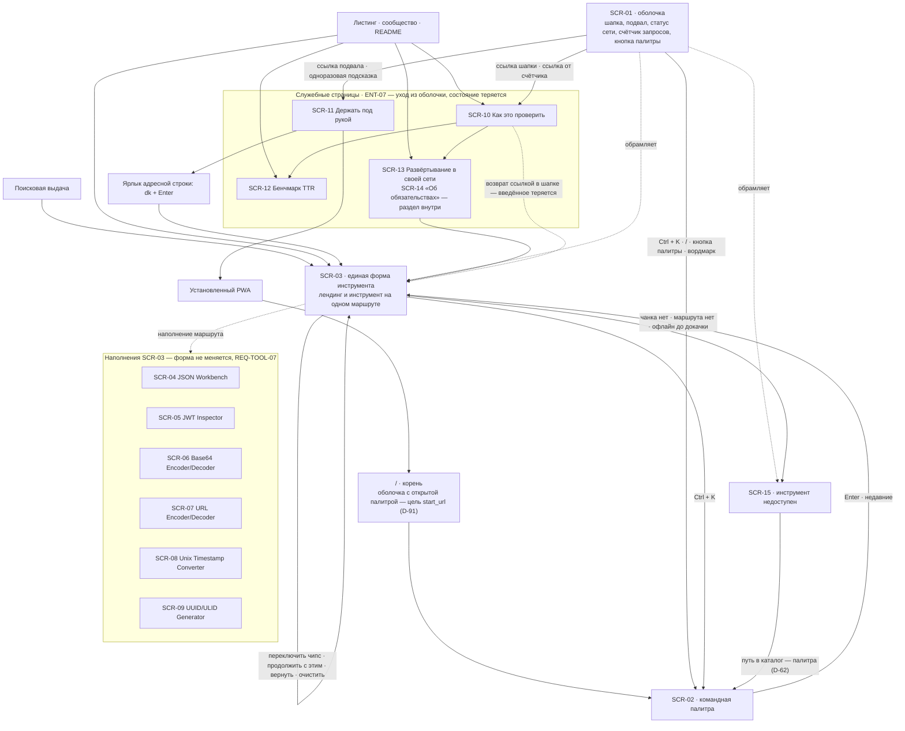

# DoKey — Карта экранов

**Дата:** 2026-09-07 · **Статус:** принят
**Опирается на:** [user-flows.md](user-flows.md) (FL-01…FL-20), [user-stories.md](user-stories.md)
(EP-01…EP-10, US-001…US-067), [glossary.md](glossary.md) (ENT-01…ENT-30, ROLE-01…ROLE-06),
[design-plan.md](design-plan.md) (DP-01…DP-05, §5 применение токенов, §6 состояния),
[content-guide.md](content-guide.md) (CG-01…CG-33), [decisions.md](decisions.md)
(D-05, D-13…D-18, D-25, D-26, D-30, D-53, D-62…D-83)
**Визуальный источник:** [Design System](Design%20System/readme.md). Компоненты в листах экранов
называются именами кита (`Textarea`, `CodePane`, `Tag`, `Card`, `Dialog`…); их вид, состояния и
токены живут там, а не здесь.
**Не содержит:** макетов и вёрстки (Design System), значений токенов (Design System `tokens/`),
формулировок интерфейса сверх процитированных (content-guide) и **новых требований**: поведение,
которого нет в PRD, сценариях и историях, не додумано внутри экрана.
**Открытых вопросов не осталось:** волна Q-122…Q-128 закрыта решениями D-80, D-81, D-82 — §5.

## 0. Соглашения

**SCR-NN** — экран: устойчивое состояние интерфейса, в которое человек приходит и из которого уходит.
Экраном считается маршрут (ENT-05), оверлей, перекрывающий работу, и постоянная рамка вокруг маршрутов.
Режим внутри инструмента экраном **не** является: «Base64: текст / файл» — один инструмент в двух
режимах (ENT-01), поэтому это зона SCR-06, а не отдельный SCR.

**Реестр держит два типа записей — инструмент и служебная страница** (D-82 п. 1). Отсюда следует,
что маршруты, sitemap и `hreflang` у обоих типов работают по общим правилам, добавление страницы
не правит оболочку, а в P0b английская ветка заводится страницам так же, как инструментам.

**Экран без сценария не существует.** У каждой позиции реестра стоит хотя бы один шаг FL-NN; §3 проверяет
это в обе стороны и называет непокрытое явно. Ни один экран здесь не заведён «для полноты».

**Пустое состояние обязательно для каждого списка** — и не только для списка: у DoKey пустой экран
это рабочее состояние, а не заглушка (EP-10). Там, где ещё ничего не произошло, человек обязан видеть
ответ, а не отсутствие ответа: разобранный `Пример` вместо пустой области результата (D-18 п. 2),
счётчик ввода вместо «тип не распознан» (D-16). **Единственное исключение названо решением:** у
генератора пустого состояния нет — значение сгенерировано и показано на первом кадре (D-81 п. 1).

**Главного экрана нет.** Витрина каталога отвергнута D-18: первым экраном является сам инструмент.
Поэтому центр карты — SCR-03, а не хаб, и §4 перечисляет витрину среди отклонённого, а не отложенного.
Каталог существует как поиск: его единственное представление — палитра (D-62 п. 4).

**Одна форма — шесть наполнений.** REQ-TOOL-07 запрещает инструментам собственные раскладки, DP-04
повторяет это принципом. Поэтому SCR-03 описывает форму целиком, а SCR-04…SCR-09 — **только отличие**
наполнения. Экран инструмента, который потребовал бы второго макета, является дефектом, а не экраном.

**Вид описывается именами кита, а не значениями.** Там, где лист называет поверхность, компонент или
состояние, он называет их так, как они называются в `Design System`: `--surface-code`,
`--surface-accent-soft`, `--amber-100`, `CodePane`, `Card`, `Tag`. Правило разделения поверхностей
данных задано design-plan §5.2: **сплошной машинный текст — тёмная панель `CodePane`, разобранные
пары — `Card`.**

---

## 1. Карта навигации

**Как читать карту.** Три вещи в ней важнее остальных.

**Первое: стрелок в «главную» нет ни одной.** Все четыре механизма входа ведут на маршрут инструмента,
и возврат из служебных страниц ведёт туда же. Это прямое следствие D-18, а не упрощение схемы.
Вордмарк, кнопка шапки, `Ctrl + K` и `/` ведут в одно место — в палитру (D-62): она же путь в
каталог, она же мобильный путь, она же обход перехваченного сочетания.

**Второе: SCR-03 имеет петлю на себя.** Переключение чипса, «Продолжить с этим», «Вернуть» и
«Очистить» не меняют экрана — меняется его содержимое. Метафора протяжки ленты (design-plan §3)
отвечает ровно за это: лента не накапливается; шаг назад — ровно один, действием «Вернуть» или
Ctrl + Z (D-69).

**Третье: две стрелки уходят из продукта в механизмы входа** (SCR-11 → IN3, SCR-11 → IN4). Это весь
механизм удержания целиком: возврат означает становление точкой входа по умолчанию, а не вовлечение
(D-13). Ни одного экрана, удерживающего человека внутри, в карте нет и не планируется.

**Чего в карте нет по построению:** экрана входа, профиля, настроек, истории операций, витрины каталога,
экрана шеринга результата. Все они лежат за красными линиями D-05 или отменены D-13 и D-18 — см. §4.

---

## 2. Реестр экранов

| SCR | Экран | Тип | Роль | FL |
|---|---|---|---|---|
| SCR-01 | Оболочка | постоянная рамка | ROLE-01 | FL-01, FL-13, FL-15, FL-16 |
| SCR-02 | Командная палитра | оверлей | ROLE-01 | FL-08, FL-09 |
| SCR-03 | Единая форма инструмента | маршрут | ROLE-01 | FL-01…FL-04, FL-07, FL-09, FL-11 |
| SCR-04 | JSON Workbench | наполнение SCR-03 | ROLE-01 (П-2) | FL-06 |
| SCR-05 | JWT Inspector | наполнение SCR-03 | ROLE-01 (П-1) | FL-05 |
| SCR-06 | Base64 Encoder/Decoder | наполнение SCR-03 | ROLE-01 | FL-10 |
| SCR-07 | URL Encoder/Decoder | наполнение SCR-03 | ROLE-01 | FL-02 |
| SCR-08 | Unix Timestamp Converter | наполнение SCR-03 | ROLE-01 | FL-02 |
| SCR-09 | UUID/ULID Generator | наполнение SCR-03 | ROLE-01 | FL-12 |
| SCR-10 | Как это проверить | служебная страница | ROLE-01, ROLE-05 | FL-13, FL-18 |
| SCR-11 | Держать под рукой | служебная страница | ROLE-01 | FL-14, FL-15 |
| SCR-12 | Бенчмарк TTR | служебная страница | ROLE-01, ROLE-05 | FL-13, FL-20 |
| SCR-13 | Развёртывание в своей сети | служебная страница | ROLE-02 (П-3) | FL-17 |
| SCR-14 | Об обязательствах | **раздел страницы SCR-13** (D-82 п. 1) | ROLE-05 | FL-18 |
| SCR-15 | Инструмент недоступен | состояние маршрута | ROLE-01 | FL-01 A4, FL-08, FL-16 A1 |

Пятнадцать записей, **четырнадцать страниц**: SCR-14 является разделом внутри SCR-13, а не отдельным
маршрутом (D-82 п. 1, REQ-CONTENT-05). Идентификатор за ним сохранён, потому что на него ссылаются
US-046 и FL-18, а достижимость «не более чем за один переход» при этом выполняется с запасом:
из SCR-13 переход не нужен вовсе, из README — один.

Пятнадцать записей на двадцать сценариев. Расхождение не случайно: FL-19 и FL-20 проходят целиком вне
продукта, а половина шагов FL-14, FL-15, FL-17 и FL-18 живёт в браузере, в GHCR и в организации — §3.

Детальные листы экранов — в [screens/](screens/), по файлу на каждый SCR.

---

### SCR-01. Оболочка

**Назначение.** Держать между переходами то, что не принадлежит ни одному инструменту: вход в палитру,
статус сети, измерение обещания и ссылки на служебные страницы · **ROLE-01**.
Не маршрут: обрамляет SCR-03…SCR-09 и SCR-15, переживает переход между ними (ENT-04) и не существует
на служебных страницах — уход туда является уходом из оболочки. Состав задан **REQ-CORE-09** одним
требованием на всю шапку и подвал (D-74).

**Данные.** ENT-04 оболочка · ENT-24 счётчик внешних запросов · ENT-09 подсказка вызова палитры ·
ENT-11 локаль (в P0a только `ru`) · статус сети · версия и дата сборки (D-67).

**Вид.** Шапка `--topbar-height` (56 px), липкая, подложка `--surface-card` 88 % и
`backdrop-filter: blur(8px)`, нижняя граница `--border-subtle` — это первое из двух мест блюра в
системе. Вордмарк слева (`dokey`, `--font-sans`, слог `key` цветом `--text-accent`), статус сети
рядом, счётчик и кнопка палитры справа. Кнопка — `Button variant="secondary" size="sm"` с `Kbd`
`Ctrl K`. Подвал — `--type-caption`, `--text-muted`, верхняя граница `--border-subtle`.
Счётчик набран `tabular-nums`.

**Действия**

| Действие | Куда ведёт |
|---|---|
| `Ctrl + K` / `⌘K`, `/` вне поля ввода, кнопка палитры в шапке | SCR-02 (D-62 п. 1–2) |
| Нажатие на счётчик «Внешних запросов: 0» | SCR-10 |
| Ссылка «Как это проверить» | SCR-10 |
| Ссылка «Держать под рукой» | SCR-11 |
| Одноразовая подсказка о ярлыке (повторный визит) | SCR-11 |
| Вордмарк `dokey` | Открывает палитру (D-62 п. 3): «домой» у продукта нет, а палитра и есть каталог |
| «Обновить» в строке `Вышла новая версия` | Перезагрузка оболочки (D-67) |

**Состояния**

- **Loading.** Шапка отрендерена на сборке и читается до выполнения JS (REQ-CORE-02). Счётчик — исключение:
  он появляется вместе с оболочкой, потому что статический «0» в HTML был бы слоганом, а не измерением
  (ENT-24, DP-02). Скелетона нет ни у одного элемента (design-plan §6).
- **Empty.** Не бывает: у шапки нет состояния «ещё нечего показать». Пустота «недавних» — состояние SCR-02.
- **Error.** Счётчик, отличный от нуля, у пользователя не возникает: сборка с ненулевым счётчиком не
  проходит CI (NFR-09). Запросы расширений считаются наравне с прочими, и при ненулевом счётчике одним
  нажатием раскрывается список origin (D-72 п. 3). Статус «Офлайн» ошибкой не является, красным и
  янтарным не красится и словами поломки не называется (design-plan §6).
- **Признак «повторный визит» на устройстве не хранится** (D-124): флаг подсказки живёт в памяти
  оболочки, и REQ-ENTRY-05 читается как «один раз за сессию вкладки».

**Реализует.** FL-01 шаг 2 (счётчик, подсказка `Ctrl + K`), FL-01 A1 и A5, FL-13 шаг 1, FL-15 шаг 1,
FL-16 шаг 1 · US-004 критерий 3, US-014, US-018, US-040, US-065.

**Тексты** (content-guide). Счётчик: `Внешних запросов: 0 · Как это проверить`. Офлайн:
`Офлайн. Ранее открытые инструменты работают.` Обновление: `Вышла новая версия` + `Обновить`.
Подсказка о ярлыке: `Открывать DoKey можно из адресной строки: dk + Enter. Держать под рукой`.

---

### SCR-02. Командная палитра

**Назначение.** Открыть любой инструмент не более чем за два действия, не вспоминая адрес и не открывая
вкладку · **ROLE-01**. Механизм ядра M-1, всегда загружена, ленивым чанком не является (ENT-09).

**Данные.** ENT-02 каталог · ENT-01 имя инструмента и описание до 55 знаков (CG-26) · синонимы записи
реестра, включая русские написания и нормализацию раскладки (D-82 п. 4) · «недавние» — до пяти
инструментов, открытых в пределах жизни оболочки, вытеснение по давности, только в памяти
(D-83 п. 2; слово «история» запрещено, глоссарий §4).

**Вид.** Единственный экземпляр `Dialog` в продукте: оверлей `--surface-overlay` с `blur(2px)` —
второе и последнее место блюра, панель `--surface-raised`, `--radius-2xl`, `--shadow-lg`. Строка
поиска — `Input mono` без собственной рамки, отделена `--border-subtle`. Строка списка: имя
`--type-ui`, описание `--type-caption` цветом `--text-muted`; ховер `--surface-hover`, выбранная
`--surface-active`; совпадение подсвечивается `--surface-accent-soft`. Открытие — `--duration-normal`,
`--ease-out`, прозрачность и сдвиг 4 px. Иконок у позиций нет: имя отличает инструмент, иконка — нет.

**Действия**

| Действие | Куда ведёт |
|---|---|
| Набор части имени | Фильтрация списка на месте по трём источникам: продуктовое имя, поисковое имя, синонимы (D-82 п. 4) |
| `Enter` на позиции | SCR-03 с соответствующим наполнением; событие открытия инструмента (REQ-METR-08, D-74) |
| Выбор из «недавних» | То же, одним действием |
| `Esc` | Закрытие; ввод и результат исходного маршрута не изменены |

**Состояния**

- **Loading.** Отсутствует по построению: палитра входит в initial JS (REQ-CORE-05), поэтому кадра
  ожидания у неё нет.
- **Empty — два разных, и путать их нельзя.**
  «Недавние» пусты (первый визит): `Пока пусто. Здесь появятся инструменты, открытые в этой вкладке`.
  Поиск не дал совпадений: `Ничего не нашлось. В каталоге шесть инструментов — сотрите запрос, чтобы увидеть все`.
  Запрос в тексте не цитируется (CG-18). Пустого списка без текста не существует (REQ-LIMIT-04).
  Оба состояния — `EmptyState` кита в компактном виде, без слота иконки.
- **Error.** Своих ошибок нет. Переход на инструмент, чанка которого нет в кеше, ведёт на SCR-15.

**Реализует.** FL-08 целиком, FL-09 шаг 2 и шаг 4, FL-01 A3, FL-03 A1 · US-014, US-063.

**Закрыто.** Вход — постоянная кнопка в шапке, `Ctrl + K`, `/` вне поля ввода и вордмарк (D-62).
«Нажатие» в правиле двух нажатий — действие, а не клавиша (D-73 п. 4). Палитра ищет **шесть
инструментов**: механизмы ядра — определитель и сама палитра — входят в восемь позиций M-02, но
записей не имеют, потому что «открыть определитель» бессмысленно; US-014 крит. 2 правится на «любой
из шести» (D-81 п. 4). Служебные страницы в палитре не показываются: вход к ним — обвязка оболочки.

---

### SCR-03. Единая форма инструмента

**Назначение.** Выполнить преобразование над вставленным вводом, не выбирая инструмент и не читая
ничего · **ROLE-01**. Лендинг и инструмент стоят на одном маршруте (ENT-06): это первый экран продукта
и единственный экран, на котором продукт зарабатывает или теряет человека.

**Данные.** ENT-12 ввод · ENT-13 результат · ENT-18 кандидаты и ENT-20 чипсы типа и кодирования ·
ENT-16 счётчик ввода · ENT-24 строка доказательства · ENT-06 лендинг: H1, вводный абзац до 240 знаков,
FAQ из 3–5 вопросов · ENT-22 пороги · `example` — разобранный пример принадлежит записи реестра,
синтетичен и рендерится на сборке (D-82 п. 5).

**Порядок элементов** — D-18 с поправкой D-80, одна колонка сверху вниз, мера 88ch:
H1 → вводный абзац → поле ввода → **чипсы типа** → область результата → строка доказательства → FAQ.
Двух колонок нет ни на одном инструменте (design-plan §5.4).

**Вид.** H1 — `--type-h1`, вводный абзац — `--type-body` на мере 68ch. Поле ввода — `Textarea` кита:
`--surface-card`, граница `--border-control`, `--radius-md`, набор `--type-code`; фокус — `--ring-focus`
плюс `--border-accent`. Чипсы — `Tag` в pill-форме, активный на `--surface-accent-soft` с
`--border-accent`, неактивные контурные; высота не меньше `--target-min`. Область результата —
`CodePane` (`--surface-code`, тёмная в обеих темах) для машинного текста либо `Card` для таблиц пар.
Строка доказательства — `--type-caption`, `--text-muted`. Блоки разделены `--border-subtle` и
`--space-6`; теней на маршруте нет.

**Действия**

| Действие | Куда ведёт |
|---|---|
| Вставить или набрать ввод | Определитель применяет кандидата немедленно; результат в области результата |
| Переключить чипс типа | Пересчёт на месте; ввод не изменён; ручной выбор побеждает всегда (D-66) |
| Нажать чипс кодирования | Кодирование по явному нажатию; само не срабатывает никогда |
| `Скопировать` | Буфер обмена; подпись меняется на `Скопировано` на 1,2 с (REQ-INPUT-07) |
| `Продолжить с этим` | Результат уходит во ввод, определитель отрабатывает заново → петля на себя (FL-07) |
| `Вернуть` / `Ctrl + Z` | Один шаг назад через буфер отмены (D-69) |
| `Очистить` | Поле обнуляется, область результата возвращает разобранный пример, ручной выбор чипса и буфер возврата сбрасываются (REQ-INPUT-08, D-65) |
| Действие мягкого порога (`Обработать`) | Операция в воркере с прогрессом и отменой (D-71 п. 4) |
| `Отменить` | Прерывание долгой операции: область результата возвращается к состоянию до запуска, ввод сохраняется, частичный результат не показывается (D-71) |
| `Ctrl + K`, `/`, кнопка палитры | SCR-02 |
| Ссылка счётчика | SCR-10 |

**Состояния**

- **Loading.** До 400 мс — ничего. Дальше: моноширинный счётчик прошедшего времени (`‹3,2› с`,
  `tabular-nums`), детерминированный прогресс там, где доля известна, и `Отменить` рядом — она
  появляется вместе с прогрессом, а не позже. Скелетонов и shimmer нет (design-plan §6).
- **Empty — что видит новичок.** Поле ввода пустое, не предзаполненное и в фокусе с первого кадра.
  Область результата занята **разобранным примером** с `Badge` `Пример`, под ним —
  `Вставьте свой — пример исчезнет`. Чипсов типа нет и счётчик ввода не показан: показывать нечего.
  Пример исчезает в том же кадре, в котором появляется результат. Предзаполненного поля в стиле
  jwt.io нет принципиально (D-18).
- **Error.** Текст `--text-danger` на месте результата, позиция ошибки — подложкой `--red-100` в самом
  вводе, граница поля `--border-danger`, ввод **не очищается и не заменяется**, фокус остаётся в поле
  (NFR-15, REQ-INPUT-03). Шаблон: факт и ожидание, затем действие человека; максимум два предложения
  и 120 знаков; ввод не цитируется (CG-17, CG-18). Порог ошибкой не является и формулируется через
  позиционирование: `Больше ‹10 МБ› не берём: всё считается у вас в браузере, а не на сервере.`
- **Warning.** Мягкий порог — `--amber-100` плюс `--text-warning` и глиф `triangle-alert`, никогда
  акцентом (D-78 п. 3).

**Реализует.** FL-01 целиком, FL-02 целиком, FL-03 целиком, FL-04 целиком, FL-07 целиком, FL-09 шаги 1–4,
FL-11 целиком, FL-14 шаг 4, FL-15 шаги 1, 4 и 5, FL-16 шаги 2–3, FL-17 шаг 4 · US-001, US-008…US-012,
US-029, US-031…US-035, US-044, US-059, US-060, US-062.

**Закрыто.** Чипсы стоят рядом с полем ввода, порядок первого экрана — H1 → поле → чипсы → результат
(D-80 п. 4). Повторная вставка и состояние после «Очистить» — D-65. Число и порядок чипсов — D-66.
Смена маршрута при победе кандидата другого инструмента — D-47. Что переживает переход — D-46:
переносится одно значение через однократный буфер в памяти роутера, обнуляемый чтением; из
инструмента с `sensitiveInput` не переносится ничего. Счётчик внешних запросов на экране **один**
и живёт в шапке; строка доказательства число не дублирует, а объясняет (D-81 п. 2).

---

### SCR-04. JSON Workbench

**Отличие от SCR-03.** Область результата — виртуализованное дерево вместо плоского значения; у поля
ввода есть вторая жизнь в виде редактора, приезжающего ленивым чанком · **ROLE-01, персона П-2**.

**Данные.** ENT-12 ввод (документ JSON) · ENT-13 результат: отформатированный документ и дерево ·
путь до узла · совпадения поиска.

**Вид.** Дерево живёт в `CodePane` (`--surface-code`, тёмная в обеих темах): ключ, строка, число,
булево и пунктуация красятся пятью ролями `--code-*` кита. Отступ уровня — `--space-4` на десктопе,
`--space-3` на мобильном. Совпадения поиска подсвечиваются `--surface-accent-soft`, и здесь правило
«одно акцентное пятно на экран» уступает: подсвечиваются все видимые совпадения, потому что здесь
подсветка и есть результат операции, а не метка о ней. Строка операций — `Button variant="secondary"`,
ни одной цветной. Действия узла видимы, а не появляются по ховеру: ховера на тач-устройствах нет.

**Действия.** `Форматировать` · `Минифицировать` · сортировка ключей · `Проверить JSON` · `Развернуть` /
`Свернуть` узел · `Найти` по дереву · `Скопировать путь` (слово «ключ» в подписи запрещено — оно занято
ENT-15) · `Продолжить с этим` на значении внутри дерева → петля SCR-03.

**Состояния**

- **Loading.** Разбор и форматирование в Web Worker, главный поток не блокируется дольше 50 мс подряд.
  Первый кадр — SSG-textarea; редактор CodeMirror подменяет поле после первой отрисовки, не двигая
  каретку. Чанк не приехал — сценарий проходится целиком на textarea.
- **Empty.** Два пустых состояния, и оба обязательны. До первого ввода — `Пример` и подсказка поля
  `Вставьте JSON — результат появится ниже`. Поиск по дереву без совпадений — `Ничего не нашлось`;
  дерево остаётся на месте, свёрнутость узлов не меняется, очистка строки поиска возвращает дерево
  в состояние до поиска.
- **Error.** `Ожидалась запятая. Строка 12, позиция 34` · `Структура не закрыта: не хватает }. Строка 118, позиция 1`.
  Номера строк в панели включаются (`lineNumbers`) именно потому, что сообщение называет строку.
  Мягкий порог: `Ввод больше ‹2 МБ›. Дальше будет медленно: всё считается у вас в браузере` плюс кнопка
  `Обработать` (D-71 п. 4).

**Реализует.** FL-06 целиком, FL-02, FL-11 · US-019, US-020, US-030, US-032, US-064.

**Закрыто.** Поиск идёт по ключам и значениям сразу, все совпадения подсвечены, рядом счётчик и переход
(D-72 п. 1). Порог по глубине вложенности — отдельная ось `jsonDepth` (D-73). Подсветка берётся из
палитры кита: `--code-key`, `--code-string`, `--code-number`, `--code-boolean`, `--code-punct`,
`--code-comment` — предложение «трёхролевой подсветки без цветов типов» отменено вместе с собственным
слоем токенов (D-53, закрытие Q-113).

---

### SCR-05. JWT Inspector

**Отличие от SCR-03.** Область результата разбита на именованные разделы стандарта, а под ней стоит
единственное в продукте свёрнутое поле для чужого секрета · **ROLE-01, персона П-1**.
Самая дорогая точка доверия во всём продукте (user-flows §4, точка 3).

**Данные.** ENT-14 токен · ENT-15 ключ подписи · разделы `header`, `payload`, `signature`, claim-ы,
`exp` / `iat` / `nbf` и срок действия · исход проверки подписи.

**Вид.** Здесь встречаются обе поверхности данных: сегменты токена и «сырые» header и payload —
`CodePane`; claim-ы — `Card` с таблицей пар, подписи `--type-label`, значения `--font-mono`.
Метка `Истёк` — `Badge tone="warning"` (`--amber-100`, `--text-warning`, глиф `triangle-alert`);
акцентная подложка остаётся только за распознанным типом (D-78 п. 3), поэтому три состояния экрана —
распознано, предупреждение, ошибка — различаются цветом и словом одновременно. Исход проверки:
`--text-success` либо `--text-danger`, всегда со словом и данными, которые его вызвали.

**Действия.** `Развернуть` / `Свернуть` поле ключа · `Показать` / `Скрыть` значение ключа ·
`Проверить подпись` · `Продолжить с этим` на claim-е → петля SCR-03 (**ключ в петлю не передаётся
никогда**) · `Скопировать`.

**Состояния**

- **Loading.** Разбор мгновенный; отдельного кадра ожидания на реальных токенах не бывает.
- **Empty.** `Пример` разобранного токена; подсказка поля — `Вставьте токен — результат появится ниже`.
  Поле ключа свёрнуто и в пустом состоянии, и после разбора: проверка подписи — необязательный шаг
  (D-25 п. 1). Рядом с полем — `Ключ нужен только для проверки подписи` и ссылка на SCR-10.
  Отсутствие `exp` в payload пустым состоянием не является: срок действия не показывается, ошибки нет.
- **Error.** `Ожидались три сегмента, разделённые точкой. Найдено два` ·
  `Подпись не совпала. Проверьте ключ подписи и алгоритм` ·
  `Подпись RS256 локально не проверяется — нужен открытый ключ. header и payload разобраны ниже`.
  Формулировка «Токен валиден» запрещена: валидна подпись, а не токен.
- **Секрет на экране.** Значение маскировано, но **не** `type="password"`: иначе менеджер паролей
  предложит сохранить чужой секрет для нашего домена. `autocomplete="off"`, `spellcheck="false"`.

**Отдельное состояние — уход с маршрута.** Teardown обнуляет поле ключа, токен и производные значения;
перечень из семи пунктов живёт в контракте инструмента ENT-25, а предметом гейта является инвариант:
подстрока токена-фикстуры не встречается на четырёх достижимых поверхностях (D-48). Возврат на маршрут
даёт пустые поля — это контракт, а не сбой. Очистка по потере фокуса вкладки сознательно не делается.
Действие «Очистить» на этом маршруте обнуляет **тот же перечень, что teardown** (REQ-INPUT-08).

**Реализует.** FL-05 целиком, FL-09 шаг 2 и шаг 4 · US-021, US-022, US-038, US-041, US-042.

**Закрыто.** Три состояния подписи, `alg: none` — предупреждение, RS256/ES256 объявлены как следующий
релиз, пустое поле ключа проверку не запускает (D-68). Перечень производных значений в teardown — D-48.
Двойной смысл маркера снят D-78 п. 3: распознавание — акцент, предупреждение — янтарь.

---

### SCR-06. Base64 Encoder/Decoder

**Отличие от SCR-03.** Два режима на одном маршруте: текст и файл. Режим — зона экрана, а не отдельный
экран: собственного маршрута и лендинга у него нет (ENT-01) · **ROLE-01**.

**Данные.** ENT-12 ввод (строка или выбранный файл) · ENT-13 результат · имя и размер файла ·
доля выполнения при чанковом кодировании.

**Вид.** Переключатель режима — два `Tag` над полем ввода: чипсы, а не вкладки (вкладка переключает
раздел, чипс — преобразование). Это единственный элемент каталога, перестраивающий зону ввода, и он же
граница: инструмент со вторым таким переключателем нарушает единую форму.

**Действия.** Переключение режима «текст / файл» · `Выбрать файл` (слово «загрузить» запрещено — оно
подразумевает отправку, которой нет) · `Сохранить` у бинарного результата и у результата больше порога
копирования (D-72 п. 2) · `Отменить` долгую операцию · чипс `Base64-кодировать` в текстовом режиме ·
`Скопировать` · `Продолжить с этим`.

**Состояния**

- **Loading.** Чтение файла частями через `File` API, кодирование чанковое. Прогресс появляется через
  400 мс, не раньше; `Отменить` появляется вместе с прогрессом. Отмена обязательна везде, где показан
  прогресс.
- **Empty.** Текстовый режим — `Пример`. Режим файла — файл не выбран: область результата пуста, действие
  `Выбрать файл` активно. **Строки этого состояния content-guide не содержит** — единственное пустое
  состояние продукта без готового текста; строка дописывается в гайд вместе с версткой режима файла.
- **Error.** `Некорректная base64-строка: длина не кратна четырём. Возможно, при копировании потерялся хвост` ·
  `Файл не читается. Выберите файл заново` · `Отменено. Ввод на месте` · жёсткий порог —
  `Больше ‹10 МБ› не берём: всё считается у вас в браузере, а не на сервере.`

**Реализует.** FL-10 целиком, FL-02, FL-04 (чипс кодирования), FL-11 · US-023, US-024, US-035, US-036.

**Закрыто.** Обратное направление поддерживается, глагол — `Сохранить` (`save`), локально из `Blob`,
ноль сетевых обращений (D-72 п. 2). Состояние после отмены — D-71. Числа порогов приходят замером на
В-2 по процедуре D-51, до него в реестре стоят предварительные и печатаются в `‹…›`.

---

### SCR-07. URL Encoder/Decoder

**Отличие от SCR-03.** Область результата показывает разбор URL на компоненты и таблицу параметров
query, а не одно значение · **ROLE-01**.

**Данные.** ENT-12 ввод · ENT-13 результат: декодированная строка либо схема, хост, порт, путь, query,
фрагмент отдельными значениями; параметры query парами, повторяющиеся ключи не схлопываются.

**Вид.** Разбор — `Card` с парами «имя — значение», подписи `--type-label`, значения `--font-mono`,
строки разделены `--border-subtle`. Пустые компоненты (нет порта, нет фрагмента) не показываются
строкой с прочерком — они отсутствуют: строка «порт: —» занимает место и ничего не сообщает.

**Действия.** Чипс `URL-кодировать` · `Скопировать` компонент или значение целиком · `Продолжить с этим`.

**Состояния**

- **Loading.** Не бывает: преобразование укладывается в кадр.
- **Empty.** `Пример` разобранного URL с повторяющимся ключом. До первого ввода таблицы параметров нет —
  не пустая таблица с заголовками, а её отсутствие.
- **Error.** `Некорректный URL: нет схемы. Добавьте https:// в начало` ·
  оборванная percent-последовательность — ошибка с позицией, ввод не очищается.

**Реализует.** FL-02 целиком (собственного сценария не имеет: проходится по FL-02 и отличается только
преобразованием — user-flows §6) · US-025.

---

### SCR-08. Unix Timestamp Converter

**Отличие от SCR-03.** Результат всегда парный: значение в двух зонах и в двух представлениях,
и ни одно время не показывается без названной зоны · **ROLE-01**.

**Данные.** ENT-12 ввод (10 или 13 знаков либо строка ISO 8601) · ENT-13 результат: ISO 8601, UTC,
локальная зона со смещением, секунды и миллисекунды.

**Вид.** `Card` с парами «представление — значение», `tabular-nums` во всём блоке: прыгающая ширина
цифр при переключении чипса читается как нестабильность продукта. Название зоны набрано тем же кеглем,
что значение, и стоит вплотную к нему — зона, набранная мельче, читается как примечание, а она часть
ответа.

**Действия.** Переключение секунд и миллисекунд чипсом · `Скопировать` любое из представлений ·
`Продолжить с этим`.

**Состояния**

- **Loading.** Не бывает.
- **Empty.** `Пример` разобранного времени. Текущее время как «живой» результат до ввода **не
  показывается**: это был бы второй генератор без ввода, а форма не растёт (DP-04).
- **Error.** `Значение вне диапазона: ожидались секунды или миллисекунды Unix-времени`.

**Формат** (CG-28, CG-29). Исходное значение — как есть, без разделения разрядов. Даты —
`1 января 2026, 03:00 UTC` и `1 января 2026, 06:00 (UTC+3)`. Относительное время только рядом
с абсолютным, никогда вместо.

**Реализует.** FL-02 целиком (собственного сценария не имеет — user-flows §6) · US-026.

---

### SCR-09. UUID/ULID Generator

**Отличие от SCR-03.** Единственный инструмент каталога, которому ввод не нужен: результат существует
до человека. Поле ввода при этом остаётся и служит разбору чужого значения — форма не меняется
(REQ-TOOL-07) · **ROLE-01**.

**Данные.** ENT-13 результат: одно значение или пакет · версия v4 / v7 / ULID · количество ·
при разборе — корректность, версия, вариант, временная метка ULID. Поле `example` записи реестра
у генератора пустое: роль примера играет само сгенерированное значение (D-82 п. 5).

**Вид.** Значения — `CodePane`, по одному на строку. Версия — чипсы `Tag`, количество — `Input`.
`Сгенерировать` — единственное первичное действие этого экрана (`Button variant="primary"`).

**Действия.** Выбор версии чипсом · задать количество · `Сгенерировать` · `Скопировать` (все значения
по одному на строку) · вставить существующее значение в поле ввода → разбор и проверка.

**Состояния**

- **Loading.** Не бывает при разумном пакете; размер пакета — отдельная ось порога `batchSize`, число
  назначается замером на В-2 (D-73, D-51).
- **Empty — его нет, и это решение.** Значение сгенерировано и показано на первом кадре, без действия
  человека (FL-12 шаг 1, US-066 крит. 1). Строка `Нажмите «Сгенерировать» — значения появятся здесь`
  удалена из content-guide §5 (D-81 п. 1). Пустое состояние поля ввода отдельного текста не требует:
  поле служит разбору, а не генерации. Механического завышения PM-01 автозначение не даёт: событием
  METR-01 оно не является (D-52).
- **Error.** Недоступен `crypto.getRandomValues` — значения из небезопасного источника не выдаются
  (правило отказа браузерного API задано D-64: проверяем до, объясняем при, не подделываем). Разбор
  дефектного значения — сообщение с указанием места, поле не очищается.

**Реализует.** FL-12 целиком · US-027, US-028, US-066.

---

### SCR-10. Как это проверить

**Назначение.** Дать процедуру опровержения обещания, а не заявление о нём: что уходит, что не уходит
никогда, где прокси и какой риск остался · **ROLE-01, ROLE-05**.
Страница процедуры, а не документа: заголовки «Приватность» и «Политика конфиденциальности» запрещены.

**Данные.** Три публикуемых списка (D-135, D-136): семь полей ENT-29 · пять имён событий EVT-01…EVT-05 ·
производные приёмника PD-09. Плюс ENT-28 событие и адрес прокси `dokey.app/s/event` · ENT-24
объяснение счётчика · оператор и контакт субъекта (D-125) · команда сверки манифеста с пиннингом
identity (D-123, D-148) · раздел «границы измерения»: расширения браузера, читающие DOM, и
молчащая при DNT/GPC аналитика (D-72 п. 3) · ENT-26 профиль сборки. Служебных ключей нет — список
пуст (D-124).

**Вид.** Проза, `--type-body`, мера 68ch, единственная поверхность `--surface-page`; блоки — `Card`;
команды и адреса — `CodePane`. Оболочка инструмента здесь не действует: шапка сокращённая, счётчика и
кнопки палитры на служебных страницах нет.

**Действия.** Ссылка на репозиторий · ссылка на SCR-12 · ссылка на SCR-13 (и на раздел SCR-14 внутри
него) · возврат в оболочку ссылкой в шапке (введённое при этом теряется: это уход из оболочки,
а не переход между инструментами).

**Состояния**

- **Loading.** Отрендерена на сборке, читается без JS. Входит в precache оболочки.
- **Empty.** Не бывает: страница целиком состоит из утверждений, у неё нет данных, которые могли бы
  отсутствовать. Единственный динамический элемент — опубликованный список полей, и он сравнивается
  со списком в коде гейтом CI: расхождение останавливает сборку.
- **Error.** Своих ошибок нет. Открывается офлайн, если открывалась раньше.

**Реализует.** FL-13 шаг 2, FL-18 шаг 2, FL-01 A1 · US-039, US-055 критерий 2, US-056.

**Тексты.** Формулировка `Мы ничего не отправляем` запрещена как неточная: аналитика уходит через
собственный origin, и текст обязан это выдерживать. Рядом со счётчиком на первом экране стоит одна
строка `аналитика — через свой origin, содержимое ввода не отправляется` со ссылкой сюда (D-80 п. 3).

---

### SCR-11. Держать под рукой

**Назначение.** Объяснить оба механизма входа по шагам для конкретного браузера — и честно назвать,
где механизма нет · **ROLE-01**.

**Данные.** ENT-08 механизмы входа · шаги установки PWA для Chrome и Firefox · шаги активации
ярлыка адресной строки · оговорка про офлайн: он работает с повторного визита, первый визит без сети
невозможен · предупреждение о хвосте, набранном после `dk` (D-70).

**Действия.** `Установить` (или объяснение, где это делает браузер) → механизм входа IN3 ·
`Активировать` — объяснение, где включается ярлык; **ссылки, открывающей настройки браузера, на странице
нет**, Chrome это блокирует → механизм входа IN4 · возврат в оболочку.

**Состояния**

- **Loading.** Отрендерена на сборке, входит в precache.
- **Empty.** Не бывает. Ближайшее к пустому — состояние «механизма нет в вашем браузере»: для Firefox
  на десктопе прямо сказано, что установки PWA там нет, вместо обещания одинакового пути.
- **Error.** Установка запрещена политикой организации — отказ среды, а не приложения; страница называет
  альтернативу: ярлык или внутренний URL образа (SCR-13).

**Реализует.** FL-14 шаг 2, FL-15 шаг 2, FL-16 (предупреждение про первый визит офлайн) ·
US-015, US-017, US-018.

**Закрыто.** Ярлык остаётся пусковым: хвост после `dk` отбрасывается продуктом, но остаётся в истории
браузера, и об этом сказано прямо (D-70). Обновление: `skipWaiting` только по действию человека,
тихая строка `Вышла новая версия` в оболочке, версия и дата сборки в подвале (D-67).

**Где отваливаются.** Путь сюда существует только для того, кто уже вернулся: на первом визите подсказка
запрещена сознательно (D-13 п. 3). Шаг 3 сценария FL-15 — уход в настройки браузера — самый длинный
разрыв во всём наборе, и экраном он не поддержан ничем: страница не может даже привести туда ссылкой.

---

### SCR-12. Бенчмарк TTR

**Назначение.** Предъявить утверждение о скорости измерением, которое можно перепроверить чужими
руками · **ROLE-01, ROLE-05**. Публикуется одновременно с релизом.

**Данные.** Методика · таблица замеров по перцентилям (`p50 1,2 с · p90 2,8 с`) · воспроизводимый скрипт ·
конфиг селекторов · сырые прогоны · оговорки · состав сравниваемых площадок.

**Вид.** Таблица в `Card`, `tabular-nums` во всех колонках, разряды разделяются (это замер, а не
значение, которое копируют в код). Строка, где DoKey проиграл, ничем не выделена — ни цветом, ни
пометкой: выделение проигранного замера превращает публикацию честности в жест.

**Действия.** Забрать скрипт · перейти в репозиторий · вернуться в оболочку.

**Состояния**

- **Loading.** Статическая страница, отрендерена на сборке.
- **Empty.** Не бывает и не должно: страница без таблицы замеров является нарушением REQ-CONTENT-01,
  а не пустым состоянием. Проигранный замер печатается так же, как выигранный — **0 скрытых замеров**.
- **Error.** Своих ошибок нет.

**Реализует.** FL-13 шаг 4, FL-20 шаг 4 · US-043.

**Закрыто D-75 п. 1.** Площадки берутся из выдачи research §4 и называются поимённо
(`jsonformatter.org`, `codebeautify.org`, `jwt.io` плюс две по запросам Base64 и URL); список живёт
в скрипте, а не в тексте. TTR чужой страницы определён процедурно: от навигации до появления
результата в DOM по явному селектору, медиана девяти прогонов, фиксированный троттлинг, холодный кеш.
Публикуются скрипт, конфиг селекторов и сырые данные. OSS-соседи в сравнение не входят: их
сообщества являются основным каналом.

---

### SCR-13. Развёртывание в своей сети

**Назначение.** Дать ROLE-02 полную процедуру: забрать образ, сверить, перенести в периметр, запустить
и опубликовать один внутренний URL на команду · **ROLE-02, персона П-3**.
**Содержит раздел SCR-14 «Об обязательствах»** (D-82 п. 1).

**Данные.** ENT-27 образ · ENT-26 профиль сборки · команда `docker run`, пример compose, внутренний
реестр · перенос через `docker save` и `docker load` · пиннинг тега · сверка подписи, provenance и SBOM ·
версия и дата сборки, сверяемые с публичной датой пересборки и GitHub Releases (D-67).

**Вид.** Кодовых блоков здесь больше, чем на любой другой странице, и они — основное содержание,
а не иллюстрация: `CodePane` с `--surface-code`, горизонтальная прокрутка внутри блока, длинные
команды не переносятся по словам.

**Действия.** Скопировать команду · перейти в GHCR · перейти к разделу SCR-14 · перейти в репозиторий.

**Состояния**

- **Loading.** Статическая страница.
- **Empty.** Не бывает.
- **Error.** Доступ к GHCR закрыт политикой — на странице описан перенос через разрешённый шлюз.
  Это единственное место набора, где «нет прав» является настоящим и приходит извне.

**Реализует.** FL-17 шаг 1, FL-18 шаг 1 (инструкция сверки) · US-045, US-048, US-049.

**Тексты.** Слово «офлайн-версия» запрещено: офлайн отдельному разработчику даёт PWA, и говорить иначе —
прямая неправда. Единственное место продукта, где пишется слово «удалить», — здесь, в инструкции
`docker rmi`, потому что там удаление действительно необратимо и происходит вне продукта (CG-23).

---

### SCR-14. Об обязательствах

**Тип — раздел страницы SCR-13, а не отдельный маршрут** (D-82 п. 1, REQ-CONTENT-05). Идентификатор
сохранён: на него ссылаются FL-18 и US-046.

**Назначение.** Произнести отсутствие обязательств вслух раньше, чем о нём спросят · **ROLE-05**.
Часть организаций после этого откажется — это правильный исход, а не потеря.

**Данные.** Прямые утверждения: SLA нет, срока ответа поддержки нет, срока жизни проекта нет, срока
выпуска исправлений безопасности нет. Рядом — то, что есть и проверяемо: подпись, provenance, SBOM,
профиль `selfhosted`, открытый код.

**Вид.** Четыре отрицания — списком, каждое отдельной строкой: четыре отрицания в одном абзаце
читаются как оговорка, четыре строки читаются как позиция. Ни акцентной подложки, ни `--text-danger`,
ни янтаря: цвет здесь превратил бы честность в предупреждение, а это утверждение, а не тревога.

**Действия.** Переход к SCR-10 · переход в репозиторий · возврат к началу SCR-13.

**Состояния**

- **Loading.** Часть статической страницы.
- **Empty.** Не бывает: раздел без утверждений об отсутствии обязательств является нарушением
  REQ-CONTENT-05.
- **Error.** Своих ошибок нет.

**Реализует.** FL-18 шаг 3 · US-046.

**Достижимость.** Не более чем за один переход из README и ноль переходов из SCR-13 — это критерий
приёмки, а не пожелание навигации, и после D-82 он выполняется с запасом.

---

### SCR-15. Инструмент недоступен

**Назначение.** Показать, что произошло и что делать, когда логики нет, — вместо молчания или пустого
экрана · **ROLE-01**. Четыре повода с одним корнем, и у каждого свой текст и своё действие (D-63).

**Данные.** Повод · путь восстановления · лендинг и поле ввода остаются доступными там, где
отрендерены на сборке.

**Вид.** Экран занимает **зону области результата**, а не заменяет страницу целиком: там, где лендинг
отрендерен на сборке, он остаётся на месте вместе с полем ввода. Ни модалки, ни оверлея.
Сообщение — текст на месте результата плюс действие восстановления `Button variant="secondary"`.
Иллюстраций, кодов ошибок и «404» крупным кеглем нет: изображений в продукте нет вовсе, а код наружу
не выходит.

**Действия.** «Открыть палитру» → SCR-02 (она же «путь в каталог» — D-62) · «Повторить» при обрыве
чанка · «Обновить», когда чанка нет из-за новой сборки.

**Состояния**

- **Loading.** Экран сам является исходом ожидания: показывается после того, как чанк не приехал.
- **Empty.** Экран целиком является объявленным пустым состоянием — тем самым, которое REQ-LIMIT-04
  запрещает оставлять молчаливым.
- **Error.** Это и есть состояние ошибки. Четыре текста заданы D-63:
  `Инструмент ещё не сохранён на этом устройстве, а сети нет. Откройте его один раз с сетью — дальше он работает офлайн.` + «Открыть палитру» ·
  `Логика инструмента не загрузилась.` + «Повторить» · `Вышла новая версия` + «Обновить» ·
  `Такого инструмента нет.` + «Открыть палитру».

**Реализует.** FL-01 A4, FL-08 шаг 3, FL-16 A1 · US-002 критерий 4, US-004 критерий 4, US-005 критерий 4,
US-061 критерий 5, US-067 целиком.

**Закрыто D-63 и D-62.** Первое состояние перестало быть нормой: service worker кеширует чанки всего
каталога фоном после первой отрисовки, NFR-12 усилена до «100 % инструментов каталога работают без
сети после первого визита», и обещание офлайна стало безусловным. Первый повод остался как остаточный
случай до завершения фоновой докачки.

---

## 3. Проверка покрытия

### 3.1. FL → SCR

| FL | Сценарий | Экраны | Шаги без экрана |
|---|---|---|---|
| FL-01 | Первый пустой запуск | SCR-03, SCR-01; A1 → SCR-10, A3 → SCR-02, A4 → SCR-15 | — |
| FL-02 | Преобразование вставкой | SCR-03 и все наполнения | — |
| FL-03 | Переключить тип вручную | SCR-03 | — |
| FL-04 | Счётчик ввода и чипс кодирования | SCR-03, SCR-06, SCR-07 | — |
| FL-05 | Разобрать JWT и проверить подпись | SCR-05 | шаг 6 — teardown, наблюдается на SCR-05 при возврате |
| FL-06 | JSON Workbench | SCR-04 | — |
| FL-07 | Петля «продолжить с этим» | SCR-03 (петля на себя) | — |
| FL-08 | Открыть инструмент через палитру | SCR-02 → SCR-03 | — |
| FL-09 | Перейти и вернуться | SCR-02, SCR-03 | — |
| FL-10 | Base64 файла | SCR-06 | шаг 2 частично: **диалог выбора файла — браузер** |
| FL-11 | Мягкий и жёсткий порог | SCR-03, SCR-04, SCR-06 | — |
| FL-12 | Сгенерировать UUID и ULID | SCR-09 | — |
| FL-13 | Проверить обещание | SCR-01 (шаг 1), SCR-10 (шаг 2), SCR-12 (шаг 4) | **шаг 3: DevTools и вкладка Network** |
| FL-14 | Установить PWA | SCR-11 (шаг 2), SCR-03 (шаг 4) | **шаг 1: намерение; шаг 3: диалог установки браузера** |
| FL-15 | Активировать ярлык | SCR-01 и SCR-03 (шаг 1), SCR-11 (шаг 2), SCR-03 (шаги 4–5) | **шаг 3: настройки браузера** |
| FL-16 | Работать офлайн | SCR-01 (статус), SCR-03, SCR-15 (A1) | шаг 4: неотправка событий — не состояние экрана |
| FL-17 | Развернуть образ | SCR-13 (шаг 1), SCR-03 (шаг 4) | **шаги 2–3: GHCR, cosign, `docker run` в периметре** |
| FL-18 | Впустить образ в периметр | SCR-13 (шаг 1), SCR-10 (шаг 2), SCR-14 (шаг 3, раздел SCR-13) | **шаг 4: решение организации** |
| FL-19 | Предложить инструмент в каталог | **ни одного** | **весь сценарий:** репозиторий, контракт, шаблон issue, PR |
| FL-20 | Выпустить релиз | SCR-12 как публикуемый артефакт (шаг 4) | **шаги 1–3:** тег, гейты CI, публикация образа |

### 3.2. Шаги без экрана — перечислены явно

Двенадцать мест. Ни одно из них не является пробелом карты: все они происходят вне продукта, и
дорисовывать под них экран означало бы обещать управление тем, чем продукт не управляет.

| # | Шаг | Где происходит | Что делает продукт вместо экрана |
|---|---|---|---|
| 1 | FL-10 шаг 2 — выбор файла | Диалог браузера | Действие `Выбрать файл`; отмена диалога не меняет состояния и даёт сообщение |
| 2 | FL-13 шаг 3 — проверка в DevTools | Браузер | SCR-10 описывает процедуру заранее |
| 3 | FL-14 шаг 1 — решение держать под рукой | Голова человека | Единственный шаг набора, который система не поддерживает ничем |
| 4 | FL-14 шаг 3 — установка PWA | Диалог браузера | SCR-11 объясняет путь для каждого браузера и называет, где механизма нет |
| 5 | FL-15 шаг 3 — активация ярлыка | Настройки браузера | SCR-11 объясняет, где включать; ссылки туда нет — Chrome её блокирует |
| 6 | FL-16 шаг 4 — события офлайн | Отсутствие отправки | Осознанное слепое пятно D-44; экран здесь был бы враньём |
| 7 | FL-17 шаг 2 — GHCR и сверка подписи | GHCR, cosign | SCR-13 даёт воспроизводимую инструкцию |
| 8 | FL-17 шаг 3 — запуск образа | Инфраструктура организации | SCR-13; после запуска внутри периметра работает SCR-03 |
| 9 | FL-18 шаг 1 — проверка provenance и SBOM | Инструменты ИБ | SCR-13 и артефакты сборки |
| 10 | FL-18 шаг 4 — решение впустить | Организация | SCR-14 даёт основание для любого из двух исходов |
| 11 | FL-19 целиком | GitHub | Контракт ENT-25, шаблон issue, PR — тексты, а не экраны |
| 12 | FL-20 шаги 1–3 | GitHub Actions | Гейты; владельцем факта «релиз состоялся» является конвейер |

### 3.3. Экраны без сценария

**Ни одного.** Каждая запись реестра реализует минимум один шаг FL — §3.1. Проверка сделана в обе
стороны специально: экран, заведённый без сценария, является продуктовым решением, принятым явочным
порядком.

Два места заслуживают отдельной оговорки, потому что выглядят как исключения и ими не являются.

- **SCR-01 существует по сценариям и с 2026-09-07 — по требованию.** Статус «Офлайн» (FL-16 шаг 1) и
  ссылки шапки на служебные страницы (FL-01 A1, FL-13 шаг 2) описаны **REQ-CORE-09** — одним
  требованием на весь состав шапки и подвала (D-74). Разводить статус сети в отдельное требование
  значило бы описывать шапку в двух местах.
- **SCR-14 обслуживает один шаг одного сценария** — FL-18 шаг 3. Это не повод растворять его в
  SCR-13 без следа: US-046 требует достижимости за один переход из двух разных мест, поэтому раздел
  сохраняет собственный якорь, ссылку в начале страницы и запись в реестре.

### 3.4. Истории EP-10 → экраны

Пустые состояния разбросаны по эпикам, но проверяются вместе (user-stories §11). Их адреса на карте:

| US | Пустое состояние | Экран |
|---|---|---|
| US-059 | Первый экран до первого ввода: `Пример` | SCR-03 |
| US-060 | Пустая вставка и пустое поле | SCR-03 |
| US-061 | Первый визит без кеша, в том числе без сети | SCR-03, SCR-15 |
| US-062 | Первый запуск из установленного PWA | SCR-03 + SCR-01 |
| US-063 | Палитра: ничего не нашлось; «недавние» пусты | SCR-02 |
| US-064 | Поиск по дереву без совпадений | SCR-04 |
| US-065 | Первый визит: подсказки о ярлыке нет | SCR-01 |
| US-066 | Генератор: экран, на котором ввода не нужно | SCR-09 — **пустого состояния нет по D-81 п. 1** |
| US-067 | Логика недоступна: четыре повода, четыре текста | SCR-15 (D-63) |

Пустое состояние есть у каждого списка продукта: «недавние» (SCR-02), результаты поиска палитры
(SCR-02), совпадения поиска по дереву (SCR-04), таблица параметров query (SCR-07), область результата
любого инструмента (SCR-03). Списков без пустого состояния в реестре нет; единственное объявленное
исключение — пакет значений генератора (SCR-09), у которого значение существует до человека.

---

## 4. Экраны вне MVP

Разделено на две группы, и разница между ними принципиальна: **отклонённое** не появится и после P0b,
**отложенное** появится по плану. Смешивать их нельзя — первое является границей продукта, второе очередью.

### 4.1. Отклонено — экрана не будет

| Экран | Почему |
|---|---|
| Витрина каталога, главная страница, сетка плиток инструментов | D-18: первым экраном является сам инструмент. Каталог существует как поиск (D-62 п. 4); глоссарий §6 запрещает даже слово. Компонент `ToolCard` и плиточная сетка кита остаются неприменяемыми — design-plan §5.4 |
| Сайдбар с «недавними» | D-81 п. 3: сайдбара нет ни в сетке, ни в макетах; появиться он мог бы только за счёт меры ленты, то есть за счёт данных. Токен `--sidebar-width` в ките остаётся неиспользуемым |
| История операций | D-13 п. 4 перевёл её в красные линии: вход в историю — это секреты. «Недавние» относятся только к инструментам, живут в памяти и перезагрузку не переживают (D-83 п. 2) |
| Конструктор рецептов, цепочек, пайплайнов | D-26: вместо него петля «Продолжить с этим». Все четыре слова запрещены глоссарием §6 как имена отклонённой концепции |
| Вход, регистрация, восстановление доступа, профиль, рабочее пространство, приглашение в команду | D-05, красные линии: требуют сервера и идентификации |
| Экран шеринга результата ссылкой | D-05: ссылок, несущих данные, не существует ни в каком виде, включая фрагмент |
| Экран настроек | Настраивать нечего: тема идёт от системы, аналитика выбирается профилем сборки, а не переключателем (ENT-26). Ручной переключатель темы — P0b (D-58) |
| Онбординг, тур, «шаг 1 из 3», приветственная модалка | CG-24 и DP-01: обучающих поверхностей ровно три, и все уже приняты решениями |
| Баннер согласия на cookie | CG-32: аналитика cookieless, DNT и GPC уважаются молча |
| Модальные подтверждения | CG-21: в P0a их ноль, потому что персистентности нет и терять безвозвратно нечего. `Dialog` кита расходуется на палитру и больше ни на что |
| Тост как класс сообщений | D-80 п. 1: сообщение привязано к элементу или к статусной строке оболочки. `Toast` кита не применяется |
| Набор страниц «alternative to» под каждый портал | D-19 свёл их к одной странице бенчмарка с методикой |
| Крупная панель проверки приватности на первом экране | D-18 п. 3 отверг её как трату места; остались счётчик в шапке, строка про аналитику и ссылка (D-80 п. 3, D-81 п. 2) |

### 4.2. Отложено — экрана нет в P0a

| Что | Когда | Форма |
|---|---|---|
| Пять инструментов P0b: Text & Code Diff, Regex Tester в урезанной редакции, QR Code Generator, Hash/HMAC/Checksum, Number Base Converter | P0b | Наполнения SCR-03; новых макетов не появляется (REQ-TOOL-07) |
| Английская ветка маршрутов | P0b | Те же SCR; EN заводится и инструментам, и служебным страницам одинаково (D-82 п. 1), но пустой не публикуется (US-006) |
| Чипс `Хэшировать` в счётчике ввода | P0b | Зона SCR-03, отдельный порог — REQ-LIMIT-05 |
| Ручной переключатель темы | P0b | `Switch` кита в оболочке; выбор ложится в закрытый список служебных ключей одним явным ключом (D-58, D-71 п. 1) |
| Режим файла в SCR-06 | P0a, после дописывания строки пустого состояния в content-guide | Зона SCR-06; направление и глагол `Сохранить` уже заданы D-72 п. 2 |
| Редактор CodeMirror в JSON Workbench | Could в P0a, первый под нож по RISK-06 | Зона SCR-04; при демонтаже сценарий FL-06 проходится на textarea целиком |
| Инструменты P1: Color Tools, Text Case Converter, Unit & Data Converter, XML/YAML, SQL Formatter, HTML/CSS, Cron Parser | R2, и только если сработает развилка Ф-1 | Наполнения SCR-03 |

**Чего в §4.2 сознательно нет.** Экрана «Каталог» — ни в P0a, ни в P0b: он не отложен, он отклонён
(§4.1). «Путь в каталог», которого требует US-067, ведёт в палитру и новым экраном не является
(D-62 п. 1).

---

## 5. Волна вопросов карты экранов — закрыта

Семь вопросов (Q-122…Q-128), заведённых при написании этой карты, **закрыты 2026-09-07** решениями
D-80, D-81 и D-82. Реестр открытых вопросов проекта пуст.

| ID | Вопрос | Чем закрыт |
|---|---|---|
| Q-122 | Где стоят чипсы типа: под областью результата (D-18, сетка плана дизайна) или у поля (FL-02, FL-03, US-009) | **D-80 п. 4:** чипсы стоят рядом с полем ввода и видны, пока ввод непуст. Порядок первого экрана — H1 → поле → чипсы → результат → строка доказательства → FAQ. Основание не в старшинстве документов: промах определителя виден там же, где смотрит человек сразу после вставки, а чипс после результата предлагает исправление тому, кто уже уходит |
| Q-123 | Первый экран генератора: значение сразу или пустое состояние | **D-81 п. 1:** значение сгенерировано и показано на первом кадре; строка пустого состояния удалена из content-guide §5. Сцепка с PM-01 снята ещё D-52 |
| Q-124 | Куда ведёт «путь в каталог» и куда нажимается вордмарк | **D-62:** и то и другое — палитра. Каталог существует как поиск, а не как витрина; корневой маршрут не заводится |
| Q-125 | Маршруты служебных страниц не описаны ничем | **D-82 п. 1:** реестр держит два типа записей — инструмент и служебная страница. «Об обязательствах» остаётся разделом внутри страницы развёртывания: страниц четыре и один раздел |
| Q-126 | Счётчик внешних запросов — один или два | **D-81 п. 2:** один, в шапке, виден на всех маршрутах. Строка доказательства число не дублирует, а объясняет. Двух чисел не бывает никогда: при разной методике они разойдутся, и механизм предъявления станет поводом не верить продукту |
| Q-127 | «Недавние в сайдбаре» — сайдбара не существует | **D-81 п. 3:** «недавние» живут только в палитре; сайдбар вычёркивается из глоссария §4 и из правил контента кита |
| Q-128 | Палитра ищет шесть инструментов или восемь позиций каталога | **D-81 п. 4:** шесть — палитра ищет то, что можно открыть. M-02 продолжает считать восемь позиций как метрику готовности состава; путаница возникала оттого, что оба числа называли «каталогом» |

**Что осталось сделать вне этого документа.** Строка пустого состояния для режима файла в SCR-06 —
единственное пустое состояние продукта без готового текста; она дописывается в content-guide вместе
с вёрсткой режима, и до этого режим файла в макеты не входит.
