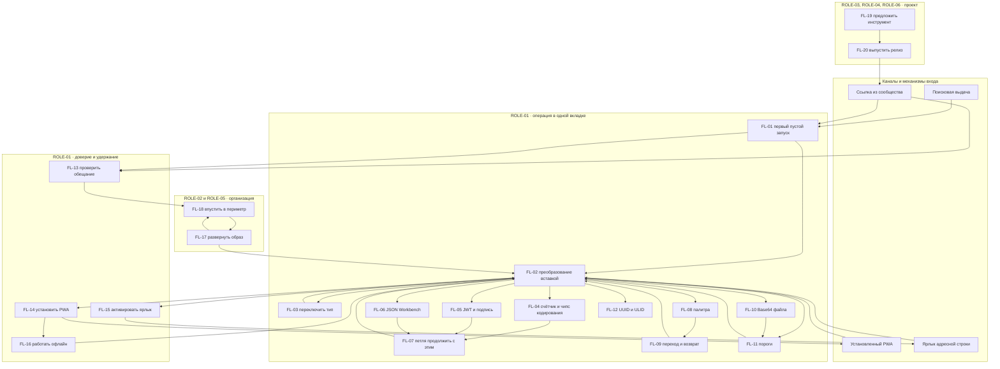

# DoKey — Пользовательские сценарии

**Дата:** 2026-09-03 · **Статус:** черновик к согласованию
**Опирается на:** [prd.md](prd.md) (REQ-*, NFR-*, J-1…J-6, П-1…П-3), [glossary.md](glossary.md)
(ENT-01…ENT-29, ROLE-01…ROLE-06, §3 «Действия»), [decisions.md](decisions.md) (D-01…D-45)
**Не содержит:** макетов и вёрстки (Design System), имён событий аналитики (analytics-spec),
обоснований решений (decisions.md) и **новых требований**: всё, чего PRD не говорит, вынесено
в §5, а не додумано внутри шага.
**Новые вопросы:** Q-68…Q-88 в [open-questions.md](open-questions.md).

## 0. Соглашения

**FL-NN** — сценарий. Шаг основного пути — пара «пользователь делает → система отвечает»;
подлежащим в правой колонке всегда является система, потому что исходы не являются действиями
(глоссарий §3). Сущности, глаголы и термины интерфейса — строго по глоссарию; список §6
глоссария нормативен, синоним в тексте сценария считается дефектом текста.

**О «нет прав».** Разграничения доступа внутри продукта не существует по построению: аккаунтов
нет (D-05), ROLE-01 — единственная роль внутри работающего приложения. Поэтому «нет прав» в
разделах ошибок означает **отказ среды, а не отказ приложения**: разрешение браузера на буфер
обмена или чтение файла, политика организации на установку PWA, доступ к GHCR, право вносить
образ в периметр. Там, где среда отказать не может, так и написано — это не пропуск разбора.

**О «нет сети».** Для большинства шагов ответ одинаков и скучен: преобразование выполняется
в браузере (REQ-TRUST-01), поэтому сеть на него не влияет. Интересны ровно три места, и они
разобраны отдельно — первый визит без кеша (FL-01), ранее не открытый инструмент офлайн
(FL-16) и события, которые офлайн не отправляются и не копятся (REQ-METR-07, D-44).

**Риск броска** — В (высокий), С (средний), Н (низкий). Оценка сравнительная внутри набора, а
не измеренная: полевых данных нет и до релиза не будет (D-31).

**Слово «сценарий».** §6 глоссария запрещает его как синоним петли «продолжить с этим». Здесь
оно употреблено в другом значении — единица этого документа, как в NFR-08 и NFR-13. Коллизия
зафиксирована в Q-88 и разрешена D-73 п. 2: слово допустимо как «пользовательский сценарий FL-NN» и запрещено как синоним петли.

---

## 1. Обзор сценариев

| ID | Сценарий | Роль | Задача | Вход | Точка успеха | Ключевые требования | Риск |
|---|---|---|---|---|---|---|---|
| FL-01 | Первый пустой запуск | ROLE-01 | J-1 | Выдача, ссылка из сообщества | Первый результат получен | REQ-CONTENT-02, REQ-CORE-02, REQ-TRUST-04 | **В** |
| FL-02 | Преобразование вставкой | ROLE-01 | J-1, J-2 | Любой маршрут инструмента | Результат в области результата | REQ-INPUT-01, REQ-INPUT-03, REQ-METR-01 | **В** |
| FL-03 | Переключить тип вручную | ROLE-01 | J-2 | Применён не тот кандидат | Результат нужного типа | REQ-INPUT-02, REQ-METR-03 | **В** |
| FL-04 | Счётчик ввода и чипс кодирования | ROLE-01 | J-2 | Текст без кандидата на декодирование | Счётчик показан или получен результат кодирования | REQ-INPUT-04, D-16 | С |
| FL-05 | Разобрать JWT и проверить подпись | ROLE-01, П-1 | J-1, J-4 | Токен из лога | `exp` и `aud` прочитаны | REQ-TOOL-02, REQ-TRUST-02, REQ-TRUST-05 | **В** |
| FL-06 | JSON Workbench: форматировать, найти, скопировать путь | ROLE-01, П-2 | J-1 | Ответ API из тикета | Путь скопирован | REQ-TOOL-01, REQ-LIMIT-02 | С |
| FL-07 | Петля «продолжить с этим» | ROLE-01, П-2 | J-3 | Результат предыдущего шага | Конечный результат скопирован | REQ-INPUT-05, D-26 | **В** |
| FL-08 | Открыть инструмент через палитру | ROLE-01 | J-5 | Ctrl/Cmd+K | Инструмент открыт | REQ-ENTRY-01, NFR-05 | С |
| FL-09 | Перейти к другому инструменту и вернуться | ROLE-01 | J-3 | Палитра, чипс типа, петля | Работа продолжена, ключ обнулён | REQ-CORE-03, REQ-TRUST-02, NFR-10 | **В** |
| FL-10 | Base64 файла | ROLE-01 | J-1 | Файл на диске | Строка получена целиком | REQ-TOOL-03, REQ-LIMIT-05 | С |
| FL-11 | Большой ввод: мягкий и жёсткий порог | ROLE-01 | J-1 | Ввод за порогом | Результат получен либо отказ понят | REQ-LIMIT-01…04 | **В** |
| FL-12 | Сгенерировать UUID и ULID | ROLE-01 | J-1 | Маршрут генератора | Значения скопированы | REQ-TOOL-06 | Н |
| FL-13 | Проверить обещание | ROLE-01, ROLE-05 | J-4 | Счётчик внешних запросов | Пользователь может назвать, что уходит | REQ-TRUST-03, REQ-TRUST-04 | С |
| FL-14 | Установить PWA | ROLE-01 | J-5 | Страница «Держать под рукой» | Визит из установленного PWA | REQ-ENTRY-02, REQ-ENTRY-04 | С |
| FL-15 | Активировать ярлык адресной строки | ROLE-01 | J-5 | Подсказка на повторном визите | Визит через ярлык | REQ-ENTRY-03, REQ-ENTRY-05 | **В** |
| FL-16 | Работать офлайн | ROLE-01 | J-1, J-5 | Запуск без сети | Преобразование выполнено без сети | REQ-CORE-04, NFR-12 | С |
| FL-17 | Развернуть образ во внутренней сети | ROLE-02 | J-6 | Страница развёртывания | Внутренний URL открылся у второго человека | REQ-CONTENT-04, REQ-DIST-02, NFR-16 | **В** |
| FL-18 | Впустить образ в периметр | ROLE-05 | J-6 | Запрос от ROLE-02 | Решение принято и обосновано | REQ-DIST-02, REQ-CONTENT-05 | **В** |
| FL-19 | Предложить инструмент в каталог | ROLE-04 | — | Публичный репозиторий | Позиция в реестре либо отказ с пунктом | REQ-DIST-04, ENT-25 | **В** |
| FL-20 | Выпустить релиз | ROLE-03, ROLE-06 | — | Закрытая позиция каталога | Тег опубликован, гейты зелёные | REQ-DIST-01, NFR-17 | С |

**Чего в наборе нет и не будет.** Сценариев входа, регистрации, восстановления доступа,
приглашения в команду, шеринга результата ссылкой и просмотра истории операций: все они
требуют сервера и идентификации, то есть лежат за красными линиями D-05. Их отсутствие —
не пробел документа, а предмет глоссария §7.

---

## 2. Карта переходов

**Как читать карту.** Возврат в FL-02 из большинства узлов — не удобство схемы, а устройство
продукта: главного экрана у DoKey нет, первым экраном D-18 сделал сам инструмент, поэтому
центр графа — операция, а не витрина. Две стрелки в механизмы входа (FL-14 → IN3,
FL-15 → IN4) исчерпывают весь механизм удержания: возврат здесь означает становление точкой
входа по умолчанию, а не вовлечение (D-13). Одной стрелки FL-17 → FL-02 достаточно, чтобы
объяснить, зачем организации образ: внутри периметра разработчик работает теми же FL-02…FL-12.

---

## 3. Сценарии

### FL-01. Первый пустой запуск

**Роль:** ROLE-01 (П-1, П-2) · **Задача:** J-1 · **Требования:** REQ-CORE-02, REQ-CONTENT-02,
REQ-CONTENT-03, REQ-TRUST-04, REQ-INPUT-01, NFR-02, NFR-04, D-18
**Цель человека:** за один взгляд понять, что делает эта страница, и выполнить своё
преобразование, не читая ничего и не выбирая ничего.
**Предусловие:** холодный старт, кеша нет, ни один механизм входа не установлен, реферер —
поисковая выдача или ссылка из сообщества.

**Основной путь**

| # | Пользователь делает | Система отвечает |
|---|---|---|
| 1 | Открывает маршрут инструмента | Отдаёт HTML лендинга, отрендеренный на сборке: `title`, H1, вводный абзац, FAQ. Поле ввода пустое и в фокусе с первого кадра, до выполнения JS |
| 2 | Смотрит на экран | Область результата занята разобранным примером, помеченным как пример. Счётчик внешних запросов показывает 0 со ссылкой на «Как это проверить». Чипсов типа нет — ввода ещё нет. Подсказка Ctrl + K живёт в оболочке, не на лендинге |
| 3 | Вставляет данные | Пример исчезает. Определитель ранжирует кандидатов по лестнице специфичности и применяет самого специфичного с осмысленным результатом. Результат появляется в области результата, исходный ввод не заменяется. Альтернативы видны чипсами типа |
| 4 | Копирует результат | Значение в буфере обмена. Отправляется событие «результат получен» |

**Альтернативные пути**

- **A1.** Ничего не вставляет, читает FAQ или уходит на «Как это проверить» → FL-13. Возврат
  на маршрут инструмента — ссылкой в шапке; состояние теряется, потому что это уход из
  оболочки.
- **A2.** Набирает текст руками вместо вставки: кандидата на декодирование нет → FL-04.
- **A3.** Пришёл по ссылке из сообщества сразу на служебную страницу — лендинга инструмента не
  видел вовсе; вход в операцию только через палитру или шапку → FL-08.
- **A4.** Оболочка не поднялась (блокировщик, чанк не приехал): лендинг остаётся читаемым, поле
  ввода — SSG-textarea, но определитель и палитра недоступны. См. ошибки.
- **A5.** Повторный визит на тот же маршрут: показывается одноразовая немодальная подсказка об
  активации ярлыка → FL-15. На первом визите она запрещена (D-13, п. 3).

**Ошибки и краевые случаи**

| Шаг | Что идёт не так | Поведение |
|---|---|---|
| 1 | **Нет сети** в момент первого открытия | Кеша нет по определению — открывать нечего, показывается браузерная страница ошибки. Обещание офлайна распространяется только на повторные визиты (REQ-CORE-04); говорить об этом нужно на «Держать под рукой» заранее, а не после факта |
| 1 | Медленное соединение | Порог NFR-02: p50 ≤ 3 с, провал > 5 с. Лендинг читаем и поле доступно для вставки до выполнения JS (REQ-CORE-02) — это и есть предохранитель |
| 1 | **Невалидный ввод** в адресной строке: маршрута нет | Реестр — единственный источник маршрутов (REQ-CORE-01); поведение на несуществующем маршруте PRD не описывает — **Q-72** |
| 2 | Счётчик внешних запросов показывает не 0 | Сборка с ненулевым счётчиком не проходит CI (NFR-09), у пользователя случай не возникает. В профиле `selfhosted` аналитика физически отсутствует (REQ-DIST-03) |
| 2 | Запрос стороннего origin добавило расширение браузера | Измерение через `performance.getEntriesByType` может его увидеть, и ноль на экране перестанет быть нулём — **Q-84** |
| 3 | **Нет данных:** вставлен пустой буфер | Ввода нет, пример не исчезает, состояние не меняется. Это не ошибка |
| 3 | Вставлено то, что не декодируется ничем | Случая «кандидата нет» не существует: показывается счётчик ввода и чипсы кодирования (D-16) → FL-04 |
| 3 | **Невалидный ввод:** обрезанный JSON или токен | Ошибка разбора за ≤ 300 мс, с позицией, ввод не очищается (NFR-15). Менее специфичный кандидат может выиграть: специфичность без осмысленности не побеждает |
| 3 | Ввод за порогом | FL-11 |
| 4 | **Нет прав:** браузер не даёт доступ к буферу обмена | Отказ среды, не приложения. Правило задано D-64: `Браузер не дал доступ к буферу обмена. Выделите результат и скопируйте: Ctrl + C`, результат выделяется одним нажатием |
| A4 | JS отключён, чанк не загрузился | Определитель и палитра недоступны. Молчаливого отказа не существует (REQ-LIMIT-04), но что именно видит человек в этом состоянии, не описано — **Q-72** |

**Точка успеха:** результат появился в области результата и скопирован; отправлено событие
«результат получен» (REQ-METR-01). Прочтение лендинга успехом не является — лендинг существует
ради попадания в выдачу, а не ради чтения.

**Где отваливаются**

- **Шаг 3, вставка.** Главная точка потери всего набора. До неё человек не потратил ничего, и
  уход бесплатен. Продукт здесь не имеет второго шанса: если определитель применил
  неожиданного кандидата, пришедший из выдачи не ищет чипсы, а возвращается в выдачу.
- **Шаг 1 на холодном старте.** Всё, что дольше NFR-02, теряется до первого кадра. Ровно
  поэтому лендинг обязан быть читаемым без JS.
- **Шаг 2 как несостоявшийся шаг.** Пустой экран с примером конкурирует с десятком похожих
  страниц; вся нагрузка по удержанию пришедшего из выдачи лежит на первом экране, потому что
  объясняющего текста под инструментом больше нет (D-17).

---

### FL-02. Преобразование вставкой

**Роль:** ROLE-01 · **Задача:** J-1, J-2 · **Требования:** REQ-INPUT-01, REQ-INPUT-02,
REQ-INPUT-03, REQ-LIMIT-01, REQ-METR-01, NFR-07, NFR-08, NFR-15, D-14
**Цель человека:** получить результат, не выбирая инструмент и по возможности не касаясь мыши.
**Предусловие:** оболочка открыта на маршруте любого инструмента, поле ввода в фокусе.

**Основной путь**

| # | Пользователь делает | Система отвечает |
|---|---|---|
| 1 | Вставляет ввод | Определитель ранжирует кандидатов по лестнице специфичности JWT → JSON → UUID/ULID → URL → percent → timestamp → hex → base64 → текст и применяет самого специфичного с осмысленным результатом немедленно, без подтверждения |
| 2 | — | Результат появляется в отдельной области, исходный ввод остаётся нетронутым. Рядом с полем — чипсы типа с альтернативными кандидатами, доступные и с клавиатуры. Уверенность числом не показывается. Отправляется событие «результат получен» |
| 3 | Читает результат | — |
| 4 | Копирует результат либо продолжает с ним | Значение в буфере обмена, либо петля → FL-07 |

**Альтернативные пути**

- **A1.** Применён не тот кандидат → FL-03, одно нажатие.
- **A2.** Тип данных обрабатывается не тем инструментом, чей маршрут открыт (JWT вставлен на
  маршруте Base64). Кандидат — это тип данных плюс инструмент (ENT-18), поэтому применяется
  JWT Inspector, и вместе с ним меняется маршрут: адрес приводится к `/jwt` через `replaceState`,
  значение вставки переносится буфером ENT-30, teardown маршрута Base64 срабатывает (D-47).
- **A3.** Кандидата на декодирование нет → FL-04.
- **A4.** Правит ввод после того, как переключил чипс вручную: сбрасывается ли ручной выбор,
  не определено — **Q-68**.
- **A5.** Ввод за мягким или жёстким порогом → FL-11.

**Ошибки и краевые случаи**

| Шаг | Что идёт не так | Поведение |
|---|---|---|
| 1 | Ввод принципиально неоднозначен (`deadbeef` — hex, base64 и текст одновременно) | Ground truth не существует (D-14): побеждает самый специфичный кандидат с осмысленным результатом, остальные стоят чипсами. Это устройство, а не ошибка, и именно поэтому цена ошибки — одно нажатие |
| 1 | **Невалидный ввод:** структура битая | Ошибка разбора за ≤ 300 мс, с позицией, ввод не очищается: 0 потерь введённого при любой ошибке (NFR-15) |
| 1 | Ввод в несколько мегабайт | Разбор в Web Worker, интерфейс не замирает ни при каком размере (REQ-LIMIT-01, NFR-07 — не дольше 50 мс на главном потоке); долгая операция показывает прогресс и допускает отмену |
| 2 | Разбор прошёл, но результат пуст или тривиален | Что считается корректным результатом для события — **Q-61**, открыт с написания PRD |
| 2 | Чипсов-кандидатов оказалось много | Все с осмысленным результатом плюс «Текст», порядок лестницы, переполнение прокручивается (D-66) |
| 2 | Ввод повторно вставлен поверх непустого поля | Заменяется, дописывается или требует «Очистить» — не определено, **Q-68** |
| 4 | **Нет прав:** буфер обмена недоступен | Подсказка и выделение результата (D-64) |
| — | **Нет сети** | На преобразование не влияет: всё считается в браузере (REQ-TRUST-01). Событие не отправляется и не копится — осознанное слепое пятно D-44, а не потеря данных |
| — | **Нет прав** внутри приложения | Не существует: ROLE-01 — единственная роль, разграничения доступа нет по построению |

**Точка успеха:** результат виден в области результата и не является сообщением об ошибке;
отправлено событие «результат получен» (REQ-METR-01), питающее PM-01. Отдельно от него —
NFR-08: сценарий пройден без единого клика мышью после вставки.

**Где отваливаются**

- **Переход 1 → 2.** Применён кандидат, которого человек не ждал. Механика спроектирована так,
  что цена ошибки — одно нажатие, но только для того, кто заметил чипсы. Кто не заметил,
  уходит, и это же место кормит PM-03.
- **Шаг 2 при пустом результате.** Экран, на котором формально всё сработало, а человек не
  понял, что произошло, — худший из исходов, потому что он не попадает ни в одну категорию
  причины REQ-METR-02.

---

### FL-03. Переключить тип вручную

**Роль:** ROLE-01 · **Задача:** J-2 · **Требования:** REQ-INPUT-02, REQ-INPUT-03, REQ-METR-03,
NFR-13, D-14 (п. 3)
**Цель человека:** получить нужное преобразование, когда применённый кандидат не тот, — и
потратить на это одно нажатие, а не поиск другого сайта.
**Предусловие:** ввод вставлен, результат показан, чипсы типа видны.

**Основной путь**

| # | Пользователь делает | Система отвечает |
|---|---|---|
| 1 | Видит результат не того типа и находит чипсы рядом с полем | Чипсы типа показывают альтернативных кандидатов, достижимы мышью и с клавиатуры |
| 2 | Переключает чипс | Преобразование пересчитывается, область результата заменяется. Ввод не тронут — исходное не потеряно. Отправляется событие переключения (REQ-METR-03) |
| 3 | Копирует результат либо продолжает с ним | Буфер обмена либо FL-07 |

**Альтернативные пути**

- **A1.** Нужного типа среди чипсов нет: открывает инструмент явно через палитру → FL-08,
  дальше FL-09 с оговоркой про судьбу введённого.
- **A2.** Возвращается на исходный чипс — операция обратима, ввод на месте.
- **A3.** Вместо переключения правит ввод: определитель отрабатывает заново. Сохраняется ли при
  этом ручной выбор — **Q-68**.

**Ошибки и краевые случаи**

| Шаг | Что идёт не так | Поведение |
|---|---|---|
| 1 | Чипсы не замечены | Требований к заметности PRD не содержит; последствие разобрано ниже, в «где отваливаются» |
| 1 | Кандидатов больше, чем помещается рядом с полем | Горизонтальная прокрутка строки чипсов, меню «ещё» нет (D-66) |
| 2 | Выбранный вручную тип не даёт осмысленного результата | Ручной выбор должен побеждать определитель, иначе переключение необратимо; в PRD это не записано — **Q-71** |
| 2 | **Нет прав / нет сети** | Неприменимо: переключение — локальный пересчёт |
| 2 | Клавиатурный путь до чипса | NFR-13 требует проходимости с клавиатуры на 100 %, конкретных клавиш не назначено — **Q-60**, открыт с написания PRD |
| 3 | **Невалидный ввод** для выбранного типа | Ошибка с позицией, ввод сохраняется (NFR-15) |

**Точка успеха:** получен результат нужного типа; отправлено событие переключения — оно же
единственный наблюдаемый вход в PM-03.

**Где отваливаются**

- **Шаг 1, и это главное слепое пятно всей инструментовки.** Человек, который увидел «не то» и
  ушёл, не переключив чипс, в PM-03 не виден вовсе — доля ручных переключений при этом
  **падает**, то есть регрессия читается как улучшение. Метрика «не выше предыдущего релиза»
  без пары к ней не отличает «определитель стал точнее» от «чипсы перестали замечать».
- **Шаг 2 у клавиатурного пользователя.** На нём стоит M-06 и NFR-08, а раскладка клавиш не
  назначена ни одним решением.

---

### FL-04. Счётчик ввода и чипс кодирования

**Роль:** ROLE-01 · **Задача:** J-2 · **Требования:** REQ-INPUT-04, REQ-INPUT-06, D-16
**Цель человека:** понять, что у него в буфере, когда формат заранее неизвестен, — и при
необходимости получить обратное преобразование.
**Предусловие:** вставлен неструктурированный текст; кандидата на декодирование нет.

**Основной путь**

| # | Пользователь делает | Система отвечает |
|---|---|---|
| 1 | Вставляет текст | Определитель не находит кандидата на декодирование. В области результата появляется счётчик ввода: символы, байты UTF-8, строки, слова. Рядом — чипсы кодирования «Base64-кодировать», «URL-кодировать» |
| 2 | Нажимает чипс кодирования | Выполняется кодирование, результат появляется в области результата, исходный ввод не тронут |
| 3 | Копирует результат | Значение в буфере обмена |

**Альтернативные пути**

- **A1.** Не нажимает ничего: счётчика достаточно, задача J-2 закрыта — «это четыре килобайта
  текста в тридцати строках», и человек уходит удовлетворённым.
- **A2.** Переключается на другой чипс кодирования — то же одно нажатие.
- **A3.** «Хэшировать» — чипс появляется в P0b (REQ-INPUT-04), в P0a его нет.
- **A4.** Продолжает с результатом кодирования → FL-07.

**Ошибки и краевые случаи**

| Шаг | Что идёт не так | Поведение |
|---|---|---|
| 1 | **Нет данных:** поле пустое | Счётчик до первого ввода не показывается — иначе он всё время показывал бы нули (D-18, п. 4) |
| 1 | В буфере текст с суррогатными парами или сломанной кодировкой | Байты UTF-8 считаются по фактической строке; случай обязан лежать в корпусе фикстур (REQ-INPUT-06) |
| 2 | Кодирование сработало само | Запрещено: человек, вставивший строку лога, не хочет получить её в Base64 (D-16, п. 3). Чипс кодирования не срабатывает никогда без нажатия |
| 2 | Текст за жёстким порогом | FL-11 |
| 3 | **Нет прав:** буфер обмена | Подсказка и выделение результата (D-64) |
| — | **Нет сети** | Не влияет |
| — | Считается ли появление счётчика «результатом» | Закрыто: **D-52** — нет; событие даёт операция над вводом человека либо копирование значения. **D-57** — счётчик не позиция каталога в P0a |

**Точка успеха:** показан счётчик ввода — для J-2 этого уже достаточно; либо получен результат
кодирования по явному нажатию.

**Где отваливаются**

- **Шаг 1.** Это единственный экран продукта, где «ничего не произошло»: определитель промолчал,
  а счётчик легко прочитать как утешительный приз вместо ответа. D-16 сознательно отверг пустой
  экран и подсказку про палитру, но третий вариант — счётчик — держится на том, что человек
  поймёт, что перед ним ответ, а не отказ.
- **Шаг 2.** Чипсы кодирования могут читаться как рекомендация системы. Прочитавший их так
  уходит искать «нормальный» инструмент, потому что рекомендация выглядит неуместной.

---

### FL-05. Разобрать JWT и проверить подпись

**Роль:** ROLE-01 (П-1) · **Задача:** J-1, J-4 · **Требования:** REQ-TOOL-02, REQ-TRUST-02,
REQ-TRUST-05, REQ-TRUST-06, REQ-INPUT-01, NFR-15, D-25
**Цель человека:** посмотреть `exp` и `aud` в боевом токене из лога за двадцать секунд, не
заводя аккаунт и не отдавая токен чужому серверу.
**Предусловие:** токен в буфере; операция вклинилась в другую работу.

**Основной путь**

| # | Пользователь делает | Система отвечает |
|---|---|---|
| 1 | Вставляет токен | JWT — верх лестницы специфичности: три base64url-сегмента, первый разбирается в JSON с полем `alg`. Кандидат применяется немедленно |
| 2 | — | В области результата: header, payload, claim-ы, `exp` / `iat` / `nbf` и срок действия. Истёкший помечен «Истёк». Поле ключа свёрнуто по умолчанию |
| 3 | Читает `exp` и `aud` | — |
| 4 | *(необязательно)* Разворачивает поле ключа | Поле маскировано визуально, без `type="password"`, с `autocomplete="off"` и `spellcheck="false"`. Рядом — короткое честное предупреждение и ссылка на «Как это проверить» |
| 5 | Вводит ключ и проверяет подпись | Локальная проверка HS256. Исход: «Подпись верна» или «Подпись не совпала» |
| 6 | Уходит с маршрута | Teardown маршрута обнуляет поле ключа, токен и производные значения |

**Альтернативные пути**

- **A1.** Останавливается на шаге 3 — так поступает подавляющее большинство, и поэтому
  верификация сделана необязательным шагом (D-25, п. 1). Это полноценное завершение сценария.
- **A2.** Показывает и снова скрывает ключ переключателем — визуальное маскирование, не
  `type="password"`, чтобы менеджер паролей не предложил сохранить чужой секрет для нашего
  домена.
- **A3.** Claim содержит Base64 или вложенный JSON → «Продолжить с этим» → FL-07. Ключ в петлю
  не передаётся ни при каких условиях.
- **A4.** Уходит скопировать ключ в другое приложение и возвращается во вкладку: очистка по
  потере фокуса вкладки сознательно не делается — поле на месте (ENT-23).

**Ошибки и краевые случаи**

| Шаг | Что идёт не так | Поведение |
|---|---|---|
| 1 | Три сегмента есть, но header не разбирается в JSON с `alg` | Кандидат JWT уступает следующему по лестнице; чипс JWT остаётся доступен вручную |
| 1 | **Невалидный ввод:** токен обрезан при копировании из лога | Ошибка разбора с позицией, ввод не очищается (NFR-15). Это самый частый реальный случай: токены переносят из логов кусками |
| 2 | `exp` отсутствует в payload | Срок действия не показывается; это допустимый токен, а не ошибка |
| 5 | `alg` не HS256 — RS256, ES256, `none` | `Подпись не проверялась` с причиной для RS256/ES256; для `alg: none` — предупреждающий вердикт «токен не подписан» (D-68) |
| 5 | **Нет данных:** поле ключа пусто | Действие неактивно, рядом причина; состояние — `Подпись не проверялась` (D-68) |
| 5 | Ключ не совпал | «Подпись не совпала». Формулировка «Токен валиден» запрещена: валидна подпись, а не токен |
| 6 | Уход по внешней ссылке или закрытие вкладки | Данные живут только в памяти вкладки, персистентности ноль (NFR-10) |
| 6 | Возврат к JWT Inspector после ухода | Ключ и токен обнулены — это контракт. Что происходит с вводом других инструментов при том же переходе — **Q-70** |
| — | Расширение браузера читает DOM | Остаточный риск назван на «Как это проверить» (REQ-TRUST-03) и не устраняется — он вне нашего контроля |
| — | **Нет сети** | Не влияет, и это ровно тот инструмент, на котором обещание zero-egress продаёт себя само: проверка подписи выполняется локально |
| — | Ключ или токен попал в событие, текст ошибки или фикстуру | Прямо запрещено (REQ-TRUST-06); фикстуры используют только синтетические токены |

**Точка успеха:** `exp` и `aud` прочитаны — для основной массы визитов; либо получен вердикт
подписи. Оба исхода дают событие «результат получен».

**Где отваливаются**

- **Шаг 4, разворачивание поля ключа.** Здесь человек с боевым секретом останавливается и
  решает, вставлять ли его в браузерную страницу. Всё, что работает в этот момент, —
  предупреждение рядом с полем и ссылка на процедуру проверки; лендинг и счётчик уже не
  читаются. Это самая дорогая точка доверия во всём продукте.
- **Шаг 1 — до нас.** П-1 не дойдёт до этого экрана вовсе, если у него нет ярлыка или
  установленного PWA: его дефолт — вкладка `jwt.io` из истории браузера. Поэтому FL-15 и FL-14
  не украшение, а условие существования FL-05.

---

### FL-06. JSON Workbench: форматировать, найти, скопировать путь

**Роль:** ROLE-01 (П-2) · **Задача:** J-1 · **Требования:** REQ-TOOL-01, REQ-TOOL-08,
REQ-LIMIT-01, REQ-LIMIT-02, NFR-15, D-21
**Цель человека:** разобрать ответ API из тикета: свернуть лишнее, найти поле, скопировать
путь до него.
**Предусловие:** JSON в буфере; альтернативы «сделать это в терминале» у П-2 практически нет.

**Основной путь**

| # | Пользователь делает | Система отвечает |
|---|---|---|
| 1 | Вставляет ответ API | Определитель применяет JSON. Документ форматируется, в области результата появляется дерево |
| 2 | Сворачивает и разворачивает узлы | Дерево виртуализируется: в DOM живут только видимые узлы |
| 3 | Находит поле поиском по дереву | Совпадения показаны; «найти» — одно действие и в палитре, и здесь |
| 4 | Копирует путь до узла | Путь в буфере обмена. Подпись действия — «Скопировать путь»; слово «ключ» здесь запрещено, оно занято ENT-15 |

**Альтернативные пути**

- **A1.** Минифицирует, сортирует ключи или проверяет структуру — тот же движок над форматом,
  другая операция (REQ-TOOL-01).
- **A2.** Значение внутри дерева оказалось Base64 или JWT → «Продолжить с этим» → FL-07.
  Раскрытие вложенных значений прямо в дереве отвергнуто (D-26): дороже и не универсально.
- **A3.** Редактор CodeMirror приезжает ленивым чанком и подменяет поле после первой отрисовки,
  не двигая каретку (REQ-TOOL-08, Could). Если чанк не приехал, остаётся SSG-textarea, и
  сценарий проходится целиком.

**Ошибки и краевые случаи**

| Шаг | Что идёт не так | Поведение |
|---|---|---|
| 1 | **Невалидный ввод:** JSON с ошибкой | Ошибка с позицией за ≤ 300 мс, ввод сохраняется и правится на месте (NFR-15). Это ровно тот случай, ради которого запрещено очищать поле |
| 1 | Документ за мягким порогом | Предупреждение с возможностью продолжить → FL-11 |
| 1 | Документ с экстремальной глубиной вложенности | Виртуализация покрывает количество видимых узлов, но не глубину; REQ-LIMIT-03 говорит только о размере ввода — ось глубины не названа, **Q-87** |
| 2 | Каретка прыгнула при подмене поля редактором | Прямо запрещено REQ-TOOL-08 |
| 3 | Поиск ничего не нашёл | Молчаливого отказа не существует (REQ-LIMIT-04); формулировка — за Design System |
| 3 | Искали по значению, а поиск ищет по ключам | Предмет поиска в REQ-TOOL-01 не уточнён, а для П-2 это ядро задачи — **Q-81** |
| 4 | **Нет прав:** буфер обмена | Подсказка и выделение результата (D-64) |
| — | **Нет сети** | Не влияет; при первом заходе офлайн чанк инструмента может отсутствовать → **Q-72** |
| — | Интерфейс замер на большом документе | Запрещено: разбор и форматирование в Web Worker, не дольше 50 мс на главном потоке (REQ-LIMIT-01, NFR-07) |

**Точка успеха:** путь скопирован либо документ приведён к читаемому виду и нужное поле
найдено глазами.

**Где отваливаются**

- **Шаг 1 на большом документе.** Время до первого кадра дерева — то место, где П-2 сравнивает
  нас с рекламным порталом, у которого страница грузится дольше, но дерево появляется сразу
  для документа поменьше.
- **Шаг 3.** Если поиск ищет не то, что человек ждёт, он не переспрашивает — он возвращается к
  прокрутке глазами, и весь выигрыш инструмента исчезает.

---

### FL-07. Петля «продолжить с этим»

**Роль:** ROLE-01 (П-2) · **Задача:** J-3 · **Требования:** REQ-INPUT-05, REQ-INPUT-01,
REQ-TRUST-02, D-26
**Цель человека:** пройти два-три шага — декодировать, отформатировать,
декодировать поле внутри, — не открывая вкладку на каждый шаг и не вставляя данные заново.
**Предусловие:** получен результат, содержащий следующий предмет работы.

**Основной путь**

| # | Пользователь делает | Система отвечает |
|---|---|---|
| 1 | Видит результат, внутри которого лежит следующий шаг | У любого результата есть действие «продолжить с этим» |
| 2 | Нажимает «Продолжить с этим» | Значение уходит во ввод. Определитель отрабатывает заново и применяет подходящего кандидата. Ключ подписи не передаётся никогда |
| 3 | Повторяет при необходимости | Один шаг за раз, ноль конфигурации: это петля, а не конвейер |
| 4 | Копирует конечный результат | Значение в буфере обмена |

**Альтернативные пути**

- **A1.** После петли кандидата на декодирование нет → FL-04.
- **A2.** Петля привела в другой инструмент: маршрут меняется вместе с инструментом (D-47).
  Перенос значения результата подчиняется D-46 п. 4 — из `sensitiveInput = true` не переносится
  ничего.
- **A3.** Человек ждёт сохранения последовательности шагов: её нет и не будет. Конструктор
  рецептов отклонён по существу (D-26), слова «цепочка», «конвейер», «рецепт» запрещены
  глоссарием §6 именно потому, что называют отклонённую концепцию.

**Ошибки и краевые случаи**

| Шаг | Что идёт не так | Поведение |
|---|---|---|
| 2 | Нажато случайно, исходный ввод заменён результатом | **Возврата на шаг назад нет.** REQ-INPUT-03 обещает, что ввод не заменяется результатом, но REQ-INPUT-05 именно это и делает по явному действию; истории операций нет и не будет (D-13, п. 4) — **Q-82** |
| 2 | Значение за мягким или жёстким порогом | Пороги действуют как при обычной вставке; за жёстким значение во ввод не подаётся, исходный результат остаётся на экране (D-71) |
| 2 | В результате виден ключ подписи | Не передаётся ни при каких условиях (REQ-INPUT-05, D-26, п. 4) |
| 2 | Переданное значение осело где-то ещё | Запрещено: оно подчиняется тем же правилам, что и ввод, — teardown маршрута, ноль персистентности, ноль попадания в аналитику |
| 3 | Три-четыре шага подряд | Работает, но каждый шаг стирает предыдущий; ожидание «рабочей среды» не оправдается сознательно |
| 4 | **Нет прав:** буфер обмена | Подсказка и выделение результата (D-64) |
| — | **Нет сети** | Не влияет |
| — | **Нет данных:** результат пуст | Действия «продолжить с этим» на экране нет: `continuable = false` (D-71) |

**Точка успеха:** конечный результат получен и скопирован. Каждый шаг петли даёт отдельное
событие «результат получен», поэтому в PM-01 три шага петли выглядят как три успеха —
это нужно помнить при чтении метрики.

**Где отваливаются**

- **Шаг 2, момент исчезновения исходного ввода.** Если после петли получилось не то, вернуться
  некуда. Читается это как потеря данных, хотя данные никуда не делись — они просто нигде не
  сохраняются по построению. Самое опасное место сценария и главный кандидат на дешёвое
  исправление до релиза.
- **Шаг 3 как обманутое ожидание.** Человек, знакомый с CyberChef, ищет способ закрепить
  последовательность; не найдя, делает вывод «инструмент недоделан», а не «инструмент про
  другое».

---

### FL-08. Открыть инструмент через палитру

**Роль:** ROLE-01 · **Задача:** J-5 · **Требования:** REQ-ENTRY-01, REQ-CORE-03, REQ-CORE-05,
NFR-05, ENT-09
**Цель человека:** попасть в нужный инструмент, не вспоминая адрес и не открывая вкладку.
**Предусловие:** оболочка открыта, палитра всегда загружена и ленивым чанком не является.

**Основной путь**

| # | Пользователь делает | Система отвечает |
|---|---|---|
| 1 | Нажимает Ctrl + K или ⌘K | Палитра открывается поверх текущего маршрута, поле поиска в фокусе, показаны недавние инструменты |
| 2 | Набирает часть имени | Найденные позиции каталога; любой инструмент достижим не более чем за два нажатия |
| 3 | Нажимает Enter | Клиентская навигация через History API без перезагрузки, переход ≤ 300 мс. Отправляется событие открытия инструмента |

**Альтернативные пути**

- **A1.** Открывает из «недавних» без набора — одно нажатие. Слово «история» здесь запрещено
  категорически: «недавние» относится только к инструментам, в пределах жизни оболочки.
- **A2.** Закрывает палитру Esc — состояние не меняется, ввод на месте.
- **A3.** Открывает инструмент ссылкой из шапки или лендинга — тот же результат, то же событие.
- **A4.** Мобильное устройство: сочетания клавиш нет → **Q-77**.

**Ошибки и краевые случаи**

| Шаг | Что идёт не так | Поведение |
|---|---|---|
| 1 | Сочетание перехвачено расширением или браузером | Другого пути к палитре PRD не задаёт — **Q-77** |
| 2 | **Нет данных:** поиск ничего не нашёл при опечатке | Каталог P0a — восемь позиций, промах реален; молчаливого отказа не существует (REQ-LIMIT-04), текст не задан |
| 2 | Инструмент есть в реестре в другой локали | В P0a наполнена только RU-ветка; EN появляется в P0b без правки оболочки (REQ-CORE-06) |
| 3 | **Нет сети**, ленивый чанк инструмента не в кеше | Ранее открытый инструмент работает без сети (REQ-CORE-04); ранее не открытый — **Q-72** |
| 3 | Введённое потеряно при переходе | Переносится одно значение через буфер вкладки; состояние оставленного инструмента не сохраняется, из `sensitiveInput = true` не переносится ничего (D-46) |
| — | **Нет прав** | Неприменимо |

**Точка успеха:** маршрут инструмента открыт, отправлено событие открытия; переход уложился в
300 мс (NFR-05).

**Где отваливаются**

- **Шаг 1, обнаружение палитры.** Подсказка Ctrl + K живёт в оболочке (D-18), а пришедший из
  выдачи смотрит в поле ввода и вверх не поднимает глаз. Палитра — механизм ядра M-1, но
  обнаруживается она только теми, кто уже привык к палитрам в других продуктах.
- **Мобильный целиком.** Пути к палитре там нет, а NFR-04 при этом требует Lighthouse mobile
  ≥ 95 — то есть мобильный трафик ожидается.

---

### FL-09. Перейти к другому инструменту и вернуться

**Роль:** ROLE-01 · **Задача:** J-3 · **Требования:** REQ-CORE-03, REQ-TRUST-02, NFR-05,
NFR-10, ENT-23, D-25
**Цель человека:** продолжить ту же работу в другом инструменте и вернуться, ничего не
потеряв и не вставляя данные заново.

> **Механизм перехода (D-46, закрыл Q-70).** Переносится **одно значение**, а не состояние:
> палитра, чипс типа и подмена определителем подают значение поля ввода, петля REQ-INPUT-05 —
> значение результата. Носитель — однократный буфер в памяти роутера, обнуляемый чтением; ни
> URL, ни фрагмент, ни storage в переносе не участвуют. Собственное состояние оставленного
> инструмента не сохраняется. Из инструмента с `sensitiveInput = true` не переносится ничего.

**Основной путь**

| # | Пользователь делает | Система отвечает |
|---|---|---|
| 1 | Работает в инструменте A: есть ввод и результат | — |
| 2 | Открывает инструмент B — палитрой, чипсом типа или петлёй | Клиентская навигация ≤ 300 мс без перезагрузки. Значение поля ввода переносится (см. допущение). Teardown маршрута A обнуляет поле ключа, токен и производные значения |
| 3 | Работает в инструменте B | — |
| 4 | Возвращается в A через «недавние» или кнопкой браузера | Маршрут A открыт заново. Поля ключа и токена пусты — это контракт, а не сбой |

**Альтернативные пути**

- **A1.** Возврат кнопкой «назад» браузера: тот же History API. Маршрут A открывается заново,
  значение не восстанавливается — буфер переноса к этому моменту прочитан и пуст, а
  персистентности нет (D-46, п. 6). Это контракт, а не сбой.
- **A2.** Уход на служебную страницу и назад: это уход из оболочки, состояние теряется целиком.
- **A3.** Закрытие вкладки: исчезает всё, и так задумано — данные живут только в памяти вкладки.

**Ошибки и краевые случаи**

| Шаг | Что идёт не так | Поведение |
|---|---|---|
| 2 | Ключ подписи пережил уход с маршрута | Прямо запрещено (REQ-TRUST-02, D-25, п. 3). Это ровно та ошибка, которую не прощают, и она проверяется автотестом (NFR-10) |
| 2 | Вкладка потеряла фокус | Очистка **не** делается сознательно: человек ушёл скопировать секрет и не должен вернуться к пустому полю (ENT-23) |
| 2 | Переход дольше 300 мс | Нарушение NFR-05, гейт CI |
| 4 | Человек ждал, что вернётся к своему состоянию | «Недавние» — только про инструменты. Истории операций нет и не будет (D-13, п. 4), слово «история» в интерфейсе запрещено |
| 4 | **Нет сети** при возврате | Ранее открытый инструмент работает из кеша (NFR-12) |
| — | **Нет прав** | Неприменимо |
| — | Что именно переживает переход | Одно значение через буфер вкладки; поля оставленного маршрута пусты, буфер обнуляется чтением (D-46) |

**Точка успеха:** работа продолжена в другом инструменте без повторной вставки, поле ключа и
токен обнулены — второе проверяется автотестом на каждой сборке.

**Где отваливаются**

- **Шаг 4, возврат.** Если ввод оказался не там, где его ждали, это читается как потеря данных
  и бьёт по обещанию «одна вкладка» сильнее любой ошибки разбора: ошибку человек связывает со
  своими данными, а исчезновение ввода — с продуктом.
- **Шаг 2 у П-1 с боевым токеном.** Teardown обнулит токен, и человек, вернувшийся за вторым
  claim-ом, обнаружит пустое поле. Это правильное поведение с точки зрения обещания и
  раздражающее с точки зрения работы; предупреждения об этом ни одно требование не содержит.

---

### FL-10. Base64 файла

**Роль:** ROLE-01 · **Задача:** J-1 · **Требования:** REQ-TOOL-03, REQ-LIMIT-01, REQ-LIMIT-03,
REQ-LIMIT-04, REQ-LIMIT-05, NFR-14
**Цель человека:** получить Base64 файла, не отдавая файл никуда.
**Предусловие:** открыт Base64 Encoder/Decoder; «текст и файл» — два режима одного
инструмента, а не два инструмента (ENT-01).

**Основной путь**

| # | Пользователь делает | Система отвечает |
|---|---|---|
| 1 | Переключается в режим файла | Режим инструмента; отдельного маршрута и лендинга у него нет |
| 2 | Выбирает файл | Файл читается частями через `File` API, Base64 кодируется чанково. Показан прогресс |
| 3 | *(при долгой операции)* Отменяет | Отмена обязательна везде, где показан прогресс |
| 4 | Копирует результат | Значение в буфере обмена |

**Альтернативные пути**

- **A1.** Текстовый режим → FL-02.
- **A2.** URL-safe вариант кодирования — то же преобразование, другой алфавит.
- **A3.** Обратное направление, декодировать Base64 обратно в файл: REQ-TOOL-03 говорит «текст
  и файлы», не называя направление, а глагола для сохранения файла в глоссарии нет вовсе —
  **Q-83**.

**Ошибки и краевые случаи**

| Шаг | Что идёт не так | Поведение |
|---|---|---|
| 2 | **Нет прав:** браузер не дал доступ к файлу или диалог отменён | Отказ среды; состояние не меняется, сообщение обязательно (REQ-LIMIT-04) |
| 2 | Файл за жёстким порогом | Отказ с объяснением через позиционирование, а не как ошибка: «больше столько-то мы не берём, потому что всё считается у вас в браузере». Числа — **Q-59**, открыт |
| 2 | Мобильный Safari: память кончается раньше порога | Пороги там ниже, но 0 сценариев падает без сообщения (NFR-14) |
| 2 | Хэширование файла (P0b) | Порог ниже прочих: у WebCrypto нет потокового API, буфер нужен целиком (REQ-LIMIT-05) |
| 3 | Отменил на середине | Что остаётся на экране и в поле после отмены, не описано — **Q-74** |
| 4 | Результат в несколько мегабайт | Копирование такой строки упирается в браузер; общее правило отказа задано D-64 (подсказка и выделение), сохранение файлом — **Q-83** |
| — | **Нет сети** | Не влияет: файл не уходит никуда. Слово «загрузить» запрещено именно потому, что подразумевает отправку |

**Точка успеха:** строка Base64 получена целиком и скопирована.

**Где отваливаются**

- **Шаг 2, ожидание.** Даже с прогрессом человек, привыкший к мгновенному онлайн-конвертеру,
  закрывает вкладку: у конкурента файл уходит на сервер и возвращается быстрее, чем считается
  локально. Это прямая цена обещания, и объяснять её нужно до отказа, а не после.
- **Шаг 4.** Многомегабайтная строка в буфере обмена — предел браузера, а не наш; без пути
  «сохранить файлом» сценарий обрывается ровно на успехе.

---

### FL-11. Большой ввод: мягкий и жёсткий порог

**Роль:** ROLE-01 · **Задача:** J-1 · **Требования:** REQ-LIMIT-01…REQ-LIMIT-04, REQ-METR-02,
NFR-07, NFR-14, ENT-22, D-30
**Цель человека:** обработать большой ввод — или заранее понять, почему нельзя, и не считать
это поломкой.
**Предусловие:** ввод превышает мягкий порог инструмента; числа порогов опубликованы в
документации инструмента до релиза.

**Основной путь**

| # | Пользователь делает | Система отвечает |
|---|---|---|
| 1 | Вставляет ввод за мягким порогом | Предупреждение с названным числом и возможностью продолжить. Ввод не очищен |
| 2 | Продолжает | Операция выполняется в Web Worker, интерфейс не замирает. Показан прогресс, доступна отмена |
| 3 | — | Результат появляется в виртуализованном виде: в DOM живут только видимые узлы |

**Альтернативные пути**

- **A1.** Не продолжает: очищает поле и вставляет фрагмент. «Очистить» — явное действие
  пользователя, само поле не обнуляется никогда.
- **A2.** Ввод за жёстким порогом: отказ с объяснением через позиционирование, продолжения нет.
  Отправляется событие «результат не получен» с категорией «превышен лимит» (REQ-METR-02).
- **A3.** Отменяет долгую операцию → **Q-74**.

**Ошибки и краевые случаи**

| Шаг | Что идёт не так | Поведение |
|---|---|---|
| 1 | Числа порогов не назначены | REQ-LIMIT-03 требует опубликовать их до релиза, D-30 отложил их «до первого замера» — **Q-59**, открыт, естественное место — первая закрытая позиция (M-03) |
| 1 | Подпись «продолжить» на пороге совпадает с «Продолжить с этим» | Два разных действия под одним словом в одном экране — **Q-78** |
| 1 | Порог показан как ошибка | Прямо запрещено: это позиционирование, а не недоработка (ENT-22, D-30, п. 4). Слова «Ошибка», «Не поддерживается», «Упс» запрещены глоссарием §4 |
| 2 | Прогресс без известной доли | REQ-LIMIT-04 требует показывать прогресс, определённости шкалы не задаёт |
| 2 | Вкладка умирает по памяти на мобильном | Молчаливой смерти не существует по D-30, п. 5, но подтвердить это можно только замером; на мобильном Safari пороги ниже (NFR-14) |
| 2 | Интерфейс замер | Запрещено: не дольше 50 мс на главном потоке при любом размере (NFR-07) |
| 3 | **Нет данных:** результат не построился после долгого ожидания | Категория причины обязательна (REQ-METR-02), молчание запрещено (REQ-LIMIT-04) |
| — | **Нет сети** | Не влияет; событие об отказе офлайн не отправляется и не копится (REQ-METR-07) |
| — | Пороги ужесточены ради TTR | Предохранитель — PM-09: доля отказов по причине «превышен лимит» не выше предыдущего релиза |

**Точка успеха:** либо получен результат за мягким порогом, либо отказ понят и не прочитан как
поломка. Второе — тоже успех сценария: предел объявлен заранее и в документации инструмента.

**Где отваливаются**

- **Шаг 1.** Предупреждение читается как «не работает» — и человек уходит, не нажав
  «продолжить». Формулировка здесь решает больше, чем сам порог.
- **Шаг 2.** Ожидание дольше терпения. Уход в этот момент не попадает ни в одну категорию
  REQ-METR-02: события «результат не получен» не будет, потому что вкладка закрыта. Отказы по
  нетерпению — самый большой невидимый класс во всей инструментовке.

---

### FL-12. Сгенерировать UUID и ULID

**Роль:** ROLE-01 · **Задача:** J-1 · **Требования:** REQ-TOOL-06, REQ-TOOL-07, REQ-METR-01
**Цель человека:** получить одно или несколько идентификаторов и вставить их в свой код.
**Предусловие:** открыт UUID/ULID Generator. Это единственный инструмент каталога, которому
ввод не нужен.

**Основной путь**

| # | Пользователь делает | Система отвечает |
|---|---|---|
| 1 | Открывает маршрут генератора | Значение сгенерировано и показано в области результата сразу, без действия человека |
| 2 | Выбирает версию — v4, v7 или ULID — либо задаёт количество | Пакет значений в области результата |
| 3 | Копирует | Значения в буфере обмена |

**Альтернативные пути**

- **A1.** Вставляет существующий UUID в поле ввода: разбор и проверка — корректен ли, какая
  версия. Единая форма инструмента при этом не меняется (REQ-TOOL-07).
- **A2.** UUID вставлен на маршруте другого инструмента: определитель поднимает его на
  четвёртой ступени лестницы, маршрут меняется на маршрут UUID/ULID (D-47).

**Ошибки и краевые случаи**

| Шаг | Что идёт не так | Поведение |
|---|---|---|
| 1 | Результат появился без действия человека | Считается ли это «результатом» для REQ-METR-01 — **Q-61**, открыт: при буквальной инструментовке PM-01 завышается механически именно здесь |
| 1 | **Нет прав:** `crypto.getRandomValues` недоступен | Значения не выдаются вовсе; показано `Этот инструмент работает только по HTTPS или на localhost.` со ссылкой на страницу развёртывания (D-64). Подделка источника случайности запрещена навсегда |
| 2 | Запрошен пакет в сотни тысяч значений | REQ-LIMIT-03 описывает порог размера **ввода**, а здесь ввода нет — ось не названа, **Q-87** |
| 2 | **Невалидный ввод:** в поле количества буква или ноль | Валидация поля количества не описана; входит в **Q-87** |
| 3 | **Нет прав:** буфер обмена | Подсказка и выделение результата (D-64) |
| — | **Нет сети** | Не влияет |

**Точка успеха:** значения получены и скопированы.

**Где отваливаются**

- **Практически не отваливаются:** сценарий однокнопочный и без ввода. Риск здесь другой и
  лежит не на пользователе — этот инструмент механически завышает PM-01 и портит сравнение
  релизов между собой, а PM-01 сравнивается именно с предыдущим релизом (Q-61).

---

### FL-13. Проверить обещание

**Роль:** ROLE-01, ROLE-05 · **Задача:** J-4 · **Требования:** REQ-TRUST-01, REQ-TRUST-03,
REQ-TRUST-04, REQ-METR-04, REQ-CONTENT-01, NFR-09, D-15
**Цель человека:** убедиться, что боевой секрет никуда не ушёл, — проверкой, а не доверием к
обещанию на лендинге.
**Предусловие:** человек уже на маршруте инструмента либо пришёл по ссылке из сообщества.

**Основной путь**

| # | Пользователь делает | Система отвечает |
|---|---|---|
| 1 | Видит на первом экране «Внешних запросов: 0» | Живое измерение: число записей `performance.getEntriesByType('resource')` с чужим origin, со ссылкой на страницу проверки |
| 2 | Открывает «Как это проверить» | Что отправляется, что не отправляется никогда, прокси аналитики раскрыт явно, остаточный риск расширений браузера назван. Опубликован закрытый список полей |
| 3 | Открывает DevTools, вкладку Network, и выполняет операцию | Ноль запросов к чужим origin: `script-src` и `connect-src` — `'self'` без исключений, сторонних origin в релизной сборке ноль |
| 4 | *(опционально)* Идёт в репозиторий или на страницу бенчмарка | Публичный репозиторий под Apache-2.0; бенчмарк с методикой, таблицей и воспроизводимым скриптом |

**Альтернативные пути**

- **A1.** Не проверяет — так поступает большинство. Счётчик тогда работает как сигнал, а не как
  процедура, и это принятая цена D-15: пришедший из выдачи не открывает DevTools.
- **A2.** Пришёл из сообщества сразу на «Как это проверить» — лендинга инструмента не видел.
- **A3.** ROLE-05 продолжает проверку на уровне образа → FL-18.

**Ошибки и краевые случаи**

| Шаг | Что идёт не так | Поведение |
|---|---|---|
| 1 | Счётчик показывает не 0 | Сборка не проходит CI (NFR-09); в профиле `selfhosted` аналитика физически отсутствует и не включается конфигурацией |
| 1 | Запросы стороннего origin добавило расширение браузера | Измерение может их увидеть, и ноль перестанет быть нулём не по нашей вине — поведения PRD не задаёт, **Q-84** |
| 2 | Формулировка «Мы ничего не отправляем» | Запрещена как неточная: аналитика уходит через свой origin `dokey.app/s/event`, и формулировка обязана это выдерживать |
| 2 | Страница названа «Приватность» или «Политика конфиденциальности» | Запрещено: это страница процедуры, а не документа |
| 3 | Включён DoNotTrack или GPC — в Network пусто вовсе | События не отправляются (REQ-METR-05), и человек может решить, что аналитики нет в принципе; объяснения этого расхождения PRD не требует — **Q-84** |
| 3 | **Нет прав:** DevTools закрыты политикой организации | Остаются подпись, SBOM и репозиторий → FL-18 |
| — | **Нет сети** | Страница проверки входит в precache оболочки и доступна офлайн, если открывалась (REQ-CORE-04) |
| — | Расширения браузера читают DOM | Названо на самой странице как остаточный риск и не устраняется — честность здесь дешевле умолчания |

**Точка успеха:** человек может своими словами назвать, что уходит и что не уходит никогда.
Для ROLE-05 сценарий продолжается в FL-18 и завершается решением.

**Где отваливаются**

- **Шаг 3.** DevTools открывает меньшинство. Для остальных единственное доказательство —
  маленький счётчик на первом экране, и это осознанная ставка D-15: оба отличия продукта
  невыразимы в поисковой выдаче и работают только в сообществах и листингах.
- **Шаг 1 у пришедшего из выдачи.** Он вообще не смотрит на счётчик — он смотрит в поле ввода.
  Обещание при этом продолжает работать, но как страховка, а не как аргумент.

---

### FL-14. Установить PWA

**Роль:** ROLE-01 · **Задача:** J-5 · **Требования:** REQ-ENTRY-02, REQ-ENTRY-04, REQ-CORE-04,
NFR-12, D-13
**Цель человека:** больше не искать инструмент — получить иконку, открывающуюся быстрее, чем
вспоминается адрес.
**Предусловие:** человек уже пользовался приложением хотя бы раз.

**Основной путь**

| # | Пользователь делает | Система отвечает |
|---|---|---|
| 1 | Решает держать приложение под рукой | — |
| 2 | Открывает «Держать под рукой» — из подсказки, шапки или README | Оба механизма входа с пошаговым объяснением для Chrome и Firefox |
| 3 | Устанавливает приложение | Иконка на устройстве. `start_url` содержит статический маркер запуска, не производный от ввода |
| 4 | Запускает из иконки | Оболочка открывается мимо браузера, поле ввода пустое и в фокусе. Визит помечается как визит из установленного PWA (PM-06) |

**Альтернативные пути**

- **A1.** Браузер сам предложил установку — короткий путь мимо страницы.
- **A2.** Firefox на десктопе установку PWA не предлагает: страница обязана сказать это прямо,
  а не обещать одинаковый путь во всех браузерах.
- **A3.** Не устанавливает, но активирует ярлык → FL-15. Механизмы независимы.

**Ошибки и краевые случаи**

| Шаг | Что идёт не так | Поведение |
|---|---|---|
| 2 | Человек попал на страницу до первого использования | Ничего не ломается, но мотивации нет: страница объясняет «как», а не «зачем» |
| 3 | **Нет прав:** политика организации запрещает установку | Единственное место набора, где «нет прав» реально и приходит извне. Альтернатива — ярлык (FL-15) или внутренний URL образа (FL-17) |
| 3 | Браузер не поддерживает установку | См. A2; NFR-14 фиксирует набор браузеров, но установку во всех не обещает |
| 3 | `start_url` несёт данные ввода | Прямо запрещено: маркер статический (REQ-ENTRY-02), иначе ввод оказался бы в истории браузера |
| 4 | **Нет сети** при запуске | Оболочка открывается офлайн в пределах NFR-01 (NFR-12); события офлайн не отправляются и не копятся, поэтому PM-06 систематически занижена (D-44) |
| — | Вышла новая сборка | Стратегия обновления установленного PWA в PRD не описана: человек может неделями работать со старой версией — **Q-79** |
| — | Образ подан как способ работать офлайн | Запрещено: офлайн отдельному разработчику даёт PWA, говорить иначе — прямая неправда (D-09, п. 5) |

**Точка успеха:** состоялся визит из установленного PWA (PM-06) — то есть механизм не просто
установлен, а использован.

**Где отваливаются**

- **Шаг 2.** Путь на «Держать под рукой» существует только для того, кто уже вернулся: на
  первом визите подсказка запрещена сознательно (D-13, п. 3). Значит, весь механизм работает
  только после второго прихода, а второй приход из выдачи ничем не гарантирован.
- **Шаг 1 как отсутствующее событие.** «Решает держать под рукой» — единственный шаг набора,
  который система ничем не поддерживает: намерение возникает само или не возникает.

---

### FL-15. Активировать ярлык адресной строки

**Роль:** ROLE-01 · **Задача:** J-5 · **Требования:** REQ-ENTRY-03, REQ-ENTRY-04,
REQ-ENTRY-05, M-18, D-13
**Цель человека:** открывать DoKey из адресной строки двумя нажатиями, минуя поисковую выдачу.
**Предусловие:** повторный визит; подсказка показывается один раз и только на нём.

**Основной путь**

| # | Пользователь делает | Система отвечает |
|---|---|---|
| 1 | Возвращается вторым визитом | Одноразовая немодальная подсказка об активации ярлыка ведёт на «Держать под рукой» |
| 2 | Переходит и читает шаги для своего браузера | Chrome регистрирует такие ярлыки неактивными; страница объясняет, где включить, и не пытается открыть настройки ссылкой — Chrome это блокирует |
| 3 | Активирует ярлык в настройках браузера | *(вне продукта)* |
| 4 | Набирает `dk` и Enter | Приложение открыто, фокус в поле ввода. Введённые данные в URL не передаются: шаблон несёт статический маркер |
| 5 | Вставляет данные внутри приложения | → FL-02 |

**Альтернативные пути**

- **A1.** Не активирует — так поступает подавляющее большинство: доля активации в Chrome
  оценивается единицами процентов, и это записанное **[ДОПУЩЕНИЕ]** (D-13, п. 6).
- **A2.** Firefox: путь другой — ключевое слово закладки; страница обязана дать оба.
- **A3.** Закрывает подсказку: второй раз она не показывается никогда.

**Ошибки и краевые случаи**

| Шаг | Что идёт не так | Поведение |
|---|---|---|
| 1 | Признак «повторный визит» негде хранить | NFR-10 запрещает пользовательский ввод в хранилищах и молчит про служебные флаги; без ответа REQ-ENTRY-05 нереализуем — **Q-73** |
| 1 | Подсказка показана на первом визите | Запрещено: она отняла бы ровно то время, ради которого существует (D-13, п. 3) |
| 1 | Подсказка модальная | Запрещено прямо (REQ-ENTRY-05) |
| 4 | Человек набрал `dk` и следом сам токен | Хвост отбрасывается: не читается, не показывается, не уходит в аналитику, URL очищается до первой отрисовки (D-70). Строка омнибокса при этом попадает в историю браузера независимо от нашего шаблона — поэтому предупреждение стоит заранее, на «Держать под рукой» и в подсказке |
| 4 | **Нет прав:** ярлык не активирован или отключён политикой | Отказ среды; путь восстановления — «Держать под рукой» |
| 4 | **Нет сети** | Ярлык открывает оболочку из кеша (REQ-CORE-04) |
| — | Ярлык назван «поисковым» | Запрещено §6 глоссария: слово ложно обещает передачу данных в URL |

**Точка успеха:** состоялся визит через ярлык (PM-07).

**Где отваливаются**

- **Шаг 3 — самый длинный разрыв во всём наборе.** Человек уходит в настройки браузера, куда
  страница не может его даже привести ссылкой. Механизм берётся не ради массовости, а потому
  что для дошедших он сильнейший из доступных без расширения (D-13).
- **Шаг 1.** Подсказка одноразовая и немодальная — то есть спроектирована так, чтобы её было
  легко не заметить. Это осознанный размен: заметность против времени операции.

---

### FL-16. Работать офлайн

**Роль:** ROLE-01 · **Задача:** J-1, J-5 · **Требования:** REQ-CORE-04, REQ-CORE-05,
REQ-METR-07, NFR-12, D-44
**Цель человека:** выполнить преобразование без сети — в самолёте, в метро, при отвалившемся
VPN — и не обнаружить, что «офлайн» было фигурой речи.
**Предусловие:** приложение открывалось раньше, service worker установлен.

**Основной путь**

| # | Пользователь делает | Система отвечает |
|---|---|---|
| 1 | Открывает приложение без сети — иконкой PWA или вкладкой | Service worker отдаёт оболочку из precache. В шапке — статус «Офлайн» |
| 2 | Открывает ранее открытый инструмент | Логика приходит из runtime-кеша, инструмент работает |
| 3 | Выполняет преобразование | Результат появляется; всё считается в браузере |
| 4 | — | События не отправляются и не копятся на устройстве: ни очереди, ни счётчиков |

**Альтернативные пути**

- **A1.** Открывает инструмент, который раньше не открывал: его ленивого чанка в кеше нет →
  **Q-72**. Это единственное исключение из обещания офлайна, и ни одно требование не говорит,
  что человек в этот момент увидит.
- **A2.** Сеть возвращается: статус меняется, накопленных событий нет по построению.
- **A3.** Сети нет вообще и не будет — закрытый контур организации. Это не PWA, а FL-17: образ
  адресован сети, а не человеку (D-09).

**Ошибки и краевые случаи**

| Шаг | Что идёт не так | Поведение |
|---|---|---|
| 1 | Первый визит происходит офлайн | Кеша нет — открывать нечего. Обещание касается повторных визитов, и сказать это нужно на «Держать под рукой» заранее |
| 1 | Статус назван «Нет соединения» или «Ошибка сети» | Запрещено: это обещание, а не поломка (глоссарий §4) |
| 2 | **Нет данных:** чанк инструмента не в кеше | **Q-72** |
| 3 | Ввод за порогом офлайн | Ведёт себя так же: пороги от сети не зависят → FL-11 |
| 4 | Метрики | Офлайн-визиты невидимы. PM-06 систематически занижена, и слепое пятно названо, а не закрыто (D-44) — список полей не растёт ради измерения собственных слепых пятен |
| — | Вышла новая сборка, пока человек был офлайн | Стратегия обновления не описана — **Q-79** |
| — | **Нет прав** | Неприменимо |

**Точка успеха:** преобразование выполнено без сети. Событием это не подтверждается и
подтверждено быть не может — измерение здесь сознательно отсутствует.

**Где отваливаются**

- **Шаг 2 на неоткрытом ранее инструменте.** Человек, поверивший в «работает офлайн»,
  встречает исключение из обещания в худший момент — когда сети нет и разобраться нельзя.
  Обещание, у которого есть необъявленное исключение, дороже отсутствия обещания.
- **Невидимо для метрик целиком.** Отвал в этом сценарии не будет виден никогда: офлайн-события
  не отправляются, и провал офлайна выглядит в данных как отсутствие визита.

---

### FL-17. Развернуть образ во внутренней сети

**Роль:** ROLE-02 (П-3) · **Задача:** J-6 · **Требования:** REQ-CONTENT-04, REQ-DIST-02,
REQ-DIST-03, NFR-16, ENT-26, ENT-27, D-09
**Цель человека:** дать команде внутри периметра один согласованный инструмент вместо десяти
случайных вкладок у десяти человек — с фиксацией версии и нулевым внешним следом.
**Предусловие:** внутри периметра внешние утилиты недоступны или запрещены неформально.

**Основной путь**

| # | Пользователь делает | Система отвечает |
|---|---|---|
| 1 | Находит страницу «Развёртывание в своей сети» через README или листинг | `docker run`, compose, внутренний реестр, установка без интернета через `docker save` и `load`, пиннинг тега, сверка целостности образа |
| 2 | Забирает образ из GHCR и сверяет подпись | Keyless-подпись Sigstore, provenance-аттестация и SBOM на каждой сборке → проверка у ROLE-05, FL-18 |
| 3 | Переносит образ внутрь периметра и запускает с профилем `selfhosted` | Первый ответ ≤ 5 с после `docker run`. Ноль сетевых обращений в рантайме; аналитика физически отсутствует и не включается конфигурацией |
| 4 | Публикует один внутренний URL на команду | Разработчики внутри периметра работают как ROLE-01 — FL-02 и далее |

**Альтернативные пути**

- **A1.** Внутренний реестр вместо переноса файлом — тот же результат.
- **A2.** Compose вместо `docker run` — оба описаны на странице.
- **A3.** Отказ после FL-18: часть организаций после честного ответа об обязательствах
  откажется, и это правильный исход (D-09, D-37).

**Ошибки и краевые случаи**

| Шаг | Что идёт не так | Поведение |
|---|---|---|
| 1 | Человек ищет «офлайн-версию для себя» | Образ ему не нужен и не предлагается: офлайн отдельному разработчику даёт PWA (D-09, п. 5). Слово «офлайн-версия» запрещено §6 глоссария |
| 2 | **Нет прав:** доступ к GHCR закрыт политикой | Отказ среды, и здесь он настоящий: путь — перенос образа через разрешённый шлюз |
| 2 | Подпись не сверяется | Воспроизводимая сверка подписи и SBOM — часть NFR-16; без неё образ в периметр не входит |
| 3 | Образ обратился в сеть в рантайме | Прямо запрещено: это гейт сборки, а не пожелание (D-09, п. 3; NFR-16) |
| 3 | Перепутан профиль сборки | Профиль выбирается на сборке; «выключить аналитику в настройках» — операция, которой не существует (ENT-26) |
| 3 | **Нет сети** внутри контура | Это и есть условие сценария, а не сбой: `docker save` и `load` описаны на странице |
| 4 | Команда ждёт SLA и поддержки | Ни SLA, ни срока ответа, ни срока жизни проекта не обещано — и это произнесено вслух (REQ-CONTENT-05) |
| 4 | Вышла новая версия образа | Пиннинг тега есть; расписание пересборки закреплено D-59 вместе с датой последней сборки на странице образа. Как ROLE-02 узнаёт о новой версии внутри периметра — **Q-79** |

**Точка успеха:** внутренний URL открылся у второго человека из команды — то есть инструмент
стал общим, а не остался экспериментом одного инженера.

**Где отваливаются**

- **Шаг 2, проверка ИБ (FL-18).** Здесь теряется большинство организаций, и это спроектировано:
  честный ответ об отсутствии обязательств отсеивает тех, кто без них не может.
- **Шаг 4.** Инструмент, который некому обновлять внутри периметра, через полгода становится
  запиннутой старой версией — и это не отказ, а тихая деградация, которую продукт никак не
  видит.

---

### FL-18. Впустить образ в периметр

**Роль:** ROLE-05 · **Задача:** J-6 · **Требования:** REQ-DIST-02, REQ-DIST-03,
REQ-CONTENT-05, REQ-TRUST-03, NFR-16, D-37
**Цель человека:** решить, впускать ли сторонний образ в защищённый контур, и обосновать
решение перед своей организацией.
**Предусловие:** запрос от ROLE-02. Спрашивает про обязательства раньше, чем про функции.

**Основной путь**

| # | Пользователь делает | Система отвечает |
|---|---|---|
| 1 | Проверяет подпись, provenance и SBOM | Keyless-подпись Sigstore, provenance-аттестация и SBOM на каждой сборке |
| 2 | Читает «Как это проверить» | Закрытый список полей, покидающих браузер; прокси аналитики раскрыт; остаточный риск расширений назван |
| 3 | Спрашивает про обязательства | Раздел об отсутствии обязательств: ни SLA, ни срока ответа поддержки, ни срока жизни проекта, ни срока выпуска исправлений безопасности |
| 4 | Принимает решение | *(вне продукта)* Впустить или отказать |

**Альтернативные пути**

- **A1.** Требует воспроизводимости сборки — отвечает provenance-аттестация.
- **A2.** Требует регулярного сканирования уязвимостей: вместо него расписание пересборки, и
  оно приоритета Could и не служит ни одной M-NN (**Q-57**).
- **A3.** Отказ — правильный исход, а не потеря: продукт не пытается его предотвратить.

**Ошибки и краевые случаи**

| Шаг | Что идёт не так | Поведение |
|---|---|---|
| 1 | Подпись не проверяется | Keyless-подпись есть на каждой сборке (REQ-DIST-02); её отсутствие — стоп-фактор, и правильно |
| 2 | Профиль сборки перепутан с публичным | В `selfhosted` аналитика физически отсутствует, внешних доменов ноль (REQ-DIST-03) |
| 3 | Обязательства обещаны на словах в переписке | Запрещено: соло-команда не проходит ИБ-закупку, а обещание, которое нельзя выполнить, обходится дороже отсутствия обещания (D-09) |
| 3 | Требуется юридическое лицо и договор | Продукт этого не предоставляет; часть организаций отсеется здесь |
| 4 | **Нет прав** | Здесь они настоящие и не наши: право вносить внешний образ в периметр принадлежит организации |
| — | **Нет сети / нет данных** | Проверка выполняется на артефактах, вынесенных наружу; работающий продукт в ней не участвует |

**Точка успеха:** решение принято и обосновано — **любое из двух**. Отказ является успешным
завершением сценария: он получен по названным причинам, а не по умолчанию.

**Где отваливаются**

- **Шаг 3, и это спроектировано.** Отсутствие обязательств названо вслух раньше, чем о нём
  спросят; часть организаций после этого откажется. Альтернатива — умолчание, которое дороже.
- **Шаг 1 при жёстком регламенте.** Организации, требующей сканирования уязвимостей по
  расписанию с отчётом, продукт предлагает пересборку по расписанию, у которой нет ни метрики,
  ни статуса Must.

---

### FL-19. Предложить инструмент в каталог

**Роль:** ROLE-04 · **Требования:** REQ-DIST-04, REQ-CORE-01, REQ-INPUT-06, REQ-TOOL-07,
ENT-25, D-21
**Цель человека:** добавить в каталог инструмент, которого там не хватает, и понять правила
до того, как потратит вечер.
**Предусловие:** публичный репозиторий под Apache-2.0, контракт инструмента опубликован.

**Основной путь**

| # | Пользователь делает | Система отвечает |
|---|---|---|
| 1 | Открывает репозиторий и читает контракт инструмента | Публичный список условий приёма: четыре критерия D-04, единая форма, бюджет ленивого чанка, фикстуры, обе локали, запись в реестре |
| 2 | Заводит issue по шаблону | Шаблон повторяет пункты контракта и работает как самофильтр |
| 3 | Получает ответ мейнтейнера | Согласие либо отказ. Отказ всегда называет пункт контракта, а не вкус |
| 4 | Открывает PR | Правка реестра, единая форма, фикстуры в корпус, обе локали |
| 5 | — | Сборочный конвейер прогоняет гейты: NFR-01…06, NFR-09, NFR-10, закрытый список полей |

**Альтернативные пути**

- **A1.** Отказ на шаге 3 — сценарий завершён корректно, если названа причина по контракту.
- **A2.** Правка без нового инструмента — контракт целиком не применяется.
- **A3.** Предложение вне четырёх критериев D-04 (нужен сервер, нужна сеть, занимает минуты) —
  отказ по первому пункту.

**Ошибки и краевые случаи**

| Шаг | Что идёт не так | Поведение |
|---|---|---|
| 2 | Предложение без фикстур | Новый тип данных ломает лестницу специфичности; пункт 4 контракта существует именно для этого |
| 3 | Отказ сформулирован «по вкусу» | Запрещено (D-21). Право не сопровождать записано в контракте прямо, и это тоже пункт |
| 4 | Контракт требует обе локали, а EN-ветка наполняется только в P0b | Для вклада, поданного в P0a, пункт невыполним: требование контракта и релизная логика PRD §9 расходятся — **Q-85** |
| 4 | Собственное layout-решение в инструменте | Отказ по пункту «единая форма» (REQ-TOOL-07) |
| 5 | Гейты не пройдены | Релиза нет. Способа выпустить сборку мимо гейтов не существует, и это сознательно (ROLE-06) |
| — | **Нет прав** | У ROLE-04 их нет по определению: PR принимает мейнтейнер, и ничем в продукте контрибьютор не управляет |

**Точка успеха:** позиция появилась в реестре и каталоге — либо получен отказ с названным
пунктом контракта. Второе тоже успех: контракт для того и публичен.

**Где отваливаются**

- **Переход 1 → 2, и это цель.** Контракт работает как фильтр намеренно: большинство
  неподходящих предложений отсеиваются до того, как кто-то потратит на них вечер.
- **Шаг 4.** Объём требований контракта — фикстуры, обе локали, бюджет чанка — выше типичного
  вклада «за вечер». Нагрузка на поддержку при этом остаётся неограниченной по построению, и
  единственный предохранитель — право мейнтейнера отказать.

---

### FL-20. Выпустить релиз

**Роль:** ROLE-03, ROLE-06 · **Требования:** REQ-DIST-01, REQ-DIST-02, REQ-CONTENT-01,
NFR-17, PRD §9, D-31
**Цель:** выпустить P0a законченным — первое впечатление расходуется один раз.
**Предусловие:** порядок работ внутри P0a задан архитектурой: реестр, worker и виртуализация,
teardown маршрута и движок над форматом закладываются до первого инструмента.

**Основной путь**

| # | Мейнтейнер делает | Конвейер отвечает |
|---|---|---|
| 1 | Закрывает позицию каталога и ставит тег релиза | — |
| 2 | Запускает сборку | Гейты: NFR-01…NFR-06 на запиннутом пресете Lighthouse CI, NFR-09 (ноль сторонних origin), NFR-10 (ноль байт ввода в хранилищах и ноль полей, переживающих смену маршрута), закрытый список полей аналитики |
| 3 | — | Публикация: репозиторий под Apache-2.0 с тегом P0a, образ в GHCR с подписью, provenance и SBOM |
| 4 | Публикует в сообществах и листингах | Страница бенчмарка TTR опубликована вместе с релизом |

**Альтернативные пути**

- **A1.** Гейт не пройден — релиза нет. Владельцем факта «релиз состоялся» является конвейер,
  а не человек.
- **A2.** Сработал план реакции RISK-06: состав режется до жёсткого минимума — четыре
  инструмента, палитра, определитель — при неизменном сроке. Демонтируются Could: REQ-TOOL-08,
  REQ-ENTRY-05, REQ-LIMIT-05, REQ-DIST-05. Оболочку, TRUST и REQ-CONTENT-01
  резать нельзя — это и есть продукт.
- **A3.** Замер бенчмарка проигран — публикуется тоже (D-19, п. 5).

**Ошибки и краевые случаи**

| Шаг | Что идёт не так | Поведение |
|---|---|---|
| 2 | Гейт NFR-10 проверяет три вещи | Поля оставленного маршрута пусты, буфер переноса пуст, носители чисты (D-46). Формулировка требования переписана, противоречия с REQ-CORE-03 больше нет |
| 2 | Числа порогов не опубликованы | REQ-LIMIT-03 требует их до релиза — **Q-59**, открыт |
| 2 | Требование не служит ни одной M-NN | REQ-CORE-07 и REQ-DIST-05 помечены ⚠ — **Q-56**, **Q-57** |
| 3 | Подпись или SBOM не приложены | Требуются на каждой сборке (REQ-DIST-02) |
| 4 | Продукт выпущен «почти готовым» | Первое впечатление единственное (D-31, п. 3): проверка всех гипотез перенесена за релиз, и другого замера не будет |
| — | **Нет прав** обойти гейты | У мейнтейнера их нет, и это сознательно (ROLE-06) |

**Точка успеха:** тег P0a опубликован, образ подписан, гейты зелёные, бенчмарк на месте.

**Где отваливаются**

- **Шаг 1 — дрейф скоупа.** Мейнтейнер прямо назван главным риском проекта: дрейф отдаляет
  M-01. Отвал здесь означает не потерянного пользователя, а несостоявшийся продукт.
- **Шаг 2 — гейт NFR-10.** Единственное место, где открытый вопрос блокировал не проектирование,
  а сборку: до D-46 противоречие между REQ-CORE-03 и NFR-10 не позволяло написать гейт, от
  которого зависит допуск релиза. Теперь предмет проверки назван — три условия после навигации.

---

## 4. Сводка: где отваливаются

Точки собраны из §3 и упорядочены по ожидаемой цене. Числа не назначаются: полевых данных нет
и до релиза не будет (D-31), а лабораторные величины продуктовыми метриками не являются.

| # | Точка | Сценарий и шаг | Почему дорого | Видна ли в метриках |
|---|---|---|---|---|
| 1 | Вставка на первом визите | FL-01, шаг 3 | До неё не потрачено ничего, уход бесплатен, второго шанса нет | Только косвенно, через PM-01 |
| 2 | Чипсы типа не замечены | FL-03, шаг 1 | Ушедший, не переключив, снижает PM-03 — регрессия читается как улучшение | **Нет, и это опасно** |
| 3 | Разворачивание поля ключа | FL-05, шаг 4 | Самая дорогая точка доверия: решение вставить боевой секрет | Нет |
| 4 | Исчезновение исходного ввода в петле | FL-07, шаг 2 | Возврата нет, читается как потеря данных | Нет |
| 5 | Ожидание дольше терпения | FL-11, шаг 2; FL-10, шаг 2 | Вкладка закрывается до события об отказе | **Нет:** событие не успевает уйти |
| 6 | Возврат к инструменту после перехода | FL-09, шаг 4 | Ввод не там, где ждали, — удар по обещанию «одна вкладка» | Нет |
| 7 | Уход в настройки браузера | FL-15, шаг 3 | Самый длинный разрыв: страница не может даже открыть нужный экран | Косвенно, через PM-07 |
| 8 | Ранее не открытый инструмент офлайн | FL-16, шаг 2 | Необъявленное исключение из обещания в момент, когда разобраться нельзя | **Нет:** офлайн-события не отправляются |
| 9 | Холодный старт дольше NFR-02 | FL-01, шаг 1 | Потеря до первого кадра | Косвенно, PM-04 |
| 10 | Проверка ИБ | FL-18, шаг 3 | Спроектированная потеря части организаций | Нет |
| 11 | Дрейф скоупа | FL-20, шаг 1 | Не потерянный пользователь, а несостоявшийся продукт | Нет |

**Что из этого следует для инструментовки.** Пять из одиннадцати точек невидимы принципиально,
а одна (№ 2) видна с обратным знаком. Это не дефект набора событий, а следствие принятых
решений: список полей закрыт (REQ-METR-04) и не растёт ради измерения собственных слепых пятен
(D-44), а офлайн-события не копятся (REQ-METR-07). Вывод для чтения метрик один: PM-01…PM-10
описывают тех, кто дошёл, и ничего не говорят о тех, кто ушёл. Единственный доступный способ
увидеть №№ 2, 4 и 6 — реакция на релиз в сообществах, то есть тот же канал, который D-31 уже
назначил инструментом исследования.

---

## 5. Открытые вопросы

Двадцать одно место, где шагу сценария требуется требование, которого в PRD нет. Ни одно из них
не додумано в §3: там, где ответа нет, шаг помечен ссылкой сюда. Вопросы перенесены в
[open-questions.md](open-questions.md) как Q-68…Q-88; приоритеты — по шкале того документа.

**Первым закрылся Q-70** — единственный случай во всём наборе, когда два требования PRD
противоречат друг другу напрямую, и от ответа зависят роутер, teardown, сценарий FL-09 и гейт
CI, без которого не выпускается релиз. **D-46** (2026-09-03) показал, что противоречие неполное,
и переписал вторую часть NFR-10; остальные двадцать вопросов остаются открытыми.

| ID | Вопрос | Где возник | Приоритет |
|---|---|---|---|
| ~~Q-70~~ | **Закрыт D-46.** REQ-CORE-03 и NFR-10 противоречали друг другу. Первое требует переход «с сохранением введённого», второе — чтобы «0 полей ввода переживало смену маршрута», и проверяет это автотестом на каждой сборке. Одновременно выполнимы они только при одном прочтении: переносится значение единственного поля ввода, состояние оставленного инструмента не сохраняется. Прочтение нужно либо утвердить, либо заменить — вместе с ним решается судьба кнопки «назад» браузера | FL-08 шаг 3, FL-09 целиком, FL-20 шаг 2 | **P2**, первым |
| ~~Q-69~~ | **Закрыт D-47.** Меняется ли маршрут, когда определитель выбрал другой инструмент. Кандидат — это тип данных плюс инструмент (ENT-18), поэтому JWT, вставленный на маршруте Base64, обрабатывается JWT Inspector. Меняется ли при этом адресная строка, попадает ли инструмент в «недавние» и что видит человек, PRD не говорит | FL-02 A2, FL-07 A2, FL-12 A2 | **P2** |
| Q-72 | **Что видит человек, когда логика недоступна.** Три случая с одним корнем: ранее не открытый инструмент офлайн, не загрузившийся ленивый чанк и несуществующий маршрут. REQ-LIMIT-04 запрещает молчаливый отказ, но эти три состояния под него не подведены, а первое из них — прямое исключение из обещания офлайна | FL-01 A4, FL-08 шаг 3, FL-16 A1 | **P2** |
| Q-76 | ~~Отказ браузерного API~~ — **закрыт D-64:** проверяем возможность до показа действия, объясняем причину при отказе, не подделываем никогда. Три деградации: буфер → выделение с подсказкой, WebCrypto → объявленное состояние «только по HTTPS или на localhost» со ссылкой на развёртывание, файл → вставка текстом | FL-01 шаг 4, FL-06 шаг 4, FL-10 шаг 4, FL-12 шаг 1 | закрыт |
| Q-77 | **Мобильный путь к палитре и перехваченное сочетание.** Ctrl + K — единственный описанный вход в командную палитру; на мобильном его нет, на десктопе его может перехватить расширение. NFR-04 требует Lighthouse mobile ≥ 95, то есть мобильный трафик ожидается, а механизм ядра M-1 для него недоступен | FL-08 шаг 1, A4 | **P2** |
| Q-68 | **Повторная вставка и правка ввода.** Три неописанных состояния: вставка поверх непустого поля (заменяется, дописывается или требует «Очистить»); правка ввода после ручного переключения чипса (сбрасывается ли выбор); что показывает область результата после «Очистить» — возвращается ли пример | FL-01 шаг 3, FL-02 A4, FL-03 A3 | **P2** |
| Q-71 | **Чипсы типа: сколько, в каком порядке и что при промахе.** Лестница специфичности содержит девять ступеней, REQ-INPUT-02 требует, чтобы альтернативы были «всегда видны», числа и порядка не задавая. Отдельно: побеждает ли ручной выбор определитель, если выбранный тип не даёт осмысленного результата — иначе переключение необратимо | FL-02 шаг 2, FL-03 шаги 1 и 2 | **P2** |
| Q-79 | **Обновление: PWA и образ.** Стратегия обновления service worker не описана — установивший PWA может неделями работать со старой сборкой и не знать об этом. Симметрично: как ROLE-02 внутри периметра узнаёт о новой версии образа при запиннутом теге. Оба — следствие того, что REQ-CORE-04 описывает кеширование, но не смену версий | FL-14, FL-16, FL-17 шаг 4 | **P2** |
| Q-80 | **JWT Inspector вне HS256.** REQ-TOOL-02 обещает локальную проверку подписи HS256. Что показывается при `alg` RS256 или ES256, что происходит с `alg: none` — случаем с прямой ценой безопасности — и что происходит при пустом поле ключа, не описано | FL-05 шаг 5 | **P2** |
| Q-82 | **Возврата на шаг назад в петле нет.** REQ-INPUT-03 обещает, что исходный ввод никогда не заменяется результатом; REQ-INPUT-05 именно это и делает по явному действию. После второго шага петли исходный токен недостижим, а истории операций нет и не будет (D-13, п. 4). Нужно решение: принять как цену отказа от истории или дать возврат в пределах жизни маршрута | FL-07 шаг 2 | **P2** |
| Q-86 | ~~Хвост после `dk`~~ — **закрыт D-70:** хвост отбрасывается продуктом; утечка строки омнибокса в историю браузера от шаблона не зависит и называется прямо на «Держать под рукой» | FL-15 шаг 4 | закрыт |
| Q-73 | **Где живёт признак «повторный визит».** REQ-ENTRY-05 показывает подсказку только на повторном визите; NFR-10 запрещает пользовательский ввод в `localStorage` и `sessionStorage` и про служебные флаги молчит. Без явного разрешения требование нереализуемо, а с ним — нужна оговорка на странице «Как это проверить» | FL-15 шаг 1 | P3 |
| Q-74 | **Состояние после «Отменить».** Отмена обязательна везде, где показан прогресс (REQ-LIMIT-04), но что остаётся после неё — прежний результат, пустая область или частичный результат — и сохраняется ли ввод, не описано | FL-10 шаг 3, FL-11 A3 | P3 |
| Q-75 | **Петля и порог.** Что происходит, когда «продолжить с этим» подаёт во ввод значение за мягким или жёстким порогом, и имеет ли действие смысл на пустом результате | FL-07 шаг 2 | P3 |
| Q-78 | **Слово «продолжить» на пороге.** Мягкий порог даёт «предупреждение с возможностью продолжить», и в том же экране живёт действие «Продолжить с этим» — два разных действия под одним корнем, что нарушает правило «один глагол — одно действие» глоссария §3 | FL-11 шаг 1 | P3 |
| Q-81 | **Предмет поиска в JSON Workbench.** REQ-TOOL-01 называет «поиск», не уточняя, ищется ли ключ, значение или оба. Для П-2 это ядро задачи: найти поле в ответе API он чаще всего умеет только по значению | FL-06 шаг 3 | P3 |
| Q-83 | **Обратное направление и сохранение файлом.** REQ-TOOL-03 говорит «текст и файлы», не называя направления: можно ли декодировать Base64 обратно в файл. Глагола для сохранения файла в глоссарии §3 нет вовсе, а «загрузить» запрещено — значит, действие либо не существует, либо не названо | FL-10 A3, шаг 4 | P3 |
| Q-84 | **Честность счётчика внешних запросов.** Два случая, в которых измерение расходится с обещанием: запрос стороннего origin, добавленный расширением браузера, может попасть в `performance.getEntriesByType`; и наоборот — при `doNotTrack` или GPC аналитика молчит совсем, и проверяющий увидит картину, отличную от описанной на странице | FL-01 шаг 2, FL-13 шаги 1 и 3 | P3 |
| Q-85 | **Контракт требует обе локали раньше, чем они существуют.** ENT-25 и D-21 включают в контракт обе локали, а EN-ветка наполняется только в P0b (REQ-CORE-06). Для вклада, поданного до P0b, пункт невыполним — либо контракт получает оговорку, либо пункт откладывается | FL-19 шаг 4 | P3 |
| Q-87 | **Оси порога, кроме размера ввода.** REQ-LIMIT-03 описывает порог как ограничение размера ввода. Два инструмента выходят за эту ось: глубина вложенности в JSON Workbench, где виртуализация не помогает, и размер пакета в генераторе, где ввода нет вовсе | FL-06 шаг 1, FL-12 шаг 2 | P3 |
| Q-88 | **Слово «сценарий».** §6 глоссария запрещает его как синоним петли «продолжить с этим», а PRD (NFR-08, NFR-13) и этот документ употребляют его в значении «пользовательский сценарий». Либо §6 получает оговорку, либо документ переименовывает свою единицу | Весь документ | P3 |

---

## 6. Покрытие требований

Проверка на полноту: какие требования PRD получили сценарий, а какие остались вне набора и
почему.

| Модуль | Покрыто сценариями | Осталось вне набора |
|---|---|---|
| CORE | REQ-CORE-02 (FL-01), CORE-03 (FL-08, FL-09), CORE-04 (FL-16), CORE-05 (FL-08) | REQ-CORE-01 — свойство реестра, наблюдаемое только в FL-19 и FL-20. REQ-CORE-06 — EN-ветка появляется в P0b, сценарии повторяют RU без изменений. REQ-CORE-07 — тема не образует сценария (⚠, Q-56) |
| INPUT | Все шесть: INPUT-01…03 (FL-02, FL-03), INPUT-04 (FL-04), INPUT-05 (FL-07), INPUT-06 (FL-04, FL-19) | — |
| ENTRY | ENTRY-01 (FL-08), ENTRY-02 (FL-14), ENTRY-03 и 05 (FL-15), ENTRY-04 (FL-14, FL-15) | — |
| TOOL | TOOL-01 (FL-06), TOOL-02 (FL-05), TOOL-03 (FL-10), TOOL-06 (FL-12), TOOL-07 (FL-12), TOOL-08 (FL-06 A3) | **TOOL-04 (URL) и TOOL-05 (Unix Timestamp) отдельных сценариев не имеют:** оба проходятся целиком по FL-02 и отличаются только преобразованием. Отдельный сценарий добавил бы строки, а не смысл |
| LIMIT | LIMIT-01…04 (FL-11), LIMIT-05 (FL-10) | — |
| TRUST | TRUST-01, 03, 04 (FL-13), TRUST-02 (FL-05, FL-09), TRUST-05, 06 (FL-05) | — |
| CONTENT | CONTENT-02 (FL-01), CONTENT-04 (FL-17), CONTENT-05 (FL-18) | CONTENT-01 (бенчмарк) и CONTENT-03 (лендинг) — контентные артефакты: они появляются в FL-01 и FL-20 как условие, но пользовательского пути не образуют |
| DIST | DIST-01, 02 (FL-17, FL-20), DIST-03 (FL-17), DIST-04 (FL-19) | DIST-05 — расписание пересборки, ⚠, Q-57 |
| METR | METR-01 (FL-02), METR-02 (FL-11), METR-03 (FL-03), METR-05 (FL-13), METR-07 (FL-16) | METR-04 и METR-06 — гейт CI и форма поля; наблюдаются в FL-20, действием человека не являются |

**Персоны и задачи.** J-1 — FL-01, FL-02, FL-05, FL-06, FL-10, FL-12; J-2 — FL-02, FL-03,
FL-04; J-3 — FL-07, FL-09; J-4 — FL-05, FL-13; J-5 — FL-08, FL-14, FL-15, FL-16; J-6 — FL-17,
FL-18. П-1 ведёт FL-05, П-2 — FL-06 и FL-07, П-3 — FL-17. Ни одна задача PRD не осталась без
сценария, и ни один сценарий не введён без задачи.
